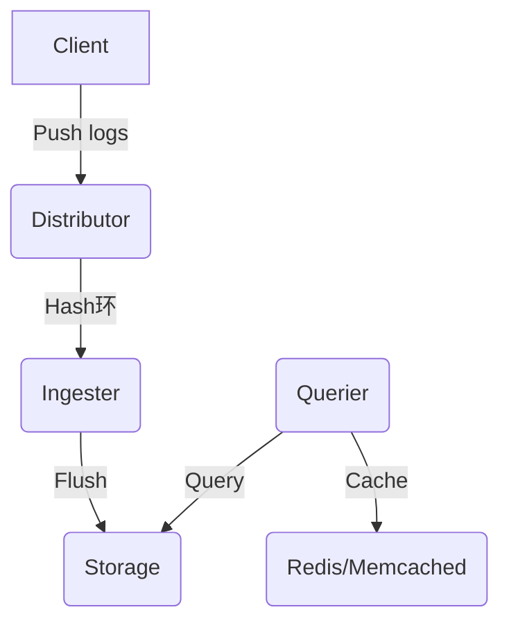

# Loki 组件故障排除

## 介绍

Grafana Loki是一个高效的日志聚合系统，但在实际部署中可能遇到组件运行异常。本章将指导您通过系统化的方法识别和解决Loki核心组件（Distributor/Ingester/Querier等）的常见故障。

## 核心组件健康检查

### 1. 验证组件状态
使用Loki的`/ready`和`/metrics`端点进行基础健康检查：

```bash
# 检查Ingester就绪状态
curl http://loki-ingester:3100/ready

# 获取Querier的Prometheus指标
curl http://loki-querier:3100/metrics
```

预期输出应包含 `ready`状态和组件指标数据。

### 2. 组件通信诊断
Loki各组件通过gRPC通信，使用`grpc_health_probe`工具测试连接：

```bash
grpc_health_probe -addr="loki-distributor:9095"
```

:::note
如果连接失败，检查：
- 网络防火墙规则
- 组件的服务发现配置
- gRPC端口(默认9095)是否暴露
:::

## 常见故障场景

### 场景1：日志接收失败（Distributor问题）

**症状**：
- 客户端收到HTTP 5xx错误
- Prometheus指标`loki_distributor_bytes_received_total`无增长

**排查步骤**：
1. 检查Distributor日志：
   ```bash
   kubectl logs -l app=loki-distributor --tail=50
   ```
2. 验证存储后端连接：
   ```bash
   curl -XPOST "http://loki-distributor:3100/api/push" \
     -H "Content-Type: application/json" \
     -d '{"streams": [{ "stream": { "foo": "bar" }, "values": [ [ "<timestamp>", "test log" ] ] }]}'
   ```

### 场景2：查询超时（Querier问题）

**症状**：
- Grafana面板显示"query timeout"
- `loki_querier_store_client_request_duration_seconds`指标异常

**解决方案**：
```yaml
# 在Loki配置中增加查询超时时间
querier:
  query_timeout: 1m
  max_concurrent: 20
```

## 数据流分析



:::warning 关键检查点
1. Ingester的WAL(Write-Ahead Log)是否正常
2. 存储后端(如S3)的权限配置
3. 时间戳同步问题(NTP服务)
:::

## 实战案例

**问题描述**：
生产环境Loki集群突然停止接收日志，`loki_ingester_memory_chunks`指标达到上限。

**解决过程**：
1. 通过`/config`端点确认配置：
   ```bash
   curl http://loki-ingester:3100/config | jq .ingester
   ```
2. 发现`chunk_idle_period`设置过短(原值15m)
3. 调整配置并重启：
   ```yaml
   ingester:
     chunk_idle_period: 1h
     chunk_target_size: 1572864
   ```

## 总结

掌握Loki组件排障需要：
- 理解各组件职责和数据流
- 熟练使用健康检查接口
- 监控关键Prometheus指标
- 分析日志时注意时间戳和错误代码

## 延伸学习

1. 官方排障文档：[Loki Troubleshooting](https://grafana.com/docs/loki/latest/operations/troubleshooting/)
2. 练习：部署测试集群并模拟Distributor节点故障
3. 工具推荐：
   - `logcli` - Loki命令行查询工具
   - `pt-query-digest` - 分析慢查询