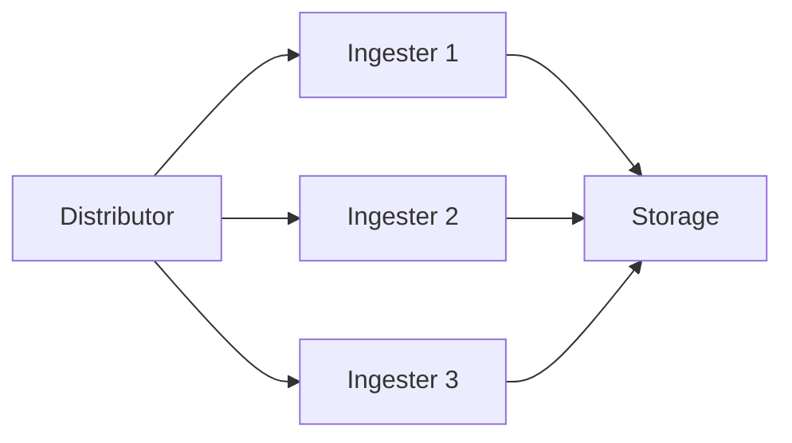
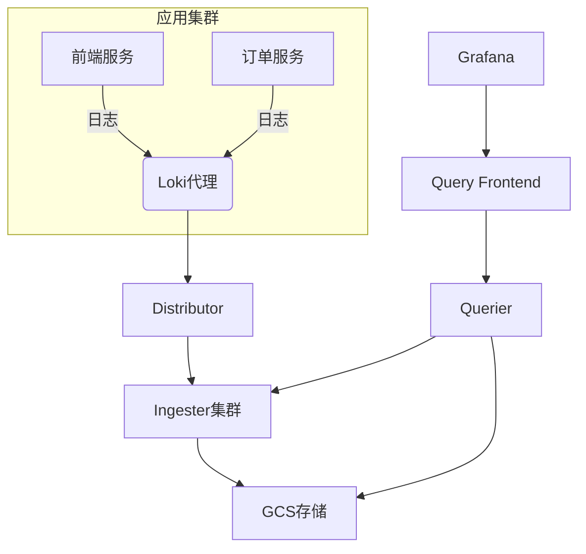

# Loki 组件日志

## 介绍

Grafana Loki是一个开源的日志聚合系统，专为云原生环境设计。与传统的日志系统不同，Loki通过索引日志的元数据（如标签）而非内容本身来实现高效存储和查询。理解Loki的组件及其日志处理流程是掌握该系统的关键。

Loki主要由以下核心组件构成：
- **Distributor**：接收日志数据并分发
- **Ingester**：处理日志写入和短期存储
- **Querier**：执行日志查询
- **Query Frontend**：优化查询性能
- **Ruler**：告警规则评估

## 核心组件详解

### 1. Distributor（分发器）

Distributor是日志进入Loki的第一站，负责：
- 验证日志数据的正确性
- 将日志分批发送给Ingester
- 确保数据一致性

```go
// 示例：通过Loki客户端发送日志
client := loki.New("http://loki:3100")
labels := loki.Labels{"job": "myapp"}
entries := []loki.Entry{
    {Timestamp: time.Now(), Line: "User logged in"},
}
client.Handle(labels, entries)
```

:::tip
生产环境中通常会在应用和Distributor之间部署负载均衡器，确保高可用性。
:::

### 2. Ingester（摄取器）

Ingester负责：
- 将日志写入长期存储（如对象存储）
- 维护最近日志的内存缓存
- 处理日志压缩



### 3. Querier（查询器）

Querier组件：
- 从Ingester和长期存储中获取日志
- 执行LogQL查询
- 合并查询结果

```bash
# 示例LogQL查询
{container="nginx"} |= "error" | logfmt | duration > 10s
```

## 日志处理流程

1. **接收阶段**：客户端通过HTTP/gRPC发送日志到Distributor
2. **分发阶段**：Distributor根据哈希算法选择Ingester
3. **存储阶段**：Ingester将日志写入存储后端
4. **查询阶段**：Querier从多个来源聚合数据

:::note
Loki使用"多租户"架构，每个租户的数据完全隔离，通过`X-Scope-OrgID`头实现。
:::

## 实际案例：电商平台日志系统

某电商平台使用Loki架构：



**实现效果**：
- 日志查询延迟从分钟级降至秒级
- 存储成本降低70%（相比传统方案）
- 支持每天PB级日志处理

## 总结

Loki的组件化设计使其具有高度可扩展性：
- 各组件可独立扩展（如单独增加Ingester处理写入高峰）
- 基于标签的索引大幅降低存储需求
- 原生集成Grafana提供可视化能力

## 延伸学习

**推荐练习**：
1. 使用Docker Compose部署最小化Loki集群
2. 通过`logcli`工具查询测试日志
3. 配置一个基于LogQL的告警规则

**进一步阅读**：
- Loki官方文档的"Architecture"章节
- 《Cloud-Native Observability with Loki》电子书
- LogQL语法速查表