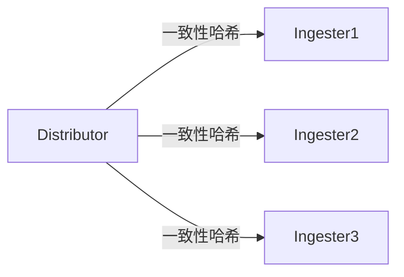

# Loki 组件性能调优

## 介绍

Grafana Loki是一个高效的日志聚合系统，专为大规模日志处理设计。理解其核心组件的性能特性并进行调优，可以显著提升系统的吞吐量和响应速度。本章将深入探讨Loki各组件（如Ingester、Distributor、Querier等）的调优策略，帮助初学者构建高性能的日志系统。

---

## 核心组件调优要点

### 1. Ingester 调优
**作用**：接收并临时存储日志数据，定期刷新到存储后端。

#### 关键参数
```yaml
ingester:
  lifecycler:
    ring:
      replication_factor: 3  # 副本数（影响容错性）
  chunk_idle_period: 30m    # 块空闲时间（影响刷新频率）
  max_transfer_retries: 0   # 禁用转移（降低重启影响）
```

:::tip 实际案例
**场景**：高频日志导致内存溢出  
**解决方案**：调整 `chunk_block_size` 和 `chunk_target_size` 控制内存占用：
```yaml
ingester:
  chunk_block_size: 262144  # 256KB
  chunk_target_size: 1572864 # 1.5MB
```
:::

---

### 2. Distributor 调优
**作用**：分发日志到多个Ingester实例。

#### 哈希环优化


```yaml
distributor:
  ring:
    kvstore:
      store: memberlist  # 使用轻量级memberlist替代etcd
```

---

### 3. Querier 调优
**作用**：执行日志查询请求。

#### 并行查询配置
```yaml
querier:
  max_concurrent: 8               # 并发查询数
  timeout: 30s                    # 查询超时
  query_parallelism: 16           # 子查询并行度
```

:::caution 注意
过高的并行度可能导致存储后端（如S3）限流，需配合 `querier.max_query_parallelism` 调整。
:::

---

## 存储层优化

### 1. 索引优化
**使用BoltDB-SHI替代Cassandra**：
```yaml
schema_config:
  configs:
    - from: 2023-01-01
      store: boltdb-shipper
      object_store: s3
```

### 2. 对象存储配置
```yaml
storage_config:
  aws:
    s3: s3://your-bucket
    s3forcepathstyle: true
```

---

## 实战示例

### 高负载场景配置
```yaml
limits_config:
  ingestion_rate_mb: 20          # 每用户摄入速率限制
  ingestion_burst_size_mb: 40    # 突发流量允许值
  max_streams_per_user: 10000    # 流数量限制
```

---

## 总结

| 组件       | 关键调优点                  | 典型值范围         |
|------------|----------------------------|-------------------|
| Ingester   | 块大小/刷新间隔            | 1-3MB / 15-60min  |
| Querier    | 并发查询数                 | CPU核心数的1-2倍  |
| Storage    | 索引存储选择               | BoltDB-SHI优先    |

---

## 延伸学习
- [官方性能基准报告](https://grafana.com/docs/loki/latest/benchmarks/)
- 练习：使用 `loki-canary` 工具测试调优效果