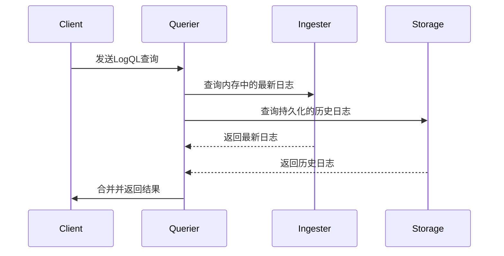

# Loki Querier组件

## 概述

Loki Querier是Grafana Loki的核心组件之一，负责处理日志查询请求。它接收来自用户或Grafana的查询，从Loki的存储后端（如对象存储或本地文件系统）检索日志数据，并将结果返回给客户端。Querier的设计目标是高效、可扩展地处理大规模日志查询。

:::tip 初学者提示
Querier类似于数据库中的"查询引擎"，但专门为日志数据优化，支持LogQL查询语言。
:::

## 工作原理

Querier的工作流程可以分为以下几个步骤：



1. **接收查询**：接受LogQL格式的查询请求
2. **确定查询范围**：根据时间范围决定需要查询哪些数据源
3. **并行查询**：同时查询Ingester(内存数据)和存储后端(持久化数据)
4. **结果合并**：将来自不同源的结果合并、排序
5. **返回响应**：将最终结果返回给客户端

## 核心功能

### 1. 查询执行

Querier解析并执行LogQL查询，支持两种主要查询类型：

- **日志查询**：检索原始日志行
  ```logql
  {app="frontend"} |= "error"
  ```
  
- **指标查询**：基于日志生成指标
  ```logql
  rate({app="frontend"}[5m])
  ```

### 2. 查询优化

Querier实现了多种优化策略：

- **并行查询**：将大时间范围查询拆分为多个小范围并行执行
- **缓存**：缓存常用查询结果
- **下推过滤**：将过滤条件推送到存储层减少数据传输

### 3. 结果处理

- 排序：按时间戳对结果排序
- 限制：应用查询限制(如`limit 100`)
- 分页：支持结果分页

## 配置示例

以下是Querier的典型配置片段：

```yaml
querier:
  # 查询并发度
  max_concurrent: 8
  
  # 查询超时时间
  timeout: 1m
  
  # 查询引擎配置
  engine:
    max_look_back_period: 30s
    
  # 缓存配置
  cache_results: true
  cache_ttl: 1h
```

## 实际应用场景

### 场景1：生产环境错误排查

当应用出现异常时，开发人员可以通过Querier快速查询相关错误日志：

```logql
{namespace="production", app="order-service"} 
  |= "panic" 
  | json 
  | line_format "{{.timestamp}} {{.user_id}} {{.error}}"
```

### 场景2：API监控

监控API的响应时间和错误率：

```logql
# 计算每分钟错误率
sum(rate({app="api-server", status_code=~"5.."}[1m])) 
by (service) 
/ 
sum(rate({app="api-server"}[1m])) 
by (service)
```

## 性能调优建议

:::caution 性能注意事项
以下设置需要根据实际负载调整，不当配置可能导致性能下降或资源耗尽
:::

1. **并发控制**：根据CPU核心数设置`max_concurrent`
2. **超时设置**：复杂查询需要更长超时时间
3. **缓存策略**：高频查询启用缓存，低频查询可禁用
4. **查询拆分**：大时间范围查询拆分为多个小查询

## 总结

Loki Querier组件是日志查询的核心处理器，它：
- 提供高效的LogQL查询执行能力
- 支持并行查询和结果合并
- 包含多种性能优化机制
- 可配置性强，适应不同规模场景

## 延伸学习

1. **实践练习**：
   - 尝试编写不同复杂度的LogQL查询
   - 比较启用/禁用缓存时的查询性能差异

2. **深入学习**：
   - 阅读Loki查询路径的源代码实现
   - 研究分布式查询的执行计划

3. **相关组件**：
   - 了解Querier如何与Distributor、Ingester协同工作
   - 探索查询前端(Query Frontend)如何优化查询性能