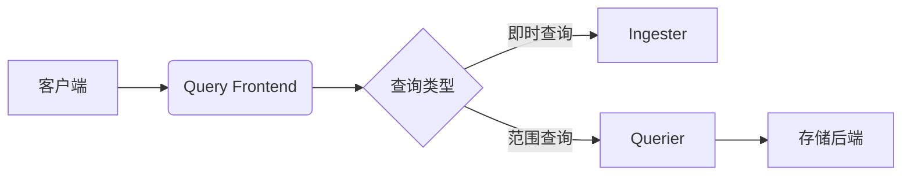

# Loki Query Frontend组件

## 介绍

Loki Query Frontend是Grafana Loki的核心组件之一，负责处理查询请求的调度、拆分和缓存优化。作为Loki查询流程的"入口网关"，它通过以下机制提升查询效率：
- **查询拆分**：将大时间范围查询分解为多个小查询并行执行
- **缓存集成**：支持结果缓存（如Memcached/Redis）减少重复计算
- **队列管理**：实现公平调度和限流，防止系统过载

## 架构设计



关键设计特点：
1. **无状态服务**：可水平扩展
2. **HTTP代理模式**：接收请求后转发给Querier
3. **中间件链**：依次处理认证、拆分、缓存等逻辑

## 核心功能详解

### 1. 查询拆分

将长时间范围查询（如`7d`）拆分为多个短区间（如`1d`）并行执行：

```logql
# 原始查询
{app="nginx"} |= "error" | logfmt | duration > 2s

# 拆分后等效查询（按1天分段）
{app="nginx"} |= "error" | logfmt | duration > 2s [1d]
{app="nginx"} |= "error" | logfmt | duration > 2s [2d] 
...
```

:::tip 性能建议
最佳实践是将查询拆分为`12h`或`24h`分段，可通过`-querier.split-queries-by-interval`参数配置。
:::

### 2. 缓存机制

支持三级缓存：
1. **结果缓存**：完整查询结果
2. **索引缓存**：标签查询结果
3. **TSDB缓存**：块数据缓存

配置示例：
```yaml
query_frontend:
  cache_results: true
  results_cache:
    cache:
      memcached:
        batch_size: 100
        parallelism: 10
```

### 3. 队列调度

采用租户感知的公平队列算法：
- 每个租户有独立队列
- 请求按轮询方式处理
- 支持优先级设置

:::warning 注意
当系统过载时，新查询会进入队列等待，超时设置（默认`30s`）可通过`-frontend.max-query-length`调整。
:::

## 实战案例

### 场景：电商日志分析
```logql
# 分析黑五期间的支付错误
sum by (service) (
  rate(
    {cluster="us-east", namespace="payments"} 
    |= "error" 
    | logfmt 
    | status_code = 500 [1d]
  )
)
```

Query Frontend处理流程：
1. 将30天查询拆分为30个1天查询
2. 并行执行各分段查询
3. 合并结果并返回
4. 缓存结果供后续相似查询使用

## 配置参考

基本部署配置：
```yaml
query_frontend:
  log_queries_longer_than: 10s
  max_outstanding_per_tenant: 100
  compress_responses: true
  downstream_url: http://querier:3100
```

## 总结

关键要点：
- 查询前端是Loki查询性能优化的关键组件
- 通过拆分、缓存、队列三机制提升吞吐量
- 适合处理大规模范围查询场景

进阶学习：
- 官方文档：[Query Frontend架构](https://grafana.com/docs/loki/latest/architecture/components/query-frontend/)
- 性能调优指南：`-querier.parallelise-shardable-queries`参数
- 相关组件：Querier、Ingester的工作协调