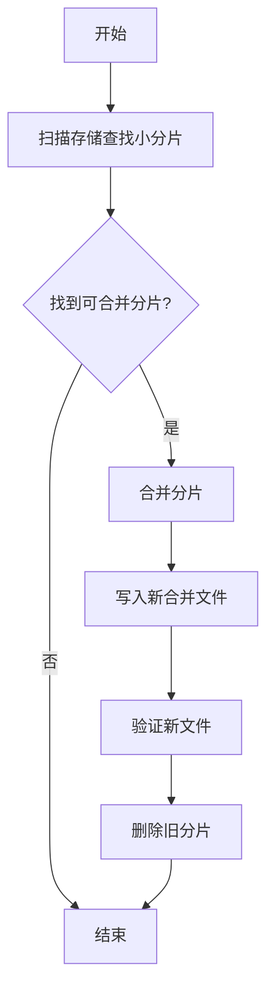

# Loki Compactor组件

## 介绍

Loki Compactor是Grafana Loki中的一个关键后台组件，专门用于优化索引存储并提升查询效率。它的主要职责是压缩和重组Loki的索引文件（通常存储在对象存储中，如S3或GCS），以减少存储空间占用并加速查询。

当Loki运行一段时间后，会生成大量小索引文件（称为"索引分片"）。这些小文件虽然单独查询效率尚可，但数量过多时会导致查询性能下降。Compactor通过合并这些小文件为更大的、更优化的文件来解决这一问题。

## 工作原理

Compactor的工作流程可以分为以下几个步骤：

1. **识别候选文件**：扫描存储系统，找到需要压缩的索引分片。
2. **合并分片**：将多个小分片合并为更大的分片。
3. **清理旧文件**：在确认新文件创建成功后，删除旧的小分片。
4. **周期运行**：作为一个后台进程定期执行上述操作。



## 配置Compactor

Compactor通常作为Loki的独立服务运行。以下是一个基本的配置示例：

```yaml
compactor:
  working_directory: /tmp/loki/compactor
  shared_store: s3
  compaction_interval: 10m
  retention_enabled: true
  retention_delete_delay: 2h
  retention_delete_worker_count: 10

storage_config:
  aws:
    s3: https://s3.amazonaws.com
    bucketnames: my-loki-bucket
    region: us-east-1
    access_key_id: <your-key>
    secret_access_key: <your-secret>
```

:::note
`compaction_interval`决定了Compactor运行的频率。对于生产环境，通常设置为几小时到一天一次，取决于数据量。
:::

## 实际应用场景

假设你有一个中等规模的Loki部署，每天接收约100GB的日志数据。经过一周运行后，你可能会有：

- 700个索引分片（每天约100个）
- 每个分片约100MB大小

这种情况下，Compactor可以：

1. 将这些分片合并为每天一个约10GB的大分片
2. 将总索引文件数量从700减少到7
3. 显著提升查询速度，因为查询引擎需要扫描的文件数量减少了99%

## 性能考量

使用Compactor时需要注意以下几点：

1. **资源使用**：合并过程需要消耗CPU和内存资源
2. **存储需求**：合并过程中需要临时存储空间
3. **运行时机**：最好在系统负载较低时运行
4. **网络带宽**：如果使用云存储，合并过程会产生数据传输费用

:::tip
对于大型部署，可以考虑将Compactor运行在单独的实例上，以避免影响查询性能。
:::

## 常见问题

**Q: Compactor会影响正在进行的查询吗？**<br />
A: 不会。Compactor会确保在删除旧文件前新文件已经完全可用，查询会无缝切换到新文件。

**Q: 合并后的文件可以再被合并吗？**<br />
A: 可以。Compactor会根据配置的策略决定是否进一步合并大文件。

**Q: 如果Compactor失败会怎样？**<br />
A: Compactor设计为幂等操作，可以安全地重试。失败时会保留所有原始文件。

## 总结

Loki Compactor是一个关键的维护组件，它通过：

- 减少索引文件数量来提升查询性能
- 优化存储使用率来降低成本
- 自动化维护任务来减少人工干预

对于任何生产环境的Loki部署，合理配置和使用Compactor都是必不可少的。

## 延伸学习

1. 尝试在不同数据量下测试Compactor的效果
2. 监控Compactor的资源使用情况，优化其配置
3. 阅读Loki官方文档中关于Compactor的高级配置选项

:::caution
在生产环境启用Compactor前，务必在测试环境验证其配置和效果。
:::