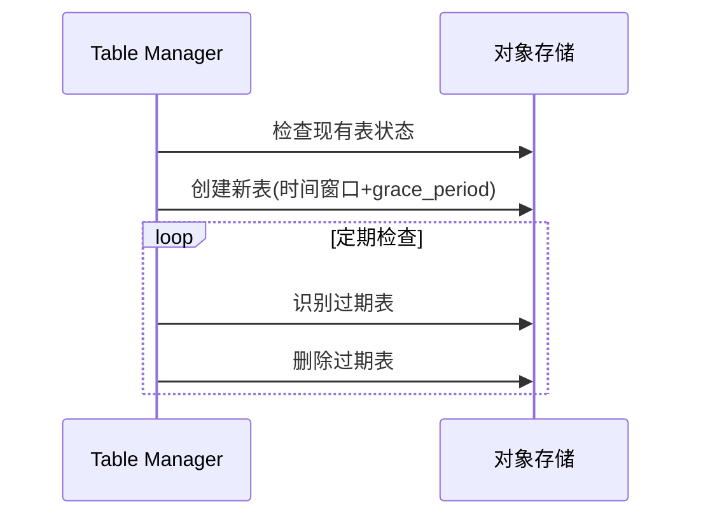

# Loki Table Manager组件

## 介绍

Table Manager是Grafana Loki中负责管理索引表生命周期的核心组件。它通过自动创建、过期和删除索引表来优化存储效率，尤其适用于基于对象存储（如S3、GCS）的Loki部署。对于初学者来说，理解Table Manager的工作机制是掌握Loki存储管理的关键一步。

:::note 为什么需要Table Manager？
Loki将日志索引存储在"表"中（类似于数据库表的概念），每个表对应一个时间范围。Table Manager确保旧数据按配置策略自动清理，避免存储成本无限增长。
:::

## 核心功能

### 1. 表生命周期管理
Table Manager根据配置自动执行以下操作：
- 创建新表（预创建未来时间段的表）
- 标记旧表为"只读"
- 删除超过保留期限的表

### 2. 配置详解
以下是一个典型的Table Manager配置示例：

```yaml
table_manager:
  retention_deletes_enabled: true
  retention_period: 168h  # 保留7天数据
  creation_grace_period: 10m
  index_tables_provisioning:
    inactive_read_throughput: 100
    inactive_write_throughput: 0
    provisioned_read_throughput: 300
    provisioned_write_throughput: 1000
```

配置参数说明：
- `retention_period`：数据保留时长（如168h=7天）
- `creation_grace_period`：提前创建表的时间缓冲
- `provisioned_throughput`：针对DynamoDB等后端设置的读写容量

### 3. 工作原理时序图



## 实际应用案例

### 场景：电商日志管理
某电商平台使用Loki收集应用日志，配置要求：
- 保留最近14天日志供查询
- 每天00:00自动创建新表
- 凌晨2点执行旧表清理

实现配置：
```yaml
table_manager:
  retention_period: 336h  # 14天
  creation_grace_period: 1h
  index_tables_provisioning:
    provisioned_read_throughput: 500
```

:::tip 最佳实践
1. 根据日志量调整`creation_grace_period`，高流量系统建议设置更长缓冲时间
2. 生产环境建议保留周期至少7天，方便问题回溯
3. 监控`loki_table_manager_*`指标，特别是表操作失败计数
:::

## 常见问题解答

### Q: 表删除是立即释放存储空间吗？
A: 取决于后端存储。对象存储通常有删除延迟，且可能有版本控制机制影响。

### Q: 如何紧急停止表删除？
A: 动态修改配置并重启服务：
```bash
curl -X POST http://loki:3100/loki/api/v1/config -d '{"table_manager":{"retention_deletes_enabled":false}}'
```

## 总结

Table Manager作为Loki的"存储管家"，通过自动化管理索引表生命周期：
- ✅ 自动维护表创建/删除周期
- ✅ 防止存储空间无限增长
- ✅ 支持灵活的时间窗口配置

## 扩展学习

### 推荐练习
1. 在本地Loki实例中尝试不同保留周期配置
2. 使用`loki-table-manager`指标创建Grafana监控面板
3. 模拟表删除操作并观察存储变化

### 进一步阅读
- [官方文档：Table Manager配置](https://grafana.com/docs/loki/latest/configuration/#table_manager)
- 《Loki存储架构深度解析》技术白皮书