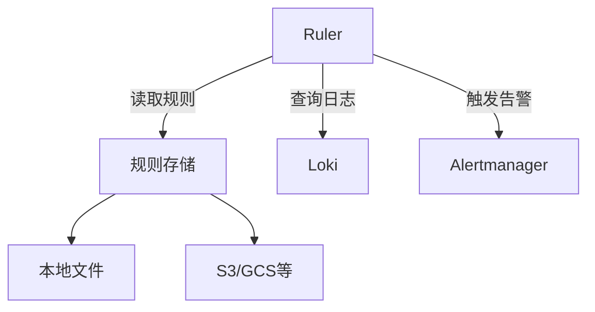

# Loki Ruler组件

## 概述
Loki Ruler是Grafana Loki的告警规则评估组件，负责持续检查日志数据是否匹配预定义的告警规则。当条件满足时，Ruler会触发告警并推送到Alertmanager，实现基于日志内容的监控告警能力。

:::tip 核心功能
- 周期性评估PromQL样式的告警规则
- 支持多租户隔离的规则配置
- 与Alertmanager无缝集成
- 规则存储支持本地文件或对象存储
:::

## 架构原理



Ruler的工作流程分为三个关键阶段：
1. **规则加载**：从配置的存储后端加载告警规则
2. **规则评估**：定期执行规则中的查询表达式
3. **告警处理**：当条件持续满足时触发告警

## 配置示例

### 基本配置
在Loki配置文件中添加Ruler部分：

```yaml
ruler:
  storage:
    type: local
    local:
      directory: /etc/loki/rules
  rule_path: /tmp/loki/rules
  alertmanager_url: http://alertmanager:9093
  enable_api: true
```

### 告警规则示例
创建规则文件 `/etc/loki/rules/app-alerts.yaml`：

```yaml
groups:
  - name: example-app
    rules:
      - alert: HighErrorRate
        expr: |
          rate({job="myapp"} |= "error" [5m]) * 100
          > 5
        for: 10m
        labels:
          severity: critical
        annotations:
          summary: "High error rate on {{ $labels.job }}"
          description: "Error rate is {{ $value }}%"
```

## 关键特性详解

### 1. 规则语法
采用类似Prometheus的规则定义，主要包含：
- `alert`：告警名称
- `expr`：日志查询表达式（LogQL）
- `for`：持续时间阈值
- `labels`：附加标签
- `annotations`：告警详情模板

### 2. 多租户支持
通过HTTP头 `X-Scope-OrgID` 实现租户隔离：
```bash
curl -H "X-Scope-OrgID: tenant1" http://loki:3100/api/prom/rules
```

### 3. 存储后端
支持多种存储类型：
- 本地文件系统
- AWS S3
- Google Cloud Storage
- Azure Blob Storage

## 实际应用场景

### 场景：电商应用监控
监控在线商城的错误日志和异常交易：

```yaml
groups:
  - name: ecommerce-monitoring
    rules:
      - alert: PaymentProcessingErrors
        expr: |
          count_over_time(
            {app="payment-service", env="production"} 
            |~ "payment processing failed" [15m]
          ) > 10
        for: 5m
        annotations:
          impact: "Checkout functionality may be degraded"
```

:::caution 注意事项
1. 规则评估间隔不宜过短（建议≥1m）
2. 避免过于宽泛的日志匹配模式
3. 生产环境建议使用远程存储而非本地文件
:::

## 最佳实践

1. **规则组织**：按功能/服务分组规则
2. **标签策略**：使用一致的标签体系
3. **测试验证**：先在开发环境测试规则
4. **性能优化**：限制查询时间范围和日志量

## 总结

Loki Ruler将日志数据转化为可操作的告警，实现了：
- 实时日志监控告警
- 统一的可观测性体系（日志+指标+告警）
- 灵活的多租户支持

## 扩展学习

1. 官方文档：[Loki Ruler配置指南](https://grafana.com/docs/loki/latest/configuration/#ruler)
2. 实践教程：[基于日志的Kubernetes应用告警](https://grafana.com/tutorials/log-alerting/)
3. LogQL参考：[告警表达式编写指南](https://grafana.com/docs/loki/latest/logql/)

## 练习建议
1. 在测试环境部署Ruler组件
2. 为你的应用创建3条不同严重等级的告警规则
3. 模拟触发条件验证告警流程
4. 尝试将规则存储从本地迁移到S3