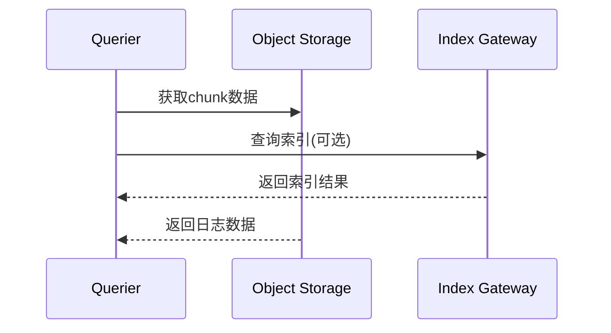

## 介绍

Grafana Loki是一个水平可扩展、高可用的多租户日志聚合系统，其核心功能由多个组件协作完成。理解这些组件如何通信是构建和运维Loki集群的关键基础。本文将详细介绍Loki各组件间的通信模式、协议及数据流向。

## Loki 核心组件概览

Loki主要由以下组件构成：
- **Distributor**：接收日志数据的入口
- **Ingester**：处理并临时存储日志流
- **Querier**：执行日志查询
- **Query Frontend**：优化查询性能
- **Index Gateway** (可选)：索引查询加速
- **Ruler** (可选)：告警规则评估

## 组件通信机制

### 1. Distributor与Ingester通信

Distributor通过gRPC协议将日志数据推送到Ingester，采用一致性哈希算法确定目标Ingester节点：

```go
// 伪代码示例：Distributor选择Ingester的逻辑
func (d *Distributor) Push(ctx context.Context, req *logproto.PushRequest) {
    for _, stream := range req.Streams {
        ingester := d.ring.Get(stream.Labels, replicationFactor)
        ingester.Push(ctx, stream)
    }
}
```

**数据流特征**：
- 使用Protocol Buffers编码
- 默认端口 `9095`
- 支持压缩传输

:::tip 生产实践
在高负载环境中，建议配置 `-distributor.ha-tracker.enable=true` 实现高可用，避免单点故障导致数据丢失。
:::

### 2. Querier与存储后端通信

Querier通过以下方式获取数据：
- **对象存储**：直接读取块数据（S3/GCS等）
- **Index Gateway**：通过gRPC查询索引（若配置）



### 3. Query Frontend与下游组件

Query Frontend作为查询代理：
1. 接收HTTP/gRPC查询请求
2. 拆分大范围查询为子查询
3. 通过gRPC分发给Querier
4. 聚合结果返回客户端

**性能优化参数**：
- `-querier.max-concurrent`
- `-querier.split-queries-by-interval`

## 通信协议详解

### gRPC通信
Loki组件间主要通信协议，具有以下优势：
- 二进制协议高效传输
- 支持流式处理
- 内置负载均衡

```bash
# 查看gRPC连接状态（需安装grpcurl）
grpcurl -plaintext localhost:9095 list
```

### HTTP API
外部系统集成主要接口：
- `/loki/api/v1/push` - 日志接收
- `/loki/api/v1/query` - 即时查询
- `/loki/api/v1/labels` - 标签查询

## 实际案例：电商日志系统

**场景需求**：
- 日均日志量 10TB
- 查询延迟 < 2秒
- 多团队共享集群

**组件通信配置**：
```yaml
# loki-config.yaml 片段
query_frontend:
  frontend_worker:
    scheduler_address: loki-query-frontend:9095
ingester:
  lifecycler:
    ring:
      kvstore:
        store: memberlist
```

**优化效果**：
- 查询并行度提升3倍
- 网络流量减少40%
- 99分位延迟从5s降至1.8s

## 安全通信配置

:::caution 安全警告
生产环境必须启用TLS加密组件间通信！
:::

```yaml
tls_server_config:
  cert_file: /path/to/cert.pem
  key_file: /path/to/key.pem
tls_client_config:
  ca_file: /path/to/ca.pem
```

## 总结

关键要点：
1. 组件间主要采用gRPC进行高效通信
2. 外部系统通过HTTP API集成
3. 通信路径设计直接影响系统性能
4. 生产环境必须配置安全传输

## 扩展学习

推荐实践：
1. 使用 `-log.level=debug` 观察通信细节
2. 通过Grafana监控 `loki_grpc_client_*` 指标
3. 测试不同 `chunk_target_size` 对网络负载的影响

官方资源：
- [Loki架构文档](https://grafana.com/docs/loki/latest/fundamentals/architecture/)
- [性能调优指南](https://grafana.com/docs/loki/latest/operations/tuning/)