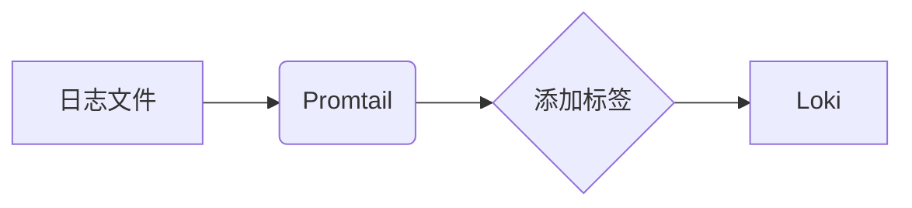

# Promtail简介

Promtail是[Grafana Loki](https://grafana.com/oss/loki/)日志系统的核心组件之一，专门设计用于收集、标记和推送日志到Loki进行存储和查询。作为Loki生态系统的“日志收集代理”，它轻量高效，非常适合在Kubernetes或传统服务器环境中运行。

## 什么是Promtail？

Promtail是一个日志收集代理，主要功能包括：
1. **日志发现**：自动扫描配置的目录或文件<br />
2. **日志提取**：从文件中提取日志内容<br />
3. **标签添加**：为日志流添加元数据标签（与Prometheus标签格式兼容）<br />
4. **日志推送**：将处理后的日志发送到Loki服务器

:::tip 为什么选择Promtail？
- 与Loki深度集成，使用相同的标签系统
- 支持动态重新加载配置
- 资源占用低
- 支持多种日志格式（JSON、Docker、CRI等）
:::

## 基本架构



## 安装与配置

### 基础配置示例

以下是一个简单的Promtail配置文件示例（`promtail-config.yml`）：

```yaml
server:
  http_listen_port: 9080
  grpc_listen_port: 0

positions:
  filename: /tmp/positions.yaml

clients:
  - url: http://loki:3100/loki/api/v1/push

scrape_configs:
- job_name: system
  static_configs:
  - targets:
      - localhost
    labels:
      job: varlogs
      __path__: /var/log/*log
```

### 配置解析

1. **server**：定义Promtail的HTTP/GRPC监听端口<br />
2. **positions**：记录文件读取位置的持久化存储<br />
3. **clients**：配置Loki服务器的连接信息<br />
4. **scrape_configs**：定义日志收集任务

## 核心功能详解

### 1. 日志发现

Promtail通过`__path__`标签发现日志文件，支持：
- 静态路径配置（如`/var/log/*.log`）
- 动态发现（如Kubernetes Pod日志）

### 2. 日志处理管道

Promtail支持通过"pipeline"对日志进行加工：

```yaml
pipeline_stages:
  - docker: {}
  - regex:
      expression: '.*level=(?P<level>\w+).*'
  - labels:
      level:
```

这个管道会：
1. 解析Docker日志格式
2. 使用正则提取`level`字段
3. 将`level`作为标签添加到日志流

### 3. 标签系统

标签是Loki查询的关键，Promtail添加的标签示例：
- `job`：日志任务名称
- `instance`：机器标识
- 自定义业务标签（如`environment=production`）

:::caution 标签使用注意事项
避免使用高基数的标签（如用户ID、请求ID），这会导致Loki性能问题
:::

## 实际应用场景

### 场景1：收集Nginx访问日志

```yaml
scrape_configs:
- job_name: nginx
  static_configs:
  - targets: [localhost]
    labels:
      job: nginx
      __path__: /var/log/nginx/access.log
  pipeline_stages:
    - regex:
        expression: '^(?P<ip>\S+) \S+ \S+ $$(?P<timestamp>[^$$]+)$$ "(?P<method>\S+) (?P<path>\S+) \S+" (?P<status>\d+)'
    - labels:
        method:
        status:
```

### 场景2：Kubernetes日志收集

```yaml
scrape_configs:
- job_name: kubernetes-pods
  kubernetes_sd_configs:
    - role: pod
  pipeline_stages:
    - cri: {}
  relabel_configs:
    - source_labels: [__meta_kubernetes_namespace]
      target_label: namespace
    - source_labels: [__meta_kubernetes_pod_name]
      target_label: pod
```

## 常见问题解决

### 问题1：日志未发送到Loki
检查步骤：
1. 确认Promtail进程正在运行
2. 检查`positions`文件是否有更新
3. 验证Loki端点可访问性

### 问题2：标签过多导致性能问题
解决方案：
1. 减少不必要的标签
2. 使用`-print-config-stderr`参数验证配置

## 总结

Promtail作为Loki生态系统的日志收集端：
- 轻量高效，适合各种环境部署
- 灵活的日志发现和处理能力
- 与Prometheus兼容的标签系统
- 原生支持Kubernetes环境

## 扩展学习

推荐练习：
1. 配置Promtail收集本地系统日志
2. 尝试添加自定义业务标签
3. 搭建测试Loki环境验证日志收集

官方资源：
- [Promtail文档](https://grafana.com/docs/loki/latest/clients/promtail/)
- [配置参考](https://grafana.com/docs/loki/latest/clients/promtail/configuration/)