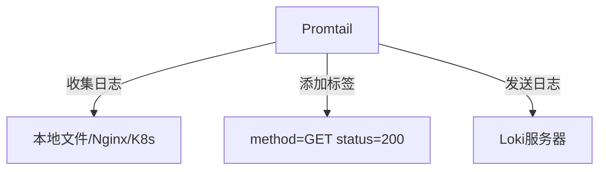

# Promtail安装配置

## 介绍

Promtail是Grafana Loki生态系统中专门设计用于收集、标记和转发日志的代理程序。它负责从本地日志文件中提取日志内容，添加标签（labels）以便于查询，并将日志发送到Loki进行存储和分析。Promtail特别适合在Kubernetes环境中运行，但也可以用于非容器化的系统。

:::note 为什么需要Promtail？
- **轻量级**: 专为日志收集优化，资源占用低
- **动态标签**: 支持基于日志来源自动添加标签
- **服务发现**: 自动发现Kubernetes中的Pod和容器
:::

## 安装Promtail

### 在Linux系统上安装

1. **下载预编译二进制文件**:

```bash
# 根据你的系统架构选择合适的版本
wget https://github.com/grafana/loki/releases/download/v2.7.3/promtail-linux-amd64.zip
unzip promtail-linux-amd64.zip
```

2. **验证安装**:

```bash
./promtail-linux-amd64 --version
```

### 在Kubernetes中安装

使用Helm chart是最简单的方式:

```bash
helm repo add grafana https://grafana.github.io/helm-charts
helm repo update
helm install promtail grafana/promtail -n loki --create-namespace
```

## 配置Promtail

Promtail的配置文件通常使用YAML格式，下面是一个基本配置示例:

```yaml
server:
  http_listen_port: 9080
  grpc_listen_port: 0

positions:
  filename: /tmp/positions.yaml

clients:
  - url: http://loki:3100/loki/api/v1/push

scrape_configs:
- job_name: system
  static_configs:
  - targets:
      - localhost
    labels:
      job: varlogs
      __path__: /var/log/*log
```

### 配置解析

1. **server**: 定义Promtail的HTTP/GRPC服务端口
2. **positions**: 记录文件读取位置，确保重启后能继续从正确位置读取
3. **clients**: 指定Loki服务器的地址
4. **scrape_configs**: 定义日志收集任务

:::tip 动态标签
在Kubernetes环境中，可以使用`pipeline_stages`动态添加标签:

```yaml
pipeline_stages:
- docker: {}
- labels:
    namespace:
    pod_name:
    container_name:
```
:::

## 实际案例

### 案例1: 收集Nginx日志

```yaml
scrape_configs:
- job_name: nginx
  static_configs:
  - targets:
      - localhost
    labels:
      job: nginx
      __path__: /var/log/nginx/*.log
  pipeline_stages:
  - regex:
      expression: '^(?P<ip>\S+) \S+ \S+ $$(?P<timestamp>[^$$]+)$$ "(?P<method>\S+) (?P<path>\S+) \S+" (?P<status>\d+) (?P<size>\d+)'
  - labels:
      method:
      status:
```

### 案例2: Kubernetes日志收集

```yaml
scrape_configs:
- job_name: kubernetes-pods
  kubernetes_sd_configs:
  - role: pod
  relabel_configs:
  - source_labels: [__meta_kubernetes_pod_label_app]
    target_label: app
  pipeline_stages:
  - cri: {}
```



## 验证配置

使用以下命令测试配置文件是否正确:

```bash
./promtail-linux-amd64 --config.file=promtail-config.yaml --dry-run
```

## 运行Promtail

启动Promtail服务:

```bash
./promtail-linux-amd64 --config.file=promtail-config.yaml
```

:::caution 注意事项
1. 确保Promtail有权限读取目标日志文件
2. 生产环境建议使用systemd或supervisor管理进程
3. 大型部署需要考虑Promtail的资源限制
:::

## 总结

Promtail是Loki日志系统的关键组件，通过本指南你学会了:
- 在不同环境中安装Promtail
- 编写基本和高级配置文件
- 收集各种来源的日志
- 验证和运行Promtail服务

## 扩展学习

1. 尝试配置Promtail收集你应用的日志
2. 研究如何添加自定义标签
3. 了解Promtail的metrics端点监控
4. 探索Promtail的日志处理流水线(pipeline)

通过实践这些内容，你将能够熟练使用Promtail构建强大的日志收集系统。