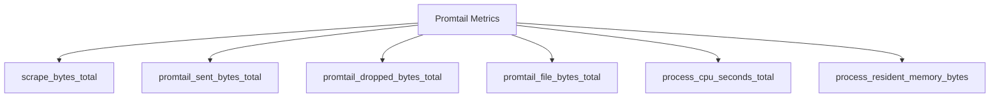

# Promtail性能优化

## 介绍

Promtail是Grafana Loki生态中的日志采集代理，负责从各种来源收集日志并将其发送到Loki存储。当处理大量日志数据时，Promtail的性能优化变得至关重要。本指南将介绍如何通过配置调整、资源管理和管道优化来提升Promtail的运行效率。

:::note 关键概念
性能优化的核心目标是：
- 降低CPU/内存消耗
- 减少网络带宽使用
- 提高日志处理吞吐量
- 避免日志丢失或重复
:::

## 基础配置优化

### 1. 调整批处理参数

```yaml
# promtail-config.yaml
clients:
  - url: http://loki:3100/loki/api/v1/push
    batchwait: 1s       # 等待1秒形成批次
    batchsize: 1048576  # 每批次最大1MB
    timeout: 10s        # 发送超时时间
```

参数说明：
- `batchwait`: 批次等待时间（平衡延迟与吞吐量）
- `batchsize`: 每批次最大字节数
- `timeout`: 发送请求超时时间

### 2. 并发度控制

```yaml
scrape_configs:
  - job_name: system
    pipeline_stages: [...]
    relabel_configs: [...]
    client:
      max_retries: 3     # 失败重试次数
      parallelism: 2     # 并发发送数
```

## 高级优化技术

### 1. 文件发现优化

```yaml
positions:
  sync_period: 15s      # 位置信息同步间隔（默认10s）

scrape_configs:
  - job_name: nginx
    file_sd_configs:
      - refresh_interval: 5m  # 文件发现刷新间隔（默认5m）
    discovery:
      watch_fs_events: true   # 使用文件系统事件通知（而非轮询）
```

:::tip 最佳实践
对于静态文件路径，可以完全禁用发现机制：
```yaml
static_configs:
  - targets: [localhost]
    labels:
      job: nginx
      __path__: /var/log/nginx/*.log
```
:::

### 2. 管道阶段优化

避免不必要的日志处理：

```yaml
pipeline_stages:
  - docker: {}          # 仅当需要docker日志格式时才启用
  - match:
      selector: '{job="nginx"}'
      stages:
        - regex:
            expression: '.*(?P<error>error).*'
        - metrics:
            error_total:
              type: Counter
              description: "Total error logs"
              source: error
              config:
                action: inc
```

### 3. 资源限制

```yaml
server:
  http_listen_port: 9080
  grpc_listen_port: 0    # 禁用GRPC（如不需要）

limits_config:
  readline_rate: 2048    # 每秒每文件最大行数
  readline_burst: 4096
  max_streams_per_user: 1000
```

## 实际案例

### 案例1：高流量Web服务器优化

**场景**：处理每秒10,000+日志行的Nginx集群

```yaml
clients:
  - url: http://loki:3100/loki/api/v1/push
    batchwait: 3s        # 增加批次等待时间
    batchsize: 3145728   # 3MB批次
    timeout: 15s
    backoff_config:
      min_period: 100ms
      max_period: 10s

scrape_configs:
  - job_name: nginx
    static_configs:
      - targets: [localhost]
        labels:
          job: nginx
          __path__: /var/log/nginx/access.log
    pipeline_stages:
      - regex:
          expression: '^(?P<ip>\\S+) \\S+ \\S+ \$$(?P<timestamp>[^\$$]+)\$$ "(?P<method>\\S+) (?P<path>\\S+) HTTP/(?P<http_version>\\S+)" (?P<status>\\S+) (?P<size>\\S+)'
      - drop:
          expression: 'status ~ "200|304"'
          percentage: 50 # 丢弃50%的成功请求日志
```

### 案例2：容器环境优化

```yaml
scrape_configs:
  - job_name: kubernetes-pods
    kubernetes_sd_configs: [...]
    pipeline_stages:
      - cri: {}          # 使用CRI格式解析
      - labelallow: [container_name, pod_name] # 只保留必要标签
    relabel_configs:
      - action: drop
        regex: 'POD'
        source_labels: ['__meta_kubernetes_pod_container_name']
```

## 监控与调优

使用Prometheus监控Promtail指标：



关键指标：
- `log_entries_rate`：日志处理速率
- `promtail_sent_bytes_total`：已发送数据量
- `promtail_dropped_bytes_total`：丢弃数据量
- `process_resident_memory_bytes`：内存使用量

## 总结

Promtail性能优化要点：
1. 合理配置批处理参数平衡延迟与吞吐
2. 根据日志源特性调整发现机制
3. 精简管道阶段和处理逻辑
4. 实施适当的速率限制和资源控制
5. 持续监控关键性能指标

## 延伸学习

练习建议：
1. 对比不同`batchwait`值对CPU使用率的影响
2. 测试`drop`阶段在不同日志过滤场景的效果
3. 模拟高负载环境观察资源使用情况

附加资源：
- Promtail官方文档中的[配置参考](https://grafana.com/docs/loki/latest/clients/promtail/configuration/)
- Loki社区提供的[性能调优指南](https://grafana.com/docs/loki/latest/optimization/)