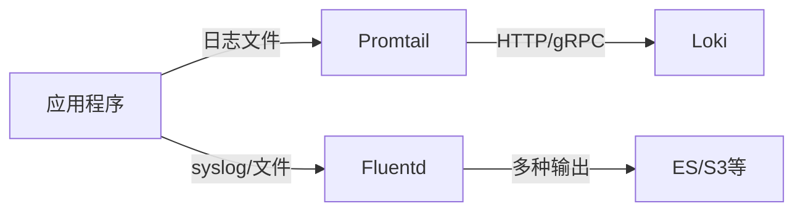
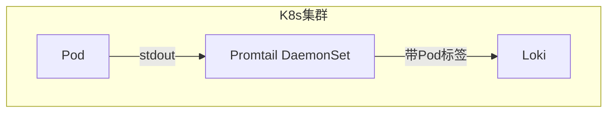
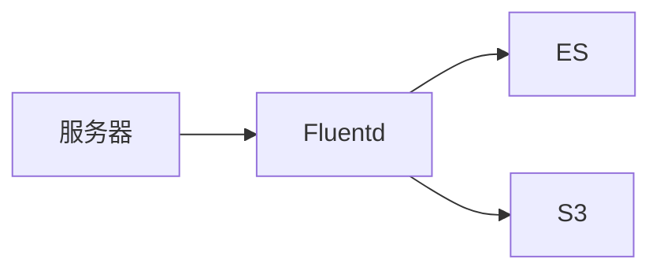

## 引言

在构建日志监控系统时，日志收集器（Log Collector）是连接应用程序与日志存储/分析工具的关键组件。Promtail是专为Grafana Loki设计的轻量级日志采集代理，但与其他日志收集器相比有何优劣？本文将对比Promtail与Fluentd、Filebeat、Logstash等工具的核心特性，帮助初学者做出合理选择。

## 核心概念

Promtail是Loki生态中的日志采集器，主要特点包括：
- **原生支持Loki**：自动添加标签（Labels）并推送日志到Loki
- **服务发现集成**：自动发现Kubernete Pods或Docker容器
- **资源占用低**：Go语言编写，无JVM开销

## 功能对比

### 1. 架构设计



| 特性               | Promtail       | Fluentd       | Filebeat      | Logstash      |
|--------------------|----------------|---------------|---------------|---------------|
| 开发语言           | Go             | Ruby/C        | Go            | Java          |
| 资源占用           | 低             | 中等          | 极低          | 高            |
| 支持输出目标       | 仅Loki         | 多种          | 多种          | 多种          |
| 服务发现           | 原生支持       | 需插件        | 需配置        | 需配置        |

### 2. 配置复杂度

**Promtail示例配置（采集Nginx日志）**：
```yaml
scrape_configs:
  - job_name: nginx
    static_configs:
      - targets: [localhost]
        labels:
          job: nginx
          __path__: /var/log/nginx/*.log
```

等效的Filebeat配置：
```yaml
filebeat.inputs:
  - type: filestream
    paths: ["/var/log/nginx/*.log"]
output.elasticsearch:
  hosts: ["localhost:9200"]
```

:::tip 初学者建议
Promtail配置更贴近Kubernetes元数据模型，适合云原生环境；Filebeat配置更通用但需额外处理标签。
:::

### 3. 处理能力对比

| 能力               | Promtail       | Fluentd       | Logstash      |
|--------------------|----------------|---------------|---------------|
| 日志过滤           | 基本           | 强大          | 极强          |
| 日志解析           | 有限           | 丰富插件      | 丰富插件      |
| 吞吐量             | 中等           | 高            | 非常高        |
| 多行日志处理       | 支持           | 支持          | 支持          |

## 实际场景选择建议

### 场景1：Kubernetes + Loki 栈

**选择Promtail**：自动继承Pod标签，与Loki无缝集成

### 场景2：混合环境+多存储

**选择Fluentd**：需要将日志同时存储到多个后端时

## 性能基准测试数据

以下为单节点处理Nginx访问日志的对比（日志量：10,000条/秒）：

| 工具      | CPU占用 | 内存占用 | 延迟   |
|-----------|---------|----------|--------|
| Promtail  | 15%     | 120MB    | 2s     |
| Filebeat  | 8%      | 80MB     | 1s     |
| Logstash  | 45%     | 1.2GB    | 5s     |

:::caution 注意
实际性能取决于日志格式、处理规则和硬件环境，以上数据仅为简化示例。
:::

## 总结与建议

**选择Promtail当：**
- 已使用或计划使用Loki
- 需要Kubernetes原生集成
- 追求简单的标签管理

**考虑其他工具当：**
- 需要将日志发送到多个存储系统
- 需要复杂的日志处理管道
- 资源极度受限（考虑Filebeat）

## 延伸练习

1. 在本地Docker环境部署Promtail和Loki，采集容器日志
2. 尝试用`logcli`查询已收集的日志
3. 对比相同配置下Promtail与Filebeat的资源占用

## 附加资源

- [Promtail官方文档](https://grafana.com/docs/loki/latest/clients/promtail/)
- [Fluentd与Loki集成指南](https://grafana.com/docs/loki/latest/clients/fluentd/)
- [Log Collector Benchmark工具](https://github.com/grafana/loki/tree/main/tools/loadgen)