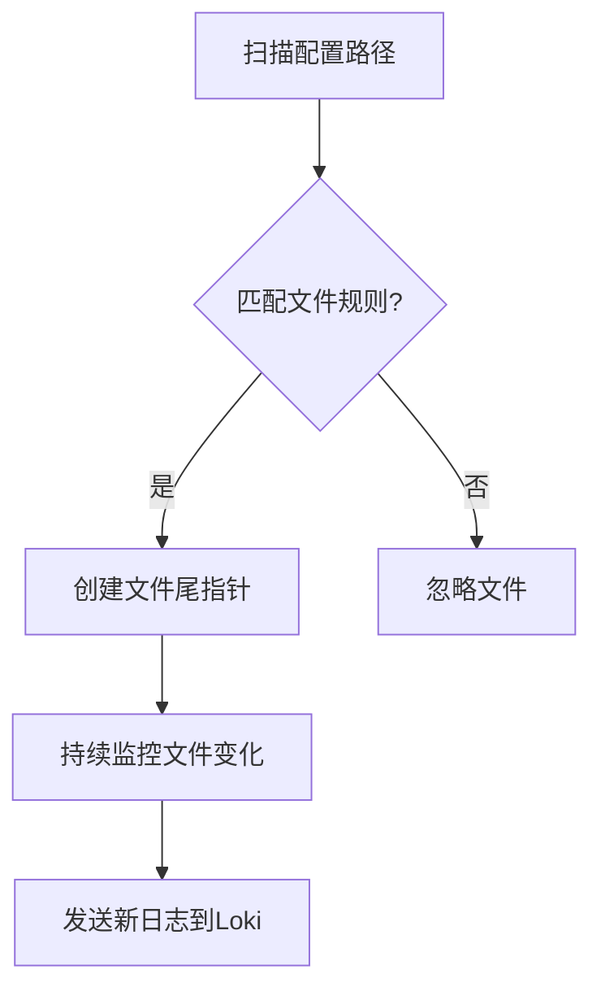

# Promtail文件发现

## 介绍

Promtail是Loki日志系统的代理组件，负责发现、采集和转发日志文件。其中**文件发现**（File Discovery）是Promtail的核心功能，它能自动检测指定目录中的日志文件变化，并实时采集新增内容。对于初学者来说，理解这个机制是搭建日志管道的首要步骤。

:::note 为什么需要文件发现？
现代应用常将日志写入文件（如/var/log/）。Promtail需要动态发现这些文件的变化，而无需为每个文件手动配置。
:::

## 工作原理

Promtail通过`scrape_configs`配置监控目标，其文件发现流程如下：



## 基础配置

在`promtail.yml`中配置文件发现的基本结构：

```yaml
scrape_configs:
- job_name: system
  static_configs:
  - targets: [localhost]
    labels:
      job: varlogs
      __path__: /var/log/*log
```

关键参数说明：
- `__path__`：支持通配符的路径模式（如`/var/log/**/*.log`）
- `labels`：为采集的日志添加元数据标签

## 高级文件发现

### 1. 多路径配置

```yaml
__path__: |
  /var/log/auth.log
  /var/log/syslog
  /tmp/app_*.log
```

### 2. 排除特定文件

```yaml
scrape_configs:
- job_name: system
  pipeline_stages:
    - match:
        selector: '{job="system"}'
        action: drop
        source: filename
        regex: ".*/exclude/.*"
```

### 3. 文件轮转处理

Promtail会自动检测文件轮转（如logrotate），通过`position`文件记录读取位置：

```text
/var/log/syslog:785632
/tmp/app.log:1245
```

## 实际案例：监控Nginx日志

```yaml
scrape_configs:
- job_name: nginx
  static_configs:
  - targets: [localhost]
    labels:
      job: nginx
      env: production
      __path__: /var/log/nginx/access.log
```

:::tip 最佳实践
建议为不同应用分配独立的`job_name`，便于在Grafana中分类查询
:::

## 调试技巧

检查文件发现是否生效：

1. 查看Promtail日志：
```bash
journalctl -u promtail -f
```

2. 验证采集目标：
```bash
curl http://localhost:9080/targets
```

## 常见问题

:::caution 文件权限问题
确保Promtail进程有权限读取目标文件：
```bash
sudo chown promtail:promtail /var/log/nginx/*
```
:::

## 总结

Promtail的文件发现机制通过灵活的路径配置和标签系统，实现了日志采集的自动化。关键要点：
- 使用`__path__`定义监控路径模式
- 通过`labels`添加业务元数据
- 位置文件保证断点续传

## 延伸学习

1. 官方文档：[File Scraping](https://grafana.com/docs/loki/latest/send-data/promtail/configuration/#static_config)
2. 实战练习：
   - 配置监控`/tmp`目录下所有`.log`文件
   - 实现按日期过滤日志文件（如`app-2023-08-*.log`）