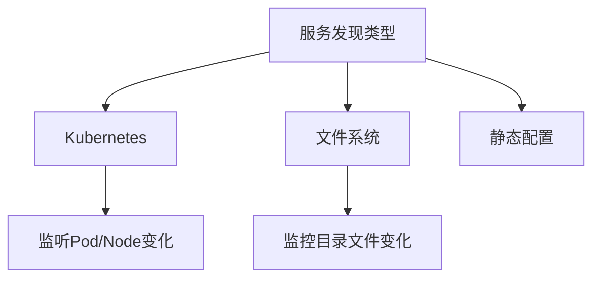

# Promtail服务发现

## 介绍

Promtail是Grafana Loki生态系统中专为日志采集设计的代理工具，其核心功能之一是**服务发现(Service Discovery)**。服务发现机制使Promtail能够自动识别新的日志源并动态调整采集配置，无需手动重启服务。这对于动态环境（如Kubernetes）尤为重要。

:::tip 为什么需要服务发现？
在传统日志采集中，管理员需要手动维护日志路径列表。当应用实例扩缩容或迁移时，这种静态配置方式会带来巨大维护成本。服务发现通过自动化解决了这一问题。
:::

## 服务发现工作原理

Promtail通过定期扫描目标系统来发现变更，支持以下主要发现模式：



## 配置详解

### 1. Kubernetes服务发现

这是容器环境下最常用的发现方式。在`promtail-config.yaml`中添加如下配置：

```yaml
scrape_configs:
- job_name: kubernetes
  kubernetes_sd_configs:
  - role: pod
  relabel_configs:
  - source_labels: [__meta_kubernetes_pod_label_app]
    action: keep
    regex: myapp.*
```

关键配置说明：
- `role: pod`：监控Pod资源（可选node/service）
- `relabel_configs`：通过标签过滤目标
- `__meta_kubernetes_*`：Kubernetes元数据标签

:::note 元标签示例
Promtail会自动添加这些元标签：
- `__meta_kubernetes_pod_name`
- `__meta_kubernetes_namespace`
- `__meta_kubernetes_pod_container_name`
:::

### 2. 文件系统服务发现

适用于物理机/虚拟机环境，监控指定目录下的文件变化：

```yaml
scrape_configs:
- job_name: system
  file_sd_configs:
  - files:
    - '/etc/promtail/targets/*.json'
    refresh_interval: 5m
```

对应的JSON目标文件示例(`/etc/promtail/targets/apps.json`)：
```json
[
  {
    "targets": ["localhost"],
    "labels": {
      "job": "nginx",
      "env": "production",
      "__path__": "/var/log/nginx/*log"
    }
  }
]
```

## 实际案例

### 案例1：动态采集Kubernetes应用日志

场景：需要采集所有带`logging=enabled`标签的Pod日志

```yaml
relabel_configs:
- source_labels: [__meta_kubernetes_pod_label_logging]
  action: keep
  regex: enabled
- source_labels: [__meta_kubernetes_pod_container_name]
  target_label: container
```

### 案例2：多环境日志分类

通过不同的文件SD配置区分环境：

```yaml
# 开发环境配置
- job_name: dev
  file_sd_configs:
  - files: ['/configs/dev-targets.json']
    labels:
      env: dev

# 生产环境配置
- job_name: prod
  file_sd_configs:
  - files: ['/configs/prod-targets.json']
    labels:
      env: prod
```

## 常见问题解决

:::caution 服务发现失效排查步骤
1. 检查Promtail日志是否有权限错误
2. 确认Kubernetes RBAC配置正确（如使用ServiceAccount）
3. 验证文件SD的JSON格式是否正确
4. 检查`refresh_interval`是否设置过短
:::

## 总结

Promtail的服务发现机制大大简化了日志采集的运维工作，主要特点包括：
- 支持Kubernetes和文件系统两种主要发现方式
- 通过relabel_configs实现灵活的目标过滤
- 动态适应基础设施变化

## 延伸学习

推荐练习：
1. 在Minikube中部署Promtail并配置自动发现Nginx Pod日志
2. 创建文件SD配置，监控`/var/log`目录下所有`.log`文件
3. 尝试使用`__meta_kubernetes_pod_annotation_*`基于注解过滤

官方资源：
- [Promtail配置文档](https://grafana.com/docs/loki/latest/clients/promtail/configuration/)
- [Kubernetes服务发现详解](https://prometheus.io/docs/prometheus/latest/configuration/configuration/#kubernetes_sd_config)