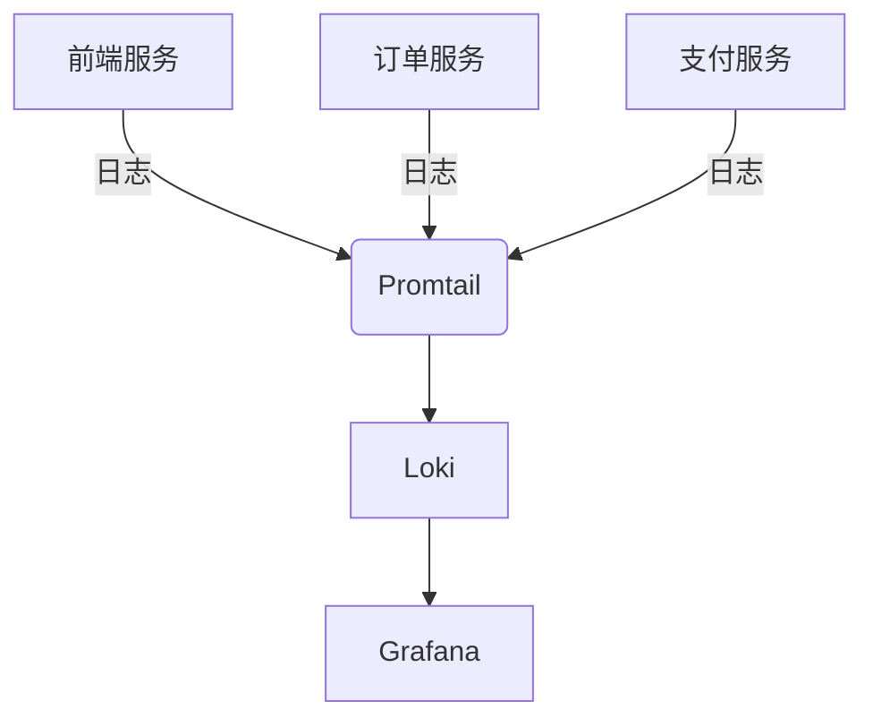
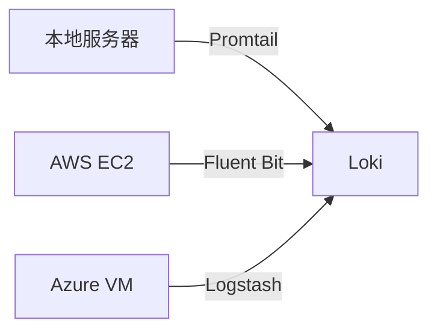

在分布式系统和云原生环境中，日志数据可能来自各种不同的来源。理解如何从多样化来源收集日志是构建高效日志管理系统的关键第一步。本文将介绍常见的日志来源类型、收集方法以及如何将它们与Grafana Loki集成。

## 什么是日志来源？

日志来源指的是产生日志数据的应用程序、服务或系统组件。在现代IT基础设施中，日志可能来自：

- 应用程序代码
- 操作系统
- 容器
- 服务器
- 网络设备
- 云服务

## 主要日志来源类型

### 1. 应用程序日志

应用程序通常会输出日志到标准输出(stdout)或文件。例如，一个Node.js应用可能这样记录日志：

```javascript
console.log('用户登录成功，用户ID: 12345');
console.error('数据库连接失败，重试中...');
```

### 2. 系统日志

操作系统和服务通常通过syslog协议记录日志。在Linux系统中，这些日志通常存储在`/var/log`目录下。

```bash
# 查看系统日志
cat /var/log/syslog
```

### 3. 容器日志

容器化应用(如Docker)将日志输出到标准输出和标准错误流。可以使用以下命令查看：

```bash
docker logs <容器ID>
```

### 4. 云服务日志

AWS、GCP等云平台提供各种服务的日志，如：

- AWS CloudWatch Logs
- GCP Stackdriver Logging
- Azure Monitor Logs

## 日志收集方法

### 使用Promtail收集日志

Promtail是Loki的日志收集代理，支持多种日志来源：

```yaml
# promtail-config.yaml
server:
  http_listen_port: 9080
  grpc_listen_port: 0

positions:
  filename: /tmp/positions.yaml

clients:
  - url: http://loki:3100/loki/api/v1/push

scrape_configs:
- job_name: system
  static_configs:
  - targets:
      - localhost
    labels:
      job: varlogs
      __path__: /var/log/*log
```

### 使用Fluentd/Fluent Bit

Fluentd是流行的日志收集器，支持多种输入源：

```xml
<source>
  @type tail
  path /var/log/nginx/access.log
  pos_file /var/log/nginx/access.log.pos
  tag nginx.access
  <parse>
    @type nginx
  </parse>
</source>
```

## 实际应用场景

### 场景1：收集微服务架构日志



### 场景2：混合云环境日志收集



## 最佳实践

1. **标准化日志格式**：使用JSON等结构化格式
2. **添加适当的标签**：便于在Loki中查询
3. **考虑日志轮转**：防止日志文件过大
4. **安全考虑**：敏感信息不应记录在日志中

## 总结

理解并有效收集多样化日志来源是构建强大日志系统的基石。通过使用Promtail、Fluentd等工具，我们可以将来自不同环境的日志统一收集到Loki中，为后续的分析和监控打下基础。

## 进一步学习

- [Loki官方文档 - 日志收集](https://grafana.com/docs/loki/latest/send-data/)
- [Promtail配置参考](https://grafana.com/docs/loki/latest/clients/promtail/configuration/)
- [Fluentd插件列表](https://www.fluentd.org/plugins)

:::tip 练习
1. 设置Promtail收集你本地系统的`/var/log/syslog`
2. 尝试配置一个应用以JSON格式输出日志
3. 探索如何从你使用的云服务收集日志
:::