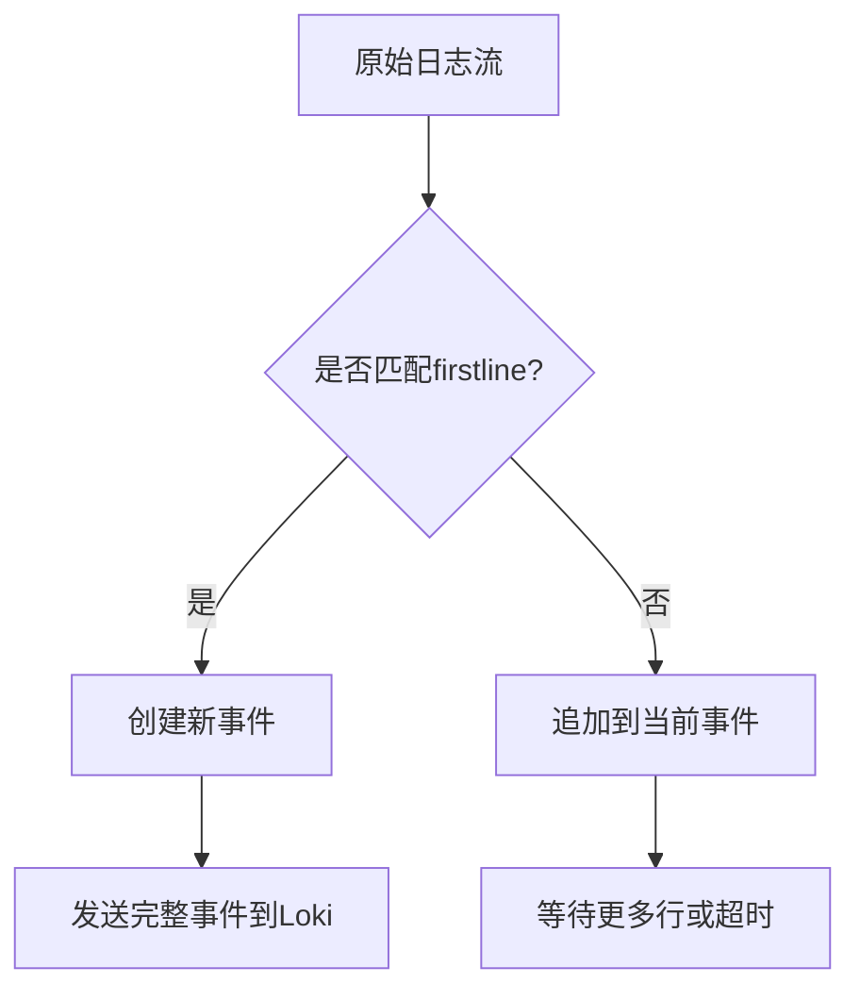

# 多行日志处理

## 介绍

在日志收集过程中，许多应用程序（如Java堆栈跟踪、Python错误或Docker日志）会生成跨越多行的日志条目。如果直接将这些日志发送到Loki，每一行会被视为独立的日志条目，导致上下文丢失和查询困难。多行日志处理技术能够将相关联的多行内容合并为单个日志条目，保留完整的语义信息。

## 为什么需要多行处理？

考虑以下Java异常日志示例的原始输入：
```
2023-01-01 ERROR: NullPointerException
    at com.example.Service.run(Service.java:42)
    at com.example.Main.main(Main.java:10)
```
未经处理时，Loki会存储为三条独立日志，破坏异常信息的完整性。

## Loki 中的解决方案

### 1. Promtail配置

通过Promtail的`pipeline_stages`配置多行合并规则。以下是典型配置示例：

```yaml
pipeline_stages:
  - multiline:
      # 匹配新日志条目的起始行（正则表达式）
      firstline: '^\d{4}-\d{2}-\d{2}'
      # 最大等待时间（防止无限缓冲）
      max_wait_time: 3s
```

### 2. 关键参数说明

| 参数 | 说明 | 示例值 |
|------|------|--------|
| `firstline` | 识别新日志开始的正则 | `^$$\d{4}-\d{2}-\d{2}` |
| `max_wait_time` | 缓冲超时时间 | `5s` |
| `max_lines` | 最大合并行数（可选） | `100` |

:::tip 正则表达式技巧
使用在线工具如regex101.com测试你的匹配模式，确保它能准确识别日志开头
:::

## 实战案例

### 案例1：处理Python日志

**原始日志：**
```python
[2023-01-01 12:00:00] ERROR: Failed to connect
Traceback (most recent call last):
  File "app.py", line 5, in <module>
    connect_to_db()
  File "db.py", line 10, in connect_to_db
    raise ConnectionError("Invalid credentials")
ConnectionError: Invalid credentials
```

**Promtail配置：**
```yaml
- multiline:
    firstline: '^$$\d{4}-\d{2}-\d{2} \d{2}:\d{2}:\d{2}$$'
```

### 案例2：Docker容器日志

处理Docker日志的时间戳前缀：
```yaml
- multiline:
    firstline: '^\d{4}-\d{2}-\d{2}T\d{2}:\d{2}:\d{2}\.\d+Z'
```

## 调试技巧

使用Promtail的调试模式验证处理结果：
```bash
promtail --config.file=promtail.yaml --client.external-labels=hostname=$(hostname) --log.level=debug
```

检查日志中是否出现类似输出：
```
level=debug msg="Matched multiline" lines=3
```

## 常见问题处理

:::caution 注意缓冲区
1. **内存消耗**：长时间的多行事件可能占用大量内存
2. **超时设置**：`max_wait_time`过短会导致截断，过长会延迟日志可见性
:::

## 总结

多行日志处理的关键步骤：
1. 识别日志的起始行模式
2. 配置适当的缓冲参数
3. 测试并验证合并效果



## 延伸学习

- 官方文档：[Loki多行日志最佳实践](https://grafana.com/docs/loki/latest/best-practices/multiline-logs/)
- 正则练习：[RegexOne交互式教程](https://regexone.com/)
- 实战项目：尝试为你的Spring Boot应用配置多行日志收集

通过合理配置多行处理，你可以确保Loki中存储的日志保持完整的上下文信息，大幅提高后续查询和分析的效率。