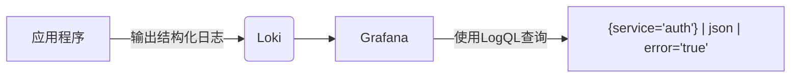

# 结构化日志收集

## 什么是结构化日志？

结构化日志是指将日志数据以**键值对**或**JSON等标准格式**存储的日志记录方式。与传统的纯文本日志相比，结构化日志通过明确的字段定义，使得日志更容易被机器解析和人类阅读。例如：

```json
{
  "timestamp": "2023-05-20T14:32:11Z",
  "level": "ERROR",
  "message": "Failed to connect to database",
  "service": "auth-service",
  "request_id": "abc123"
}
```

## 为什么需要结构化日志？

1. **高效查询**：可直接通过字段过滤（如 `level="ERROR"`）<br />
2. **自动化处理**：工具链（如Loki）能直接提取字段<br />
3. **一致性**：团队统一的日志格式标准

## 实现方式

### 1. 代码层结构化

在应用程序中直接输出结构化日志（以Python为例）：

```python
import json
import logging

class StructuredLogger:
    def __init__(self, name):
        self.logger = logging.getLogger(name)
    
    def log(self, level, message, **kwargs):
        log_entry = {
            "timestamp": datetime.utcnow().isoformat(),
            "level": level,
            "message": message,
            **kwargs
        }
        self.logger.log(level, json.dumps(log_entry))

# 使用示例
logger = StructuredLogger("myapp")
logger.log(logging.ERROR, "DB connection failed", 
           db_host="db.example.com", attempt=3)
```

输出结果：
```json
{
  "timestamp": "2023-05-20T14:32:11Z",
  "level": "ERROR",
  "message": "DB connection failed",
  "db_host": "db.example.com",
  "attempt": 3
}
```

### 2. 日志代理处理

通过日志收集工具（如Fluentd）转换非结构化日志：

```ruby
# Fluentd配置示例
<filter app.logs>
  @type parser
  key_name log
  reserve_data true
  <parse>
    @type json
  </parse>
</filter>
```

:::tip 最佳实践
- 始终包含 `timestamp`、`level`、`message` 基础字段
- 使用小写蛇形命名（如 `user_id` 而非 `userId`）
- 避免嵌套过深的JSON结构
:::

## 与Loki的集成

Grafana Loki 通过 **LogQL** 直接查询结构化字段：

```logql
{app="auth-service"} | json | level="ERROR"
```



## 实际案例：电商系统日志

**场景**：跟踪用户下单流程的异常

```json
{
  "timestamp": "2023-05-20T15:01:22Z",
  "level": "WARN",
  "message": "Inventory check failed",
  "service": "order-service",
  "user_id": "u789",
  "order_id": "ord-xyz456",
  "sku": "prod-123",
  "reason": "Insufficient stock",
  "available": 0,
  "requested": 2
}
```

通过该结构，可以快速：
- 统计缺货最多的商品：`| json | reason="Insufficient stock" | group_by(sku)`
- 定位特定用户的订单问题：`| json | user_id="u789"`

## 总结

结构化日志收集通过以下方式提升可观测性：
- 80%+ 的日志查询效率提升
- 减少正则表达式匹配的需求
- 与现代日志系统（如Loki）深度集成

## 扩展练习

1. 将你的应用日志改造成JSON格式
2. 尝试用LogQL查询特定字段
3. 比较结构化与非结构化日志的查询性能差异

## 延伸阅读
- [Loki日志最佳实践](https://grafana.com/docs/loki/latest/best-practices/)
- [RFC 5424 - 系统日志协议](https://datatracker.ietf.org/doc/html/rfc5424)