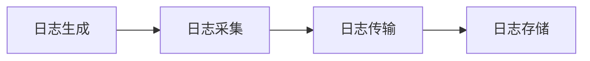
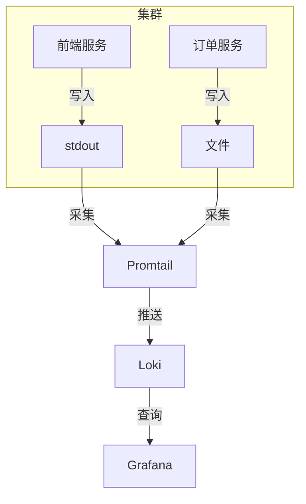

# 日志收集最佳实践

## 引言

日志收集是现代可观测性体系的核心环节，它如同系统的"黑匣子"，记录了应用程序、服务和基础设施的运行轨迹。有效的日志收集能帮助开发者快速定位问题、分析性能瓶颈，并为安全审计提供依据。本章将聚焦于日志收集的核心原则、工具选型以及与Grafana Loki集成的实用技巧。

## 基础概念

日志收集流程通常包含三个关键阶段：



1. **日志生成**：应用程序/系统产生原始日志
2. **日志采集**：通过代理(Agent)收集和预处理日志
3. **日志传输**：将日志发送到中央存储系统
4. **日志存储**：在日志平台中索引和持久化数据

## 核心原则

### 1. 结构化日志优先

始终优先使用结构化格式（如JSON），而非纯文本日志：

```json
// 不推荐
"Failed to connect to database"

// 推荐
{
  "level": "ERROR",
  "timestamp": "2023-07-20T14:32:11Z",
  "message": "Database connection failed",
  "service": "order-service",
  "error": "Connection timeout",
  "attempt": 3
}
```

:::tip
结构化日志能显著提升后续的查询和分析效率，特别是在Grafana Loki中通过标签(label)进行过滤时
:::

### 2. 合理的日志分级

采用标准日志级别体系：

| 级别    | 适用场景                          |
|---------|---------------------------------|
| DEBUG   | 开发调试详细信息                  |
| INFO    | 常规运行状态                      |
| WARNING | 非预期但可恢复的情况              |
| ERROR   | 需要立即关注的失败操作            |
| CRITICAL| 导致服务中断的严重错误            |

### 3. 有效的标签策略

在Loki中，标签(label)决定了日志的组织方式和查询性能：

```yaml
# promtail配置示例
scrape_configs:
  - job_name: nginx
    static_configs:
      - targets: [localhost]
        labels:
          job: nginx-access
          env: production
          __path__: /var/log/nginx/access.log
```

:::caution
避免使用高基数标签（如用户ID、会话ID），这会导致Loki性能下降
:::

## 技术实现

### 采集工具选型

| 工具       | 特点                          | 适用场景              |
|------------|-----------------------------|---------------------|
| Promtail   | 专为Loki优化，轻量级          | Kubernetes环境       |
| Fluentd    | 插件丰富，处理能力强           | 复杂数据处理管道      |
| Filebeat   | 资源占用低，Elastic生态友好    | 传统服务器环境        |

### 日志旋转配置示例

处理日志文件时的经典配置（以logrotate为例）：

```bash
# /etc/logrotate.d/nginx
/var/log/nginx/*.log {
    daily
    rotate 7
    compress
    delaycompress
    missingok
    notifempty
    create 0640 www-data adm
    sharedscripts
    postrotate
        invoke-rc.d nginx rotate >/dev/null 2>&1
    endscript
}
```

### 容器环境日志收集

Kubernetes中的DaemonSet部署示例（promtail）：

```yaml
# promtail-daemonset.yaml片段
containers:
- name: promtail
  image: grafana/promtail:2.8.0
  volumeMounts:
  - name: logs
    mountPath: /var/log
  - name: config
    mountPath: /etc/promtail
  args:
  - -config.file=/etc/promtail/promtail-config.yaml
```

## 真实案例：电商平台日志架构



**关键配置点**：
1. 前端服务直接输出JSON格式stdout
2. 有状态服务写入固定路径的日志文件
3. Promtail统一添加 `app=frontend`/`app=order` 标签
4. 在Grafana中按 `{app="order", level="ERROR"}` 查询错误日志

## 性能优化技巧

1. **批量发送**：配置客户端批量发送日志（Promtail示例）：

```yaml
client:
  batchwait: 1s
  batchsize: 102400
```

2. **压缩传输**：启用gzip压缩减少带宽使用

```yaml
clients:
  - url: http://loki:3100/loki/api/v1/push
    headers:
      Content-Type: application/json
    compression: gzip
```

3. **合理采样**：对DEBUG日志进行采样避免数据爆炸

```python
# Python日志采样示例
from logging.handlers import MemoryHandler

handler = MemoryHandler(
    capacity=100,
    flushLevel=logging.ERROR,
    target=real_handler
)
```

## 总结与进阶

通过本章学习，您应该掌握：
- 结构化日志的重要性和实现方式
- Loki标签策略的设计原则
- 不同环境下的日志采集方案
- 生产环境中的性能优化技巧

**推荐练习**：
1. 在本地部署Promtail，配置采集Nginx访问日志
2. 尝试为您的应用添加JSON格式日志输出
3. 在Grafana中创建基于日志标签的告警规则

**延伸阅读**：
- Loki官方文档《Label最佳实践》
- 《可观测性工程》- Charity Majors著
- CNCF日志白皮书