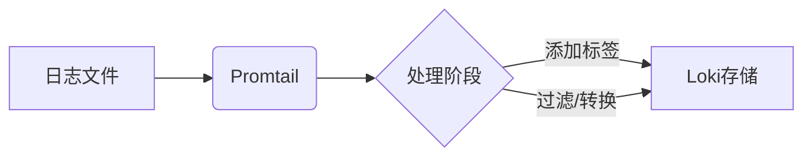

# Promtail日志收集

## 介绍

Promtail是Grafana Loki生态中的日志收集代理，专为将日志发送到Loki而设计。它轻量高效，支持从本地文件、系统日志（syslog）等多种来源收集日志，并添加标签（labels）以便在Loki中快速查询。对于初学者来说，理解Promtail的工作原理和配置方法是使用Loki进行日志管理的第一步。

:::note 核心功能
- **日志发现**：自动扫描指定目录中的日志文件<br />
- **标签添加**：为日志流附加元数据（如环境、应用名）<br />
- **管道处理**：在发送前对日志进行过滤或转换
:::

---

## 安装与运行

### 下载Promtail
从[Loki官方发布页](https://github.com/grafana/loki/releases)获取对应系统的二进制文件，或使用Docker镜像：
```bash
docker pull grafana/promtail:latest
```

### 基础启动命令
```bash
./promtail -config.file=promtail-config.yaml
```

---

## 配置详解

### 配置文件结构
典型的 `promtail-config.yaml` 包含以下部分：
```yaml
server:
  http_listen_port: 9080

positions:
  filename: /tmp/positions.yaml # 记录文件读取位置

clients:
  - url: http://localhost:3100/loki/api/v1/push # Loki 地址

scrape_configs:
  - job_name: system
    static_configs:
      - targets: [localhost]
        labels:
          job: varlogs
          __path__: /var/log/*.log
```

:::tip 关键字段说明
- `__path__`：支持通配符（如`/var/log/*.log`）<br />
- `labels`：添加的标签会出现在Loki查询中<br />
- `positions`：防止日志重复收集
:::

---

## 实际案例

### 案例1：收集Nginx日志
```yaml
scrape_configs:
  - job_name: nginx
    static_configs:
      - targets: [localhost]
        labels:
          job: nginx
          env: production
          __path__: /var/log/nginx/access.log
```

### 案例2：使用管道过滤敏感信息
```yaml
pipeline_stages:
  - match:
      selector: '{app="payment"}'
      stages:
        - regex:
            expression: '(?P<credit_card>\d{16})'
        - replace:
            replacement: '****-****-****-****'
```

---

## 高级功能

### 日志重标记（Relabeling）
通过`relabel_configs`动态修改标签：
```yaml
relabel_configs:
  - source_labels: [__meta_kubernetes_pod_name]
    target_label: pod
```

### 服务发现
支持Kubernetes、Docker等动态发现日志源：
```yaml
scrape_configs:
  - job_name: kubernetes
    kubernetes_sd_configs:
      - role: pod
    relabel_configs:
      # 将K8s元数据转为标签
      - action: labelmap
        regex: __meta_kubernetes_pod_label_(.+)
```



---

## 总结与练习

### 关键点回顾
1. Promtail通过`scrape_configs`定义日志收集规则<br />
2. 标签（labels）是Loki查询的核心维度<br />
3. 管道阶段（pipeline_stages）支持复杂日志处理

### 练习建议
1. 尝试收集本机的系统日志（`/var/log/syslog`）<br />
2. 为日志添加`hostname`标签<br />
3. 使用正则表达式隐藏日志中的邮箱地址

### 扩展阅读
- [官方配置文档](https://grafana.com/docs/loki/latest/clients/promtail/configuration/)
- [Promtail源码分析](https://github.com/grafana/loki/tree/main/clients/pkg/promtail)