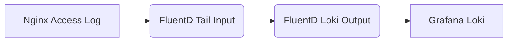

# FluentD与Loki集成

## 介绍

FluentD是一个开源的日志收集工具，支持多种输入和输出插件，能够灵活地处理日志数据流。Grafana Loki则是一个轻量级的日志聚合系统，专注于索引日志内容而非日志本身。通过将FluentD与Loki集成，您可以构建一个高效的日志管道，将分散的日志集中存储并支持快速查询。

本教程将逐步指导您完成FluentD与Loki的集成配置，并提供实际应用示例。

---

## 前置条件

在开始之前，请确保您已具备以下环境：
- 运行中的FluentD实例（版本>= v1.0）
- 已部署的Loki服务（版本>= 2.0）
- 基本的Linux命令行操作知识

---

## 配置FluentD输出到Loki

### 1. 安装FluentD Loki插件
首先需要安装 `fluent-plugin-grafana-loki` 插件：
```bash
fluent-gem install fluent-plugin-grafana-loki
```

### 2. 基本配置示例
编辑FluentD配置文件（通常位于 `/etc/fluent/fluent.conf`），添加以下Loki输出配置：

```xml
<match **>
  @type loki
  @id out_loki
  url "http://your-loki-address:3100"
  username "your_username" # 如果Loki需要认证
  password "your_password"
  <label>
    stream "fluentd"
  </label>
  <buffer>
    flush_interval 10s
  </buffer>
</match>
```

:::note
将 `http://your-loki-address:3100` 替换为您的Loki服务地址。如果Loki不需要认证，可以删除username和password字段。
:::

### 3. 标签配置说明
Loki使用标签（labels）来索引日志，在FluentD中可以通过 `<label>` 块定义：

```xml
<label>
  host "#{Socket.gethostname}"
  app "my_app"
  environment "production"
</label>
```

---

## 实际应用案例

### 场景：收集Nginx访问日志
假设我们需要收集Nginx的访问日志并发送到Loki：

```xml
<source>
  @type tail
  path /var/log/nginx/access.log
  pos_file /var/log/nginx/access.log.pos
  tag nginx.access
  <parse>
    @type nginx
  </parse>
</source>

<match nginx.access>
  @type loki
  url "http://loki:3100"
  <label>
    job "nginx"
    level "access"
  </label>
</match>
```

### 日志流示意图


---

## 高级配置技巧

### 1. 日志批量发送
通过调整buffer参数优化性能：
```xml
<buffer>
  flush_mode interval
  flush_interval 5s
  chunk_limit_size 1m
  queue_limit_length 32
</buffer>
```

### 2. 动态标签
使用record中的字段作为标签：
```xml
<label>
  app ${record["app"]}
  level ${record["level"]}
</label>
```

:::caution
避免使用高基数字段（如request_id）作为标签，这会导致Loki性能下降。
:::

---

## 验证与故障排除

### 检查FluentD日志
```bash
journalctl -u fluentd -f
```

### 测试Loki查询
在Grafana中尝试以下LogQL查询：
```logql
{job="nginx"} |= "GET"
```

---

## 总结

通过本教程，您已经学会了：
- 如何安装和配置FluentD的Loki输出插件
- 基本的标签配置方法
- 实际应用Nginx日志收集案例
- 性能优化和故障排除技巧

FluentD与Loki的集成为您提供了一个灵活且高效的日志管理解决方案。

---

## 延伸学习

1. [FluentD官方文档](https://docs.fluentd.org/)
2. [Loki LogQL文档](https://grafana.com/docs/loki/latest/logql/)
3. 练习：尝试配置FluentD收集Docker容器日志并发送到Loki