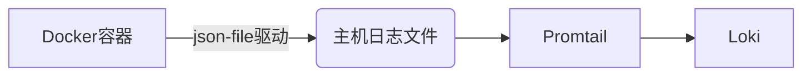

# Docker日志驱动

## 介绍

Docker日志驱动（Logging Driver）是Docker引擎的核心功能之一，它决定了容器日志的收集、存储和转发方式。默认情况下，Docker使用`json-file`驱动将日志存储在主机磁盘上，但在生产环境中，我们通常需要将日志集中管理或实时分析。通过配置不同的日志驱动，可以将容器日志直接发送到第三方系统（如Grafana Loki、ELK等）。

:::tip 为什么需要日志驱动？
- **集中管理**：跨多个容器的日志统一收集<br />
- **实时分析**：避免手动查看日志文件<br />
- **资源优化**：减少本地磁盘占用
:::

## 支持的日志驱动类型

Docker支持多种日志驱动，常见选项包括：

| 驱动名称       | 用途描述                     |
|----------------|-----------------------------|
| `json-file`    | 默认驱动，日志以JSON格式存储到文件 |
| `syslog`      | 发送日志到Syslog服务器        |
| `journald`    | 使用systemd的日志系统         |
| `gelf`        | 兼容Graylog的日志格式         |
| `fluentd`     | 转发日志到Fluentd服务         |
| `loki`        | 直接发送日志到Grafana Loki    |

## 配置日志驱动

### 全局配置
修改Docker守护进程配置文件`/etc/docker/daemon.json`（需重启Docker服务生效）：
```json
{
  "log-driver": "loki",
  "log-opts": {
    "loki-url": "http://localhost:3100/loki/api/v1/push",
    "loki-batch-size": "400"
  }
}
```

### 单容器配置
运行容器时通过`--log-driver`参数指定：
```bash
docker run --log-driver=loki \
  --log-opt loki-url="http://loki:3100/loki/api/v1/push" \
  nginx:alpine
```

### 验证配置
检查已运行容器的日志驱动：
```bash
docker inspect --format='{{.HostConfig.LogConfig.Type}}' 容器ID
```

## 与Grafana Loki集成

### 直接使用Loki驱动
Docker原生支持`loki`日志驱动，这是最轻量级的集成方案：
```bash
docker run --log-driver=loki \
  --log-opt loki-url="http://localhost:3100/loki/api/v1/push" \
  --log-opt loki-retries="5" \
  --log-opt loki-batch-wait="1s" \
  your-application
```

### 通过Promtail代理
如果无法直接使用Loki驱动，可以通过Promtail收集日志：


配置示例（Promtail）：
```yaml
scrape_configs:
- job_name: docker
  static_configs:
  - targets: [localhost]
    labels:
      job: dockerlogs
      __path__: /var/lib/docker/containers/*/*-json.log
```

## 实际案例：Nginx访问日志收集

### 步骤1：启动Nginx容器
```bash
docker run -d --name nginx-logs \
  --log-driver=loki \
  --log-opt loki-url="http://localhost:3100/loki/api/v1/push" \
  --log-opt loki-external-labels="container=nginx" \
  -p 8080:80 \
  nginx:alpine
```

### 步骤2：生成访问日志
```bash
curl http://localhost:8080
```

### 步骤3：在Grafana中查询
使用LogQL查询：
```logql
{container="nginx"} |= "GET"
```

## 常见问题解决

:::caution 注意事项
1. 日志量过大可能导致Loki压力增加，建议设置`loki-batch-size`<br />
2. 网络不稳定时配置`loki-retries`参数<br />
3. 标签数量过多会影响性能，避免使用动态标签
:::

## 总结

Docker日志驱动提供了灵活的日志管理方案，特别是与Grafana Loki集成后，可以实现：
- 实时日志监控
- 历史日志检索
- 基于标签的高效查询

## 扩展资源

1. [官方Docker日志驱动文档](https://docs.docker.com/config/containers/logging/configure/)
2. [Loki日志驱动GitHub仓库](https://github.com/moby/moby/tree/master/daemon/logger/loki)
3. 练习：尝试比较`json-file`驱动和`loki`驱动的磁盘占用差异