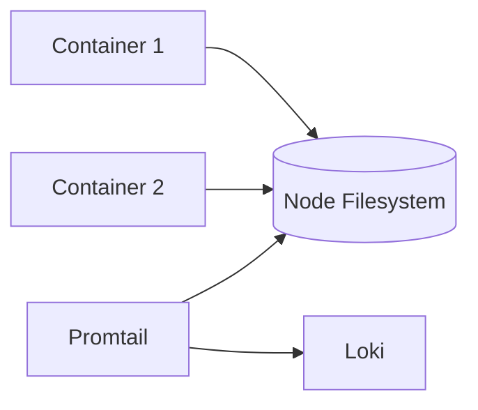

# Kubernetes日志收集

## 介绍

在Kubernetes集群中，日志是理解应用行为和排查问题的关键。由于容器是短暂且动态的，传统的日志收集方法不再适用。本章将介绍如何通过 **DaemonSet** 和 **Sidecar** 模式收集日志，并集成到Grafana Loki中。

:::note 核心概念
- **容器日志**：默认输出到`stdout`/`stderr`，由容器运行时捕获。
- **节点级收集**：通过每个节点上运行的代理（如Promtail）收集日志。
- **集中式存储**：日志最终发送到Loki等日志聚合系统。
:::

---

## 日志收集模式

### 1. DaemonSet模式
在每个Kubernetes节点部署一个日志代理（如Promtail），收集节点上所有容器的日志。



**配置示例**：
```yaml
# promtail-daemonset.yaml
apiVersion: apps/v1
kind: DaemonSet
metadata:
  name: promtail
spec:
  template:
    spec:
      containers:
      - name: promtail
        image: grafana/promtail:latest
        args:
        - -config.file=/etc/promtail/config.yaml
        volumeMounts:
        - name: logs
          mountPath: /var/log
        - name: config
          mountPath: /etc/promtail
      volumes:
      - name: logs
        hostPath:
          path: /var/log
      - name: config
        configMap:
          name: promtail-config
```

:::tip 适用场景
- 日志直接输出到`stdout`/`stderr`的容器。
- 需要低资源开销的场景。
:::

---

### 2. Sidecar模式
为每个Pod单独部署一个日志收集容器，适合需要处理文件日志的应用。

```yaml
# sidecar-example.yaml
apiVersion: v1
kind: Pod
metadata:
  name: myapp
spec:
  containers:
  - name: app
    image: myapp:latest
    volumeMounts:
    - name: logs
      mountPath: /app/logs
  - name: log-collector
    image: grafana/promtail:latest
    args:
    - -config.file=/etc/promtail/config.yaml
    volumeMounts:
    - name: logs
      mountPath: /app/logs
    - name: config
      mountPath: /etc/promtail
  volumes:
  - name: logs
    emptyDir: {}
  - name: config
    configMap:
      name: promtail-config
```

:::caution 注意
Sidecar模式会增加资源消耗，建议仅用于特殊需求（如处理应用特定日志文件）。
:::

---

## 实战案例：将日志发送到Loki

### 步骤1：配置Promtail
创建ConfigMap定义Loki连接：
```yaml
# promtail-config.yaml
apiVersion: v1
kind: ConfigMap
metadata:
  name: promtail-config
data:
  config.yaml: |
    clients:
    - url: http://loki:3100/loki/api/v1/push
    scrape_configs:
    - job_name: kubernetes
      kubernetes_sd_configs:
      - role: pod
      relabel_configs:
      - source_labels: [__meta_kubernetes_pod_node_name]
        target_label: node
```

### 步骤2：查询日志
在Grafana中通过LogQL查询：
```logql
{app="myapp"} |= "error"
```

**输出示例**：
```
2023-01-01T12:00:00Z {app="myapp"} ERROR: Failed to connect to database
```

---

## 总结

| 模式         | 优点                  | 缺点                  |
|--------------|-----------------------|-----------------------|
| DaemonSet    | 资源占用低，简单      | 无法处理文件日志      |
| Sidecar      | 灵活处理各类日志      | 资源消耗高            |

---

## 延伸学习
1. **练习**：在Minikube中部署一个应用，分别尝试两种日志收集模式。
2. **进阶**：探索Loki的日志过滤和报警功能。
3. **官方文档**：
   - [Loki Log Collection](https://grafana.com/docs/loki/latest/clients/promtail/)
   - [Kubernetes Logging Architecture](https://kubernetes.io/docs/concepts/cluster-administration/logging/)
``` 

注意：实际使用时需移除代码块外部的