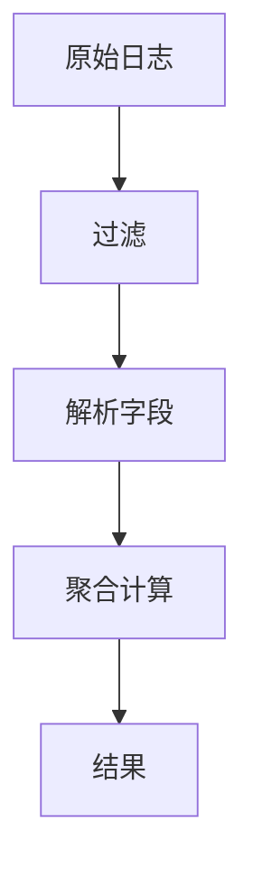

# LogQL查询性能优化

## 介绍

LogQL是Grafana Loki的查询语言，用于从日志数据中提取和分析信息。随着数据量增长，查询性能可能成为瓶颈。本指南将介绍如何通过优化LogQL查询来提升效率，减少响应时间，并降低系统负载。

## 基础优化原则

### 1. 缩小时间范围

始终为查询添加时间范围限制。未限定时间范围的查询会扫描全部日志数据，导致性能下降。

```logql
# 不推荐（无时间范围）
{job="nginx"} |= "error"

# 推荐（限定时间范围）
{job="nginx"} |= "error" [5m]
```

### 2. 使用标签过滤

标签是Loki中最有效的过滤方式，应优先使用标签缩小搜索范围：

```logql
# 不推荐（仅使用行过滤）
{namespace="production"} |= "connection timeout"

# 推荐（添加更多标签过滤）
{namespace="production", pod=~"frontend-.+"} |= "connection timeout"
```

### 3. 避免过度使用正则表达式

正则表达式会增加查询复杂度，尽量使用更简单的过滤方式：

```logql
# 不推荐（复杂正则）
{job="api"} |~ "(?i)error|fail|critical"

# 推荐（简单过滤组合）
{job="api"} |= "error" or |= "fail" or |= "critical"
```

## 高级优化技巧

### 1. 使用解析器提取字段

通过解析器提取结构化字段后，可以基于字段而非原始日志行进行过滤：

```logql
# 提取level字段后基于字段过滤
{job="app"} | logfmt | level = "error"
```

### 2. 合理使用聚合操作

聚合操作（如`sum`, `avg`）会显著增加查询负载，应谨慎使用：



```logql
# 优化聚合查询示例
{job="ingress"} 
  | json 
  | status >= 500 
  | rate() by (path) [5m]
```

### 3. 分阶段处理大数据集

对于大型查询，可以分阶段处理：

1. 先运行小范围测试查询
2. 确认结果正确后扩大时间范围
3. 使用`limit`子句控制返回结果数量

## 实际案例

### 案例1：高延迟API请求分析

**问题**：需要找出响应时间超过1秒的API请求

```logql
{job="api-server"} 
  | logfmt 
  | duration > 1s 
  | line_format "{{.method}} {{.path}} {{.duration}}"
  | limit 1000
```

### 案例2：错误率监控

**问题**：监控服务错误率并设置告警

```logql
sum(rate(
  {job="payment-service"} 
    | logfmt 
    | level = "error" [1m]
)) by (service)
/
sum(rate(
  {job="payment-service"}[1m]
)) by (service)
```

## 性能调优工具

Loki提供了查询分析工具帮助优化：

1. 使用`EXPLAIN`查看查询执行计划
2. 通过Grafana的"Query Inspector"分析查询耗时
3. 监控Loki的`/metrics`端点获取性能指标

## 总结

优化LogQL查询的核心原则：

- 尽可能早地过滤数据（通过标签和时间范围）
- 减少需要处理的数据量
- 避免不必要的复杂操作
- 分阶段处理大型查询

:::tip 练习建议
1. 对一个现有查询添加时间范围限制，比较性能差异
2. 尝试用标签替换部分行过滤器
3. 对聚合查询添加`by`子句，观察执行时间变化
:::

## 附加资源

- [官方LogQL文档](https://grafana.com/docs/loki/latest/logql/)
- [Loki性能调优指南](https://grafana.com/docs/loki/latest/operations/optimization/)
- [LogQL查询模式示例库](https://github.com/grafana/loki/tree/main/docs/sources/logql/examples)