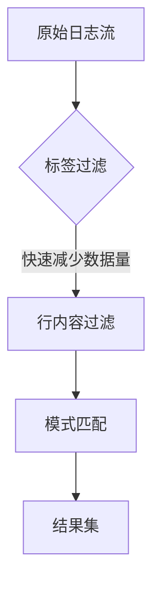

# LogQL日志过滤

## 介绍

LogQL是Grafana Loki专用的日志查询语言，其语法灵感来自PromQL。日志过滤是LogQL的核心功能之一，允许你从海量日志数据中快速提取关键信息。本文将带你逐步掌握LogQL的过滤语法，并通过实际案例展示如何解决真实场景中的问题。

## 基础过滤语法

最基本的过滤形式是通过**标签匹配**和**日志行内容匹配**：

```logql
{job="api-server"} |= "error"
```

这个查询会：
1. 先通过标签选择器 `{job="api-server"}` 筛选所有来自`api-server`任务的日志
2. 再用行过滤器 `|= "error"` 筛选包含"error"字符串的日志行

### 常用过滤操作符

| 操作符 | 说明                  | 示例                     |
|--------|---------------------|-------------------------|
| `|=`   | 包含字符串             | `|= "timeout"`          |
| `!=`   | 不包含字符串           | `!= "debug"`            |
| `|~`   | 匹配正则表达式         | `|~ "\\d{3}-\\d{4}"`    |
| `!~`   | 不匹配正则表达式       | `!~ "password=\\w+"`    |

:::tip 正则表达式提示
在LogQL中使用正则时，需要双重转义特殊字符。例如匹配IP地址应写为 `|~ "\\d+\\.\\d+\\.\\d+\\.\\d+"`
:::

## 多条件过滤

可以通过组合多个过滤条件实现复杂查询：

```logql
{namespace="production", pod=~"web-.*"} 
  |= "error" 
  != "connection timeout" 
  |~ "user_id=\\d+"
```

这个查询会筛选：
1. `production`命名空间下所有名称以`web-`开头的pod
2. 日志行包含"error"但不包含"connection timeout"
3. 且必须匹配用户ID数字模式

## 时间范围过滤

结合时间范围选择器可以进一步提高查询效率：

```logql
{container="app"} 
  |= "latency" 
  |~ "duration=[\\d\\.]+ms" 
  |~ "status_code=(5\\d\\d)" 
  | duration > 500ms
```

## 实际案例

### 案例1：监控错误率

```logql
sum(rate(
  {job="payment-service"} 
    |~ "level=(error|fatal)" 
    [5m]
)) 
by (service)
```

该查询计算`payment-service`中每个子服务在过去5分钟内的错误日志发生率。

### 案例2：敏感信息检测

```logql
{env="production"} 
  |~ "(password|token|api_key)=\\w+" 
  != "api_key=invalid"
```

用于检测生产环境中可能泄露的敏感凭证（排除已知的测试值）。

## 性能优化技巧

1. **优先使用标签过滤**：`{job="app"}` 比 `|= "app"` 高效得多
2. **合理使用正则**：简单字符串匹配 `|=` 比正则 `|~` 性能更好
3. **限制时间范围**：始终为查询添加合理的时间范围
4. **避免全文本搜索**：如必须，考虑使用 `!~` 排除已知噪音



## 总结

LogQL的过滤功能是Loki日志分析的基础，掌握它可以帮助你：
- 快速定位问题日志
- 构建有效的监控告警
- 执行安全审计
- 优化日志存储成本

## 延伸学习

1. 尝试编写查询来找出你的应用中所有HTTP 500错误
2. 设计一个查询来检测登录失败暴破攻击（连续多次失败登录）
3. 比较 `|= "error"` 和 `|~ "(?i)error"` 的性能差异

:::note 进阶提示
探索LogQL的`line_format`和`label_format`可以进一步处理过滤后的日志内容，我们将在后续章节详细介绍。
:::