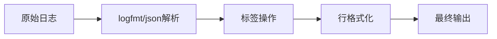

# LogQL格式化表达式

LogQL是Grafana Loki的查询语言，它不仅允许你过滤和搜索日志，还能通过**格式化表达式**对查询结果进行转换和美化。本文将详细介绍LogQL格式化表达式的语法、功能及实际应用。

## 什么是格式化表达式？

格式化表达式是LogQL中用于修改日志行输出的工具。它们通过管道符（`|`）附加在查询后，可以：
- 提取特定字段
- 重命名标签
- 转换数据格式
- 计算新值

基本语法结构：
```logql
{日志流选择器} | 格式化表达式
```

## 基础格式化操作

### 1. 字段提取 (`| json`)

从JSON格式的日志中提取字段：
```logql
{app="frontend"} | json
```
**输入日志**：
```json
{"level":"info","message":"User logged in","user_id":42}
```
**输出**：
```
level=info message="User logged in" user_id=42
```

:::tip
对于非标准JSON日志，可以用 `| logfmt` 提取键值对：
```logql
{app="nginx"} | logfmt
```
:::

### 2. 标签操作 (`| label_format`)

重命名或创建新标签：
```logql
{app="api"} | label_format new_userid=`user_id`
```
将 `user_id` 字段的值复制到新标签 `new_userid`

## 高级格式化功能

### 3. 行格式化 (`| line_format`)

完全自定义输出格式：
```logql
{app="payment"} | line_format "{{.user}} paid {{.amount}} USD at {{.timestamp}}"
```

### 4. 模板函数

使用Go模板函数进行复杂转换：
```logql
{app="auth"} | line_format "{{.message | toUpper}} ({{.duration | duration}})"
```

## 实际案例

### 案例1：Web服务器日志分析
```logql
{job="nginx"} 
  | logfmt 
  | line_format "{{.ip}} - {{.method}} {{.path}} → {{.status}}"
```

### 案例2：错误统计面板
```logql
{env="prod", level="error"} 
  | json 
  | label_format service=`app_name` 
  | line_format "ERROR in {{.service}}: {{.error_details}}"
```

## 可视化流程



## 总结

LogQL格式化表达式能帮助你：
- 从非结构化日志中提取结构化数据
- 创建更易读的日志输出
- 为可视化面板准备数据

## 下一步

尝试这些练习巩固知识：
1. 将JSON日志中的时间戳转换为可读格式
2. 组合多个字段创建复合错误消息
3. 使用 `label_format` 将IP地址转换为地理位置标签

:::note 扩展阅读
- [官方LogQL文档](https://grafana.com/docs/loki/latest/logql/)
- [Go模板函数手册](https://golang.org/pkg/text/template/)
:::