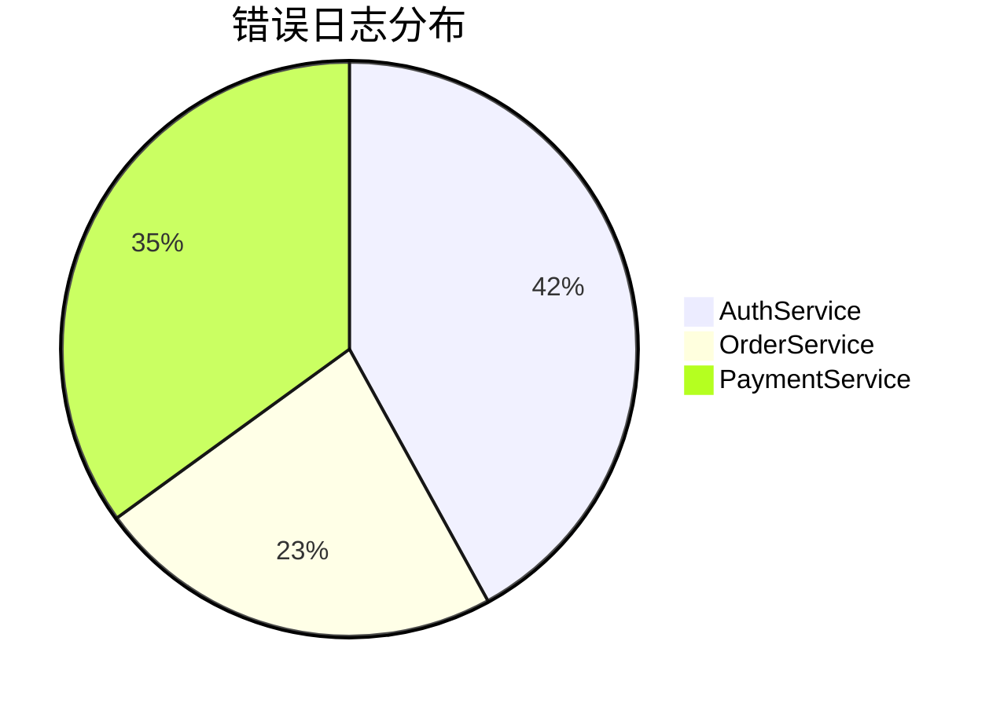

# LogQL聚合操作

## 介绍

LogQL是Grafana Loki的查询语言，其聚合操作允许你对日志流进行统计分析，类似于SQL中的GROUP BY和聚合函数。通过聚合操作，你可以从海量日志中提取有价值的指标信息，例如：

- 统计不同服务的错误日志数量
- 计算特定接口的请求延迟百分位
- 分析日志消息的频率分布

## 基础语法结构

LogQL聚合操作的基本语法如下：

```logql
<日志流选择器> | <解析器> | <聚合操作>
```

其中：
- **日志流选择器**：确定要查询哪些日志流
- **解析器**（可选）：从日志中提取标签或值
- **聚合操作**：对数据进行分组和计算

## 常用聚合函数

### 1. 计数统计

统计匹配日志条目的数量：

```logql
count_over_time({job="api-server"} |= "error" [5m])
```

这将返回5分钟内所有包含"error"的api-server日志条目数。

### 2. 求和计算

对提取的数值字段求和：

```logql
sum by (service) (
  rate({job="payment-service"} | logfmt | unwrap amount [1m])
)
```

此查询计算每分钟各服务的支付金额总和。

### 3. 平均值

计算日志字段的平均值：

```logql
avg by (host) (
  {job="nginx"} | logfmt | unwrap response_time [5m]
)
```

显示各主机5分钟内的平均响应时间。

### 4. 分位数统计

计算响应时间的百分位：

```logql
quantile by (endpoint) (
  0.95,
  {job="api-gateway"} | logfmt | unwrap latency [5m]
)
```

找出各API端点95%请求的延迟时间。

## 分组操作

使用`by`或`without`子句控制分组方式：

```logql
sum without(instance) (
  rate({job="order-service"} | logfmt | unwrap duration [5m])
)
```

此查询按除instance外的所有标签分组计算订单处理时长。

## 实际案例

### 案例1：错误率监控

```logql
sum by (service, level) (
  rate({namespace="production"} | json | level="error" [5m])
)
/
sum by (service) (
  rate({namespace="production"} | json [5m])
)
* 100
```

计算各服务错误日志占总日志的百分比。

### 案例2：API性能分析

```logql
histogram_quantile(0.99,
  sum by (le, route) (
    rate(
      {job="api-server"} 
      | logfmt 
      | unwrap duration 
      | __error__="" [5m]
    )
  )
)
```

计算各API路由99%请求的响应时间。

## 可视化聚合结果

使用Grafana可以直观展示聚合数据。例如，将以下查询结果可视化：



## 注意事项

:::caution 性能考虑
聚合操作可能消耗大量资源：
- 避免在大时间范围(如24h以上)进行复杂聚合
- 合理使用`[时间范围]`限制数据量
- 优先使用预定义的记录规则
:::

## 总结

LogQL聚合操作是日志分析的核心功能，通过本指南你学会了：
- 基本聚合函数的使用方法
- 如何通过`by`/`without`控制分组
- 实际业务场景中的应用技巧

## 延伸学习

1. 尝试编写查询统计你应用中最频繁的日志消息
2. 创建API响应时间的95分位监控
3. 比较不同版本服务的错误率差异

:::tip 进阶练习
组合使用`label_replace`和聚合操作，为结果添加更有意义的标签
:::