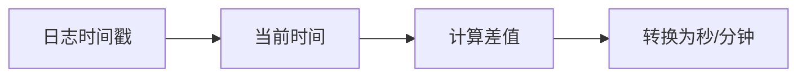

# LogQL时间函数

## 介绍
LogQL是Grafana Loki的查询语言，其时间函数允许你对日志条目中的时间戳进行操作和分析。这些函数能帮助你：
- 提取日志中的时间字段
- 转换时间格式
- 计算时间间隔
- 过滤特定时间范围的日志

对于监控和故障排查场景，时间函数是分析时间敏感型日志数据的关键工具。

## 基础时间函数

### 1. `timestamp()` 提取时间戳
从日志行中提取时间戳（Unix纳秒时间戳）：

```logql
{job="nginx"} | timestamp > now() - 1h
```

此查询返回最近1小时内所有nginx日志的时间戳。

### 2. `time()` 获取当前时间
返回查询执行时的当前时间（Unix纳秒时间戳）：

```logql
{job="mysql"} | time() - timestamp < 300000000000
```

找出时间戳与当前时间差小于5分钟（300秒）的MySQL日志。

:::tip 时间单位
LogQL中时间以纳秒为单位：
- 1秒 = 1,000,000,000纳秒
- 1分钟 = 60,000,000,000纳秒
:::

## 时间转换函数

### 3. `unpack` 解包结构化时间
当时间信息存储在JSON字段时：

```logql
{job="kafka"} | json | unpack | timestamp >= __timestamp__ 
```

解包JSON中的`__timestamp__`字段并与日志时间戳比较。

### 4. 时间格式转换
使用`strftime`将Unix时间戳转换为可读格式：

```logql
{job="frontend"} | strftime(timestamp, "%Y-%m-%d %H:%M:%S")
```

输出示例：
```
2023-07-15 14:30:45
```

## 时间区间计算

### 5. 相对时间范围
使用`now()`和持续时间计算相对时间：

```logql
{container="app"} | timestamp between (now()-15m, now())
```

获取最近15分钟的容器日志。

### 6. 持续时间计算
计算两个时间戳之间的持续时间：



```logql
{service="payment"} | (now() - timestamp) / 1e9 > 120
```

找出超过2分钟（120秒）未更新的支付服务日志。

## 实际应用案例

### 案例1：检测延迟日志
```logql
{app="order-service"} 
| json 
| latency = (__received__ - timestamp) / 1e6
| latency > 500
```

识别接收时间与日志时间戳差异超过500毫秒的订单服务日志。

### 案例2：按小时统计错误
```logql
{env="prod", level="error"} 
| strftime(timestamp, "%Y-%m-%d %H") as hour 
| rate() by (hour)
```

计算生产环境每小时错误日志的发生率。

## 总结

关键知识点回顾：
- `timestamp()` 提取日志时间戳
- `time()` 获取查询执行时间
- 时间算术运算（加减乘除）
- `strftime` 格式化时间输出
- 使用`now()`进行相对时间计算

:::warning 注意事项
1. Loki默认使用UTC时区
2. 时间戳比较时确保单位一致
3. 高精度时间计算可能影响查询性能
:::

## 扩展练习

1. 编写查询找出昨天发生的所有警告日志
2. 计算API服务的P99日志延迟
3. 创建一个按15分钟区间分组的错误率面板

推荐进一步学习：
- Loki官方文档的时间范围查询部分
- PromQL的时间操作函数（与LogQL有相似性）