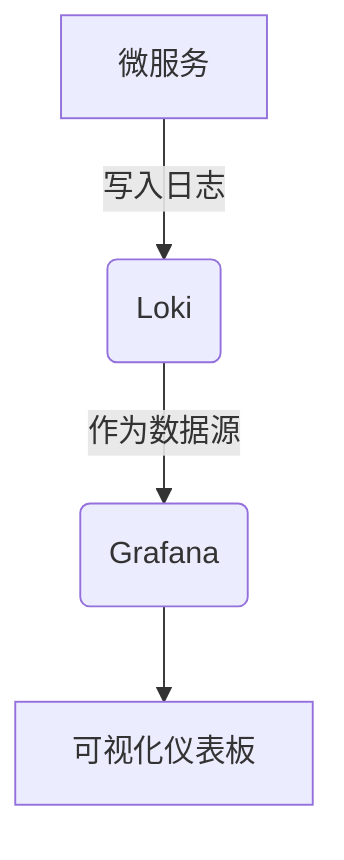

# Grafana数据源配置

## 介绍

Grafana是一个开源的监控与可视化平台，而Loki是Grafana Labs开发的日志聚合系统。通过将Loki配置为Grafana的数据源，您可以在Grafana中直接查询和可视化日志数据。本章将详细介绍如何完成这一配置过程。

## 前提条件

在开始之前，请确保您已具备以下条件：
- 已安装并运行Grafana实例（版本8.0或更高）
- 已部署Loki服务并知道其访问地址
- 拥有Grafana的管理员权限（用于添加数据源）

## 配置步骤

### 1. 打开数据源配置页面

登录Grafana后：
1. 点击左侧导航栏的"Configuration"（齿轮图标）
2. 选择"Data Sources"
3. 点击"Add data source"按钮

### 2. 选择Loki数据源类型

在数据源列表中找到"Loki"选项并点击它。您可以使用搜索框快速定位。

### 3. 填写基本配置

在配置页面中，需要填写以下关键信息：

```yaml
# 示例配置（仅用于说明，实际在UI中填写）
url: http://localhost:3100  # Loki 服务器地址
auth: 
  basicAuth: false          # 根据实际认证方式选择
```

主要字段说明：
- **Name**：数据源在Grafana中的显示名称（如"Production-Logs"）
- **URL**：Loki服务器的访问地址（如`http://localhost:3100`）
- **Auth**：认证方式（根据您的Loki配置选择）

:::tip
如果是生产环境，建议启用认证。常见的认证方式包括：
- Basic Auth
- OAuth2
- TLS客户端证书
:::

### 4. 高级配置（可选）

展开"Advanced Options"可以配置：
- **Maximum lines**：每次查询返回的最大日志行数
- **Timeout**：查询超时时间
- **Custom HTTP headers**：添加自定义请求头

```yaml
# 高级配置示例
httpHeaderName1: "X-Scope-OrgID"
httpHeaderValue1: "tenant1"
```

### 5. 保存与测试

1. 点击页面底部的"Save & Test"按钮
2. 如果配置正确，您将看到"Data source is working"的成功提示

## 实际应用案例

### 场景：监控微服务日志

假设您有一个微服务架构，使用Loki收集各服务的日志。配置完成后：

1. 在Grafana中创建新仪表板
2. 添加"Logs"面板
3. 在查询编辑器中选择Loki数据源
4. 输入LogQL查询语句，如：
   ```logql
   {container="api-service"} |= "error"
   ```
5. 查看实时错误日志



## 常见问题解决

:::caution
如果遇到连接问题，请检查：
1. Loki服务是否正在运行
2. 网络连接是否通畅（尝试`curl http://loki-address:3100/ready`）
3. 认证信息是否正确
:::

## 总结

通过本章学习，您已经掌握了：
- Loki数据源的基本配置方法
- 高级配置选项的作用
- 实际应用场景的实现步骤

配置完成后，您可以在Grafana中使用强大的LogQL查询语言分析日志，并创建丰富的可视化仪表板。

## 扩展练习

1. 尝试配置多个Loki数据源（如开发/生产环境）
2. 创建一个仪表板，同时展示来自Prometheus的指标数据和Loki的日志数据
3. 探索Grafana的"Explore"功能，使用LogQL进行即席查询

## 附加资源

- [官方文档：Grafana Loki数据源配置](https://grafana.com/docs/grafana/latest/datasources/loki/)
- [LogQL查询语言参考](https://grafana.com/docs/loki/latest/logql/)
- [Grafana数据源管理API](https://grafana.com/docs/grafana/latest/http_api/data_source/)