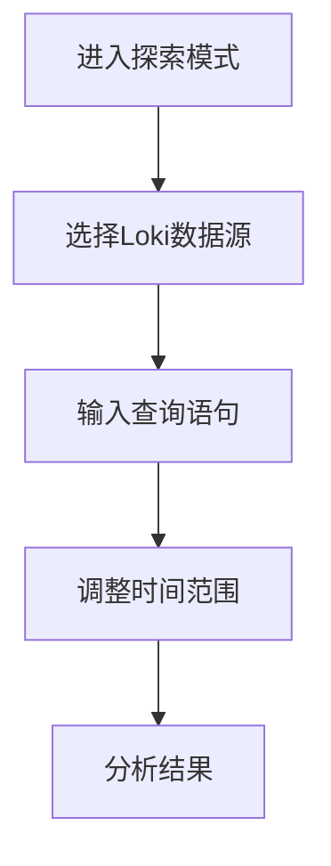
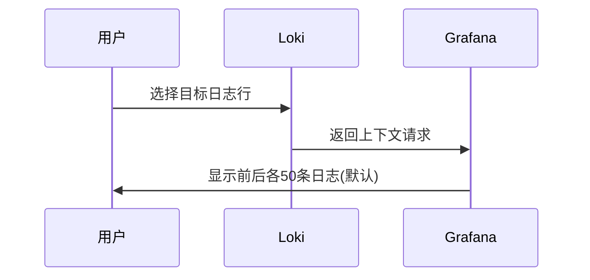

# Grafana探索模式

## 介绍

Grafana的**探索模式**是一个专门为日志和指标数据交互式探索设计的工具界面。当与Loki（Grafana Labs的日志聚合系统）结合使用时，它允许用户快速查询、过滤和分析日志数据，而无需预先创建仪表盘。对于初学者来说，这是理解日志数据模式和排查问题的理想起点。

探索模式的核心优势：
- 实时查询和结果预览
- 无需保存即可测试查询
- 直观的日志上下文浏览
- 与Grafana变量和模板的无缝集成

## 基础操作

### 1. 进入探索模式
在Grafana侧边栏点击**探索**图标（指南针形状），或通过URL路径 `/explore` 访问。

### 2. 数据源选择
在顶部选择 **Loki** 作为数据源。如果未显示，需先在Grafana中[配置Loki数据源](https://grafana.com/docs/grafana/latest/datasources/loki/)。



### 3. 基本查询语法
Loki使用LogQL查询语言。尝试以下基础查询：

```logql
{job="myapp"} |= "error"
```

:::note 说明
- `{job="myapp"}` 是日志流选择器
- `|= "error"` 是过滤表达式，匹配包含"error"的日志行
:::

## 高级功能

### 1. 日志上下文查看
在查询结果中点击任意日志行，选择 **Show context** 可以查看该日志前后相关条目：



### 2. 时间范围控制
使用右上角的时间选择器：
- 快速预设（如"Last 1 hour"）
- 绝对时间范围
- 自动刷新间隔

:::tip 实践建议
排查问题时，先使用较大时间范围定位问题时段，再缩小范围进行详细分析。
:::

### 3. 日志标签操作
点击查询字段旁的 **标签浏览器** 按钮，可以：
- 查看现有标签键/值
- 自动补全标签名称
- 通过点击添加过滤条件

## 实际案例

### 案例1：Web应用错误分析
**场景**：Nginx访问日志中出现500错误激增

1. 初始查询：
```logql
{job="nginx"} | json | status >= 500
```

2. 按路径统计错误：
```logql
sum by(path) (
  rate(
    {job="nginx"} | json | status >= 500 [5m]
  )
)
```

3. 下钻分析特定路径：
```logql
{job="nginx"} | json | status = 500 | path = "/api/v1/user"
```

### 案例2：分布式系统追踪
**场景**：追踪跨服务的请求流

```logql
{job=~"service.*"} |= "traceID=abc123"
```

使用Grafana的**Split View**功能同时查看多个服务的相关日志。

## 总结

Grafana探索模式是Loki日志分析的核心界面，通过本指南你已学习到：
- 基础查询构建方法
- 上下文关联分析技巧
- 时间范围和标签的高效使用
- 实际问题的解决流程

## 延伸学习

### 推荐练习
1. 尝试组合多个过滤条件（如 `|= "error" != "timeout"`）
2. 测试不同的时间范围对查询性能的影响
3. 练习使用LogQL的聚合运算符（如 `rate`, `count_over_time`）

:::caution 注意
探索模式的查询结果默认不会持久化。重要查询需通过 **Save to dashboard** 按钮保存到仪表盘。
:::