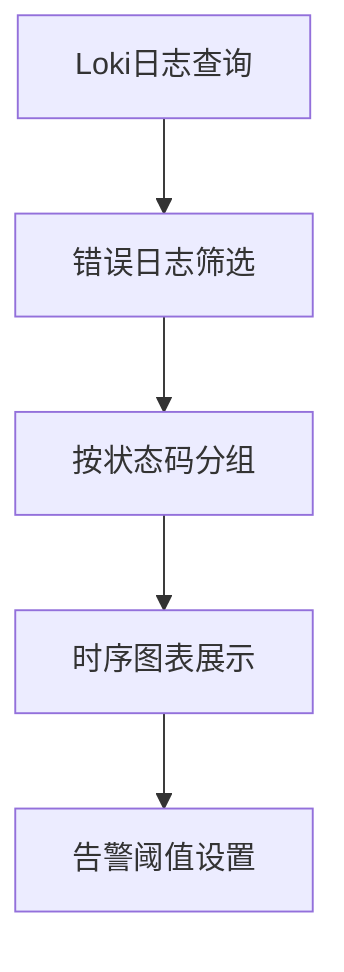

# Grafana可视化技巧

Grafana是Loki日志系统的默认可视化工具，能够将日志数据转化为直观的图表和仪表板。本章将介绍如何通过Grafana高效展示Loki数据，涵盖基础配置到高级技巧。

## 1. 基础面板配置

### 1.1 添加Loki数据源
在Grafana中连接Loki数据源是第一步：
1. 导航到 **Configuration > Data Sources**  
2. 点击 **Add data source**，选择 **Loki**  
3. 填写Loki服务器URL（如 `http://localhost:3100`）

:::tip
使用 `Basic Auth` 选项时，建议通过环境变量管理凭证而非硬编码。
:::

### 1.2 创建第一个查询
在面板中使用LogQL查询日志：
```plaintext
{container="nginx"} |= "error"
```
输出效果：
- 原始日志列表
- 时间分布直方图（通过 **Visualization > Time series** 切换）

## 2. 高级可视化技巧

### 2.1 使用模板变量实现动态过滤
在仪表板设置中定义变量：
```plaintext
# 变量名称：container
# 数据源：Loki
Query: label_values(container)
```
然后在查询中引用：
```plaintext
{container="$container"} |= "$search_term"
```

### 2.2 日志上下文关联
通过派生字段将日志链接到相关仪表板：
```json
// 在面板JSON配置中添加
"fieldConfig": {
  "overrides": [{
    "matcher": { "id": "byName", "options": "trace_id" },
    "properties": [{
      "id": "links",
      "value": {
        "title": "查看追踪",
        "url": "/explore?orgId=1&left=${__url_time_range}&query=tempo_trace_id=${__value.raw}"
      }
    }]
  }]
}
```

## 3. 实战案例：错误监控仪表板

### 场景描述
监控Nginx容器的5xx错误率，并与Prometheus指标关联。



**实现步骤：**
1. 创建混合数据源面板
2. Loki查询：
   ```plaintext
   sum(rate({container="nginx"} |~ "HTTP/1.1\" [5..9][0-9]{2}" [1m])) by (status_code)
   ```
3. Prometheus查询补充QPS指标：
   ```plaintext
   rate(nginx_http_requests_total[1m])
   ```

## 4. 性能优化技巧

- **查询加速**：使用 `| logfmt` 解析结构化日志
- **采样展示**：大数据集时启用 `Live tailing` 模式
- **缓存配置**：调整Grafana的 `[dataproxy]` 设置

:::caution
避免在单个面板中使用超过5个LogQL查询，可能影响渲染性能。
:::

## 总结与练习

### 关键知识点
- 动态变量实现交互式过滤
- 多数据源关联分析
- 日志字段的深度链接

### 拓展练习
1. 创建一个显示不同命名空间错误率的条形图
2. 实现点击日志条目跳转到对应Kubernetes Pod的仪表板
3. 使用`$__interval`变量优化采样频率

### 附加资源
- [Grafana官方文档](https://grafana.com/docs/)
- [LogQL语法参考](https://grafana.com/docs/loki/latest/logql/)