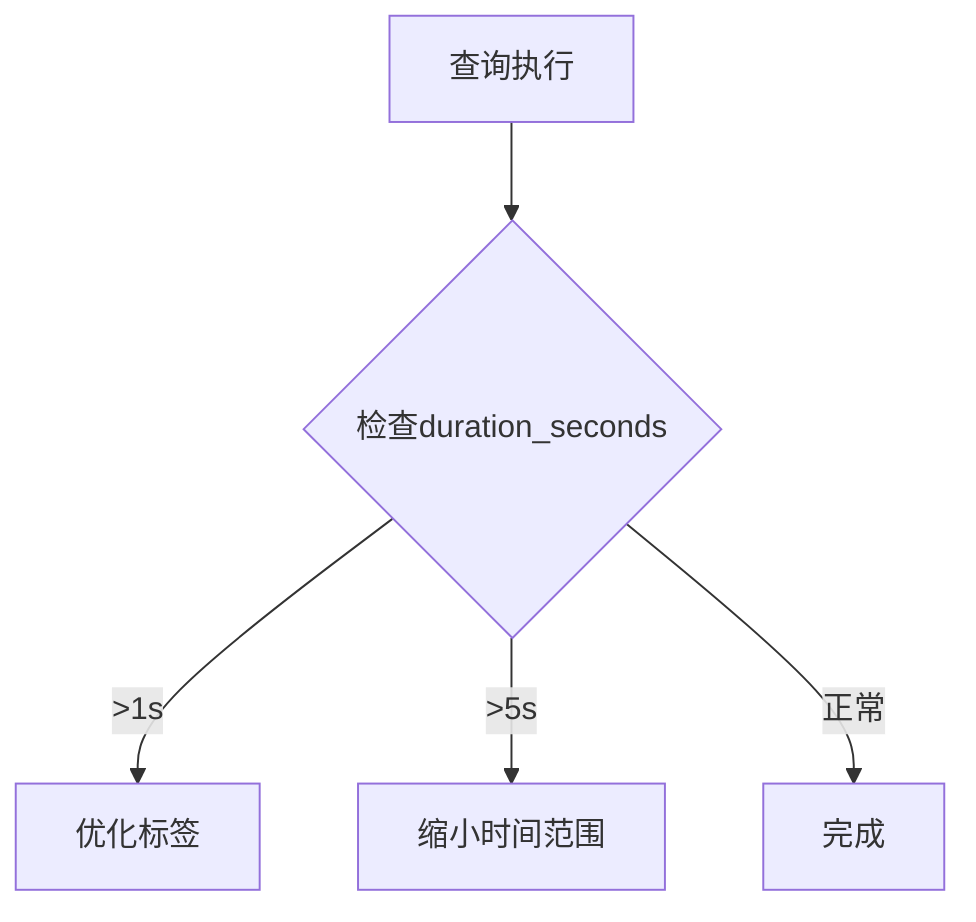

# Grafana查询优化

## 介绍

在Grafana中使用Loki进行日志查询时，高效的查询方式能显著提升响应速度并减少资源消耗。本指南将介绍关键优化技术，包括查询语法优化、时间范围控制、标签过滤等，帮助初学者构建高性能查询。

## 基础优化策略

### 1. 合理使用标签过滤

Loki通过标签索引加速查询，优先过滤高基数标签（如`job`、`namespace`）：

```logql
{cluster="prod", namespace="frontend"} |= "error"
```

优于：
```logql
|= "error" | cluster="prod" | namespace="frontend"
```

:::tip
标签过滤应放在LogQL语句最前面，减少后续处理的数据量。
:::

### 2. 控制时间范围

避免无限制的时间范围查询：

```logql
{job="api"} |= "timeout" [15m]  # 推荐明确范围
```

优于：
```logql
{job="api"} |= "timeout"  # 默认可能扫描所有历史数据
```

## 高级优化技巧

### 3. 使用解析器提取字段

通过`pattern`或`logfmt`解析器提取结构化字段：

```logql
{container="app"} | logfmt | latency > 500ms
```

### 4. 分页查询大数据集

使用`limit`和`offset`分页：

```logql
{service="payment"} | json | limit 100 offset 200
```

### 5. 避免正则表达式滥用

简单字符串匹配比正则更高效：

```logql
{app="auth"} |= "failed login"
```

优于：
```logql
{app="auth"} |~ "failed login"
```

## 实际案例

### 场景：优化API错误分析

**原始查询（低效）:**
```logql
|= "error" | json | status_code=500 | duration > 2s
```

**优化后查询:**
```logql
{app="api", env="prod"} | json status_code="500", duration > 2s
```

:::note
优化后查询：
1. 先通过标签缩小范围
2. 直接解析所需字段
3. 避免多余的数据传输
:::

## 性能监控

使用Grafana内置指标监控查询性能：



## 总结

关键优化原则：
1. **先过滤后处理**：优先使用标签缩小数据集
2. **精确时间范围**：避免全量扫描
3. **利用解析器**：减少传输数据量
4. **监控调整**：持续观察查询性能

## 延伸练习

1. 找出你项目中耗时最长的3个查询，尝试用标签优化
2. 对比`|=`和`|~`在相同查询中的性能差异
3. 为高频查询创建Grafana变量模板

## 附加资源

- [Loki官方查询优化指南](https://grafana.com/docs/loki/latest/query-optimization/)
- [LogQL语法参考](https://grafana.com/docs/loki/latest/logql/)