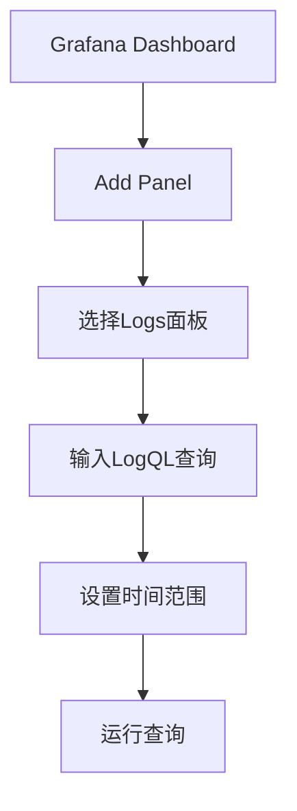

# Grafana日志查询

## 介绍

Grafana Loki是一个开源的日志聚合系统，专为云原生环境设计。它与Grafana深度集成，允许用户通过熟悉的Grafana界面查询和分析日志数据。本章将介绍如何在Grafana中使用Loki进行日志查询，涵盖基础语法、常用操作和实际案例。

## 基础查询语法

Loki使用LogQL（Log Query Language）进行日志查询。LogQL类似于PromQL（Prometheus查询语言），但专为日志设计。以下是一个简单的LogQL查询示例：

```plaintext
{app="nginx"} |= "error"
```

- `{app="nginx"}`：标签匹配器，筛选标签`app`值为`nginx`的日志流。
- `|= "error"`：日志行过滤器，筛选包含`error`的日志行。

### 查询结果示例

假设原始日志如下：
```plaintext
2023-10-01T12:00:00Z [info] Request received from 192.168.1.1
2023-10-01T12:00:01Z [error] Failed to connect to database
2023-10-01T12:00:02Z [info] Request processed successfully
```

查询结果将仅返回：
```plaintext
2023-10-01T12:00:01Z [error] Failed to connect to database
```

## 常用查询操作

### 1. 标签过滤
使用标签可以快速缩小查询范围。例如：
```plaintext
{app="nginx", env="production"}
```

### 2. 行内容过滤
- `|= "text"`：包含`text`的行。
- `!= "text"`：不包含`text`的行。
- `|~ "regex"`：匹配正则表达式`regex`的行。
- `!~ "regex"`：不匹配正则表达式`regex`的行。

### 3. 时间范围查询
在Grafana中，可以通过时间选择器指定查询的时间范围，例如：
```plaintext
{app="nginx"} |= "error" [5m]
```

### 4. 聚合操作
LogQL支持聚合操作，例如计算错误日志的数量：
```plaintext
count_over_time({app="nginx"} |= "error" [5m])
```

## 实际案例

### 案例1：监控Nginx错误日志
假设需要监控生产环境Nginx服务的错误日志，可以设置以下查询：
```plaintext
{app="nginx", env="production"} |= "error" | json
```
:::tip
使用`| json`可以自动解析JSON格式的日志字段，便于后续分析。
:::

### 案例2：分析高延迟请求
以下查询筛选响应时间超过1秒的请求：
```plaintext
{app="api"} |~ "latency=[1-9][0-9]{3,}ms"
```

## 可视化日志数据

在Grafana中，可以将日志查询结果以表格或图形形式展示。例如：
1. 创建一个新的Dashboard。
2. 添加一个"Logs"面板。
3. 输入LogQL查询并设置时间范围。



## 总结

- Grafana Loki通过LogQL提供了强大的日志查询能力。
- 标签过滤和行内容过滤是基础操作。
- 聚合操作和时间范围查询支持更复杂的分析需求。
- 结合Grafana的可视化功能，可以轻松监控和分析日志数据。

## 附加资源

1. [Loki官方文档](https://grafana.com/docs/loki/latest/)
2. [LogQL语法参考](https://grafana.com/docs/loki/latest/logql/)
3. 练习：尝试在Grafana中创建一个Dashboard，监控你的应用日志中的错误信息。