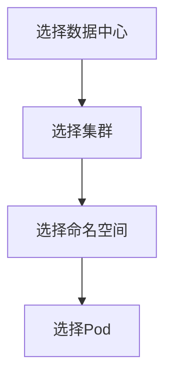

# Grafana模板变量

## 介绍

Grafana模板变量(Template Variables)是创建动态和交互式仪表板的关键功能。它们允许你定义可重用的变量，这些变量可以作为查询参数、面板标题或其他配置选项的值。当与Loki数据源结合使用时，模板变量能让你快速过滤日志流，实现高效的日志分析。

:::tip 为什么使用模板变量？
- 避免硬编码值，使仪表板更灵活
- 允许用户通过下拉菜单动态更改显示的数据
- 创建可重用的仪表板模板
- 实现跨面板的联动过滤
:::

## 基本概念

### 变量类型

Grafana支持多种变量类型：

1. **查询变量(Query)**：从数据源查询中获取值（如从Loki获取标签值）
2. **自定义变量(Custom)**：手动定义的值列表
3. **常量变量(Constant)**：固定值，可在多处引用
4. **区间变量(Interval)**：定义自动刷新的时间间隔
5. **数据源变量(Datasource)**：切换不同数据源
6. **全局变量(Global)**：可在多个仪表板间共享

### 变量语法

在Grafana中使用变量时，需要用特定语法包裹变量名：

- 标准语法：`${var_name}`
- 带默认值：`${var_name:default_value}`
- 多值变量：`${var_name|pipe-joined}`

## 创建变量

### 步骤1：访问变量配置

1. 打开仪表板设置
2. 选择"Variables"选项卡
3. 点击"Add variable"按钮

### 步骤2：配置查询变量

以下是一个从Loki获取标签值的变量配置示例：

```plaintext
Name: namespace
Type: Query
Data source: Loki
Query: label_values(namespace)
Refresh: On Dashboard Load
Multi-value: Enabled
Include All option: Enabled
```

### 步骤3：在面板中使用变量

在Loki查询中使用变量过滤日志：

```plaintext
{namespace="$namespace"} |= "error"
```

## 实际案例

### 案例1：多级下拉过滤

创建两个关联变量，实现先选择命名空间，再选择该命名空间下的pod：

1. 命名空间变量：
```plaintext
Name: namespace
Query: label_values(namespace)
```

2. Pod变量（依赖namespace变量）：
```plaintext
Name: pod
Query: label_values({namespace="$namespace"}, pod)
```

### 案例2：时间范围变量

创建动态时间范围选择器：

```plaintext
Name: time_range
Type: Custom
Values: 1h,6h,12h,24h,7d,30d
Default: 1h
```

然后在查询中使用：
```plaintext
sum(rate({job="myapp"}[$time_range])) by (level)
```

## 高级技巧

### 变量格式化

使用正则表达式格式化变量值：

```plaintext
Regex: /.*cluster=(.*?),.*/
```

### 嵌套变量



### 全局变量

在仪表板间共享变量：
1. 将变量标记为全局
2. 在其他仪表板中使用相同的变量名

## 常见问题

:::caution 变量不更新？
- 检查变量刷新设置
- 确保数据源连接正常
- 验证查询语法是否正确
:::

:::warning 性能问题
- 避免返回过多值（超过1000个）
- 对大型数据集考虑使用"Contains"过滤器
:::

## 总结

Grafana模板变量极大地增强了仪表板的交互性和重用性。通过将Loki的标签系统与模板变量结合，你可以构建强大的日志分析工具，使团队能够快速定位和解决问题。

## 练习与资源

**练习建议**：
1. 创建一个包含命名空间和pod两级下拉的仪表板
2. 实现一个可以动态切换时间范围的CPU使用率面板
3. 尝试使用变量修改面板标题

**进一步学习**：
- Grafana官方文档：模板变量
- Loki标签查询最佳实践
- 高级变量插值技巧