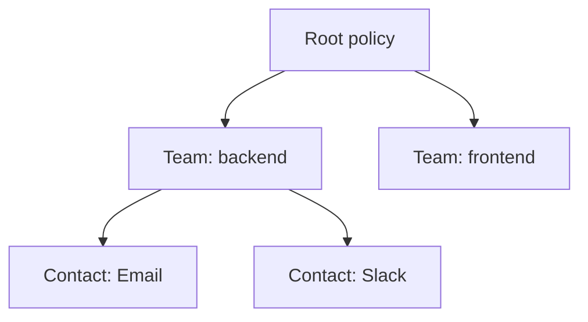

# Grafana告警配置

## 介绍

Grafana告警功能允许您基于数据源（如Loki）的查询结果设置规则，当条件满足时触发通知。通过告警配置，您可以实时监控日志中的异常模式（如错误激增、关键词匹配等），并通过邮件、Slack或Webhook等渠道接收告警。

:::note
告警配置需要Grafana 8.0+版本，并确保已正确配置Loki数据源。
:::

## 基础概念

### 告警规则组成
1. **条件（Condition）**：定义触发告警的逻辑（如 `count_over_time({job="myapp"} |= "error" [5m]) > 10`）
2. **评估间隔（Evaluate every）**：规则检查频率（如 `1m`）
3. **告警标签（Labels）**：附加到告警的元数据（如 `severity="critical"`）
4. **通知策略（Notification policy）**：决定告警路由到哪个通知渠道

## 配置步骤

### 1. 创建告警规则
在Grafana左侧菜单选择 **Alerting > Alert rules**，点击 **New alert rule**：

```yaml
# 示例：基于Loki的错误日志告警
- name: HighErrorRate
  query: |
    sum(count_over_time({job="myapp"} |= "error" [5m]))
  condition: "> 10"
  for: "5m"
  labels:
    severity: critical
  annotations:
    summary: "High error rate detected in {{ $labels.job }}"
```

### 2. 设置通知策略
进入 **Alerting > Notification policies**，配置路由和通知渠道：



### 3. 测试告警
使用Grafana的 **Explore** 界面验证Loki查询，确保能正确返回目标数据：

```sql
-- 测试查询：统计5分钟内错误日志
count_over_time({job="myapp"} |= "error" [5m])
```

## 实际案例

### 场景：监控Web应用错误日志
1. **目标**：当`/checkout`接口错误率超过5%时触发告警
2. **配置**：

```yaml
- name: CheckoutErrorRate
  query: |
    # 计算错误率
    sum(rate({job="webapp"} |~ "POST /checkout.*status=5.." [5m]))
    /
    sum(rate({job="webapp"} |~ "POST /checkout" [5m]))
  condition: "> 0.05"
  annotations:
    description: "Checkout error rate is {{ $value }}"
```

:::tip
使用 `rate()` 函数避免绝对计数带来的误报，特别适合流量波动大的场景。
:::

## 高级技巧

### 告警分组
通过标签分组，避免相似告警的重复通知：

```yaml
route:
  group_by: ['alertname', 'cluster']
  group_wait: 30s
  group_interval: 5m
```

### 静默规则
临时关闭特定告警（如计划维护期间）：

```bash
# 通过匹配标签静默
grafana-cli alerts silence --match="service=payment" --duration=2h
```

## 总结

Grafana告警配置的核心流程：
1. 编写有效的Loki日志查询
2. 定义合理的阈值条件
3. 配置通知策略和渠道
4. 通过标签管理告警生命周期

## 延伸学习

- [官方文档：Grafana Alerting](https://grafana.com/docs/grafana/latest/alerting/)
- 练习：为您的应用创建一个"登录失败次数突增"告警规则
- 进阶：尝试将告警与Grafana OnCall集成实现电话通知