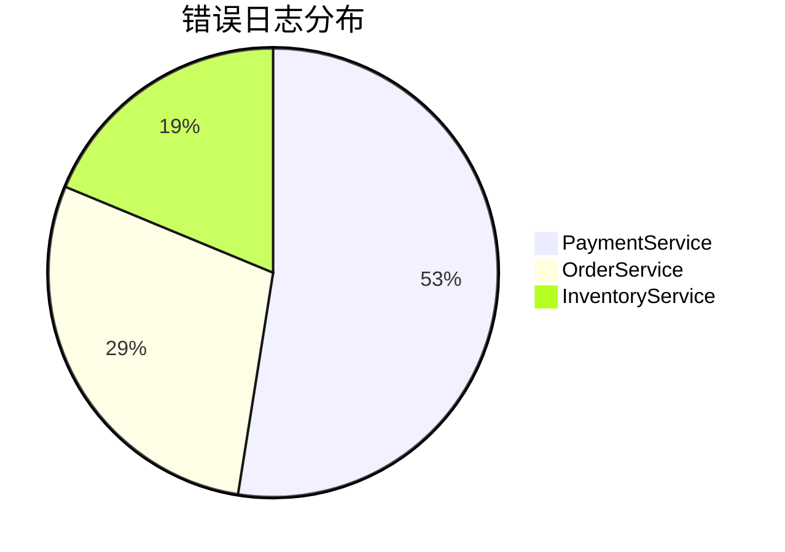

# Grafana与Loki集成最佳实践

## 介绍

Grafana和Loki是云原生日志监控的黄金组合。Grafana提供强大的可视化能力，而Loki作为日志聚合系统，专为高效率和低成本设计。两者的集成可以帮助开发者快速定位问题、分析趋势，并实现高效的日志管理。

在本章节中，你将学习：
- 如何配置Grafana连接Loki数据源
- 使用LogQL查询日志数据
- 优化查询性能的最佳实践
- 真实场景中的集成案例

---

## 配置Grafana连接Loki

### 1. 添加Loki数据源
在Grafana界面中，通过以下步骤添加Loki数据源：
1. 导航至 **Configuration > Data Sources**
2. 点击 **Add data source**，选择 **Loki**
3. 填写Loki服务器URL（例如 `http://localhost:3100`）
4. 保存并测试连接

:::tip
如果Loki需要认证，在 **Auth** 选项卡中配置Basic Auth或Bearer Token。
:::

### 2. 验证连接
成功添加后，在Grafana Explore界面选择Loki数据源，尝试简单查询：
```logql
{job="myapp"}
```
如果返回日志条目，说明配置成功。

---

## LogQL基础查询

Loki使用LogQL（类似PromQL的查询语言）进行日志检索。以下是常用模式：

### 1. 标签过滤
```logql
{namespace="production", level="error"}
```
返回 `production` 命名空间下所有错误级别的日志。

### 2. 文本搜索
```logql
{app="frontend"} |= "Timeout"
```
查找 `frontend` 应用中包含 "Timeout" 的日志行。

### 3. 聚合统计
```logql
count_over_time(
  {service="api"}[5m]
)
```
统计 `api` 服务过去5分钟的日志条目数。

---

## 性能优化实践

### 1. 合理使用标签
Loki通过标签索引日志，遵循这些原则：
- 避免高基数标签（如`user_id`）
- 使用静态标签（如`environment`、`app`）

:::caution
错误示例（高基数）：
```logql
{user_email="user@example.com"}  # 不推荐！
```
:::

### 2. 时间范围限制
始终指定时间范围以避免全量扫描：
```logql
{cluster="aws"} |~ "error" [15m]
```

### 3. 并行查询
对大时间范围查询，分割成多个小范围并行执行：
```logql
sum by (level) (
  count_over_time(
    {app="backend"}[1h]
  )
)
```

---

## 实际应用案例

### 场景：电商平台错误追踪
1. **配置告警**：当错误日志突增时触发通知
```logql
sum by (service) (
  rate(
    {env="prod", level="error"}[5m]
  )
) > 10
```
2. **可视化**：创建Dashboard展示错误趋势


---

## 总结与资源

### 关键要点
- Loki通过标签索引实现高效日志存储
- Grafana提供强大的查询和可视化能力
- 避免高基数标签是性能优化的核心

### 扩展练习
1. 尝试创建一个展示不同服务错误率的Dashboard
2. 设置当某个服务的错误率超过阈值时触发告警

### 推荐资源
- [Loki官方文档](https://grafana.com/docs/loki/latest/)
- [LogQL查询参考](https://grafana.com/docs/loki/latest/logql/)
- [Grafana告警配置指南](https://grafana.com/docs/grafana/latest/alerting/)