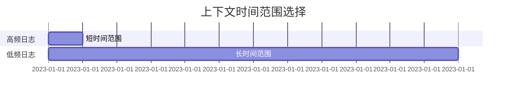

# Grafana日志上下文查看

## 介绍

在日志分析中，单独查看一条日志往往难以理解其完整背景。Grafana与Loki集成的**日志上下文查看**功能允许您快速探索某条日志前后的相关事件，帮助您理解应用程序或系统的完整行为。本指南将介绍如何通过Grafana界面高效使用这一功能。

## 基础概念

1. **日志上下文**：指目标日志条目附近的其他日志（通常包括前驱和后继日志）。
2. **Loki的查询范围**：默认情况下，Loki会返回与查询匹配的日志行，而上下文查看会扩展这个范围。

:::note
上下文查看功能需要Loki 2.3+版本支持，且依赖`/loki/api/v1/query_range`端点。
:::

## 操作步骤

### 1. 定位目标日志
在Grafana的Explore界面中：
1. 选择Loki数据源
2. 输入基础查询（如 `{job="myapp"} |= "error"`）
3. 从结果列表中点击目标日志行右侧的 **Show context** 按钮

### 2. 配置上下文参数
弹出的对话框会要求设置：
```plaintext
- 方向：向前/向后查看
- 行数限制：默认50行
- 时间范围：自动根据日志间隔计算
```

### 3. 分析上下文结果
结果将以目标日志为中心显示，并用特殊标记区分：
```plaintext
2023-01-01 12:00:01 [INFO] 收到用户请求 id=123  ← 前驱日志
2023-01-01 12:00:02 [ERROR] 数据库连接失败       ← 目标日志（高亮显示）
2023-01-01 12:00:03 [WARN]  重试连接中...       ← 后继日志
```

## 实际案例

### 调试HTTP服务错误
假设发现一条Nginx错误日志：
```plaintext
2023-01-01 15:30:45 [error] 123#123: *456 upstream timed out
```

通过上下文查看可能发现：
```plaintext
15:30:42 [info] 开始处理/api/v1/users请求
15:30:43 [debug] 查询数据库用户表
15:30:45 [error] 上游服务超时
15:30:46 [info] 返回502错误码
```

### 代码示例：通过API获取上下文
```python
import requests

url = "http://loki:3100/loki/api/v1/query_range"
params = {
    "query": '{job="nginx"}',
    "limit": 5,
    "direction": "backward",
    "start": "2023-01-01T15:30:45Z"
}
response = requests.get(url, params=params)
```

## 高级技巧

### 1. 使用派生字段增强上下文
在Grafana配置中添加派生字段，自动提取日志中的关键信息（如请求ID）：
```json
"derivedFields": [{
  "matcherRegex": "id=(\\d+)",
  "name": "request_id",
  "url": "/explore?orgId=1&left=${__value.raw}"
}]
```

### 2. 时间范围优化


## 总结

关键要点：
- 上下文查看是故障排查的核心工具
- 合理设置查询范围可以平衡性能与信息量
- 结合标签过滤能快速缩小上下文范围

## 延伸学习

建议练习：
1. 尝试在不同日志频率的服务上测试上下文功能
2. 创建仪表板变量实现动态上下文跳转
3. 对比有/无上下文时的故障诊断效率

附加资源：
- Loki官方文档《Log Context》章节
- Grafana博客《Advanced Log Analysis Techniques》