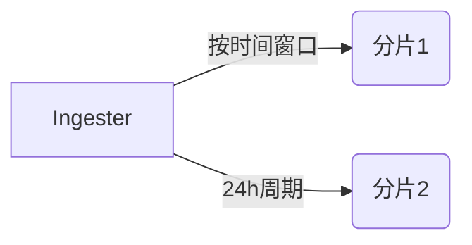

# 存储性能优化

## 介绍

Grafana Loki是一个为日志聚合设计的系统，其存储性能直接影响查询速度和资源消耗。通过优化存储配置，可以显著提升Loki的处理能力，尤其是在大规模日志场景下。本章将介绍Loki存储的核心优化策略，包括索引管理、数据分片和压缩配置。

---

## 1. 索引优化

Loki使用索引来加速日志查询，默认的索引存储（如BoltDB）可能成为性能瓶颈。以下是优化建议：

### 使用高性能索引后端
将默认的BoltDB替换为更高效的索引存储（如TSDB或Bigtable）：
```yaml
schema_config:
  configs:
    - from: 2023-01-01
      store: boltdb
      object_store: filesystem
      schema: v11
      index:
        prefix: index_
        period: 24h
```

:::tip
生产环境推荐使用`index_queries_cache_config`缓存热门查询：
```yaml
index_queries_cache_config:
  memcached:
    batch_size: 100
    parallelism: 100
```
:::

---

## 2. 数据分片策略

通过分片（Sharding）分散写入负载：

### 基于时间分片


配置示例：
```yaml
chunk_store_config:
  max_look_back_period: 168h # 保留7天分片
```

---

## 3. 压缩与保留策略

### 压缩配置
减少小文件数量以降低I/O压力：
```yaml
compactor:
  working_directory: /tmp/loki/compactor
  shared_store: filesystem
  compaction_interval: 10m
```

### 分层存储
将冷数据迁移到对象存储（如S3）：
```yaml
storage_config:
  aws:
    s3: s3://access-key:secret-key@loki-bucket
```

---

## 实际案例

### 场景：电商大促期间的日志激增
1. **问题**：日志量增长10倍，查询超时
2. **优化方案**：
   - 将索引周期从`24h`调整为`6h`
   - 启用Memcached缓存
   - 增加Ingester节点实现水平扩展
3. **效果**：P99查询延迟从15s降至2s

---

## 总结与练习

### 关键点总结
- 索引选择直接影响查询性能
- 分片策略平衡写入与查询负载
- 压缩减少存储碎片化

### 动手练习
1. 在本地Loki中启用TSDB索引
2. 模拟高负载日志写入（使用`logcli`工具）
3. 观察`loki_ingester_chunks_created_total`指标变化

### 扩展阅读
- [Loki官方存储调优文档](https://grafana.com/docs/loki/latest/operations/storage/)
- 《云原生日志系统设计》第5章