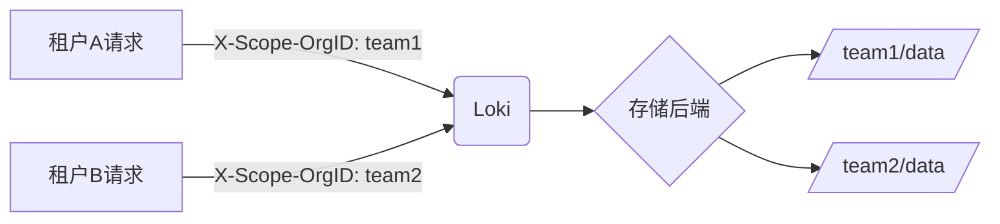

# 多租户存储隔离

## 简介

多租户存储隔离是Grafana Loki中一项关键功能，它允许不同租户（如团队、部门或客户）的日志数据在存储层面完全隔离。这种机制确保了租户间的数据隐私和安全，同时支持共享同一Loki实例的资源。

在Loki中，租户通过唯一的`X-Scope-OrgID` HTTP头标识。存储后端（如S3、GCS或本地存储）会根据租户ID自动划分数据存储路径，实现物理隔离。

:::note 什么是租户？
租户是指共享同一系统但需要数据隔离的逻辑实体。例如：公司内部的不同团队，或SaaS平台的不同客户。
:::

## 工作原理

Loki的多租户隔离通过以下机制实现：

1. **请求标识**：每个查询/写入请求必须包含`X-Scope-OrgID`头
2. **存储路径隔离**：对象存储中每个租户的数据存储在独立路径
3. **查询过滤**：查询时自动限制只访问当前租户的数据



## 配置方法

### 1. 启用多租户模式

在Loki配置文件中设置多租户认证（示例使用基本配置）：

```yaml
auth_enabled: true

storage_config:
  boltdb_shipper:
    active_index_directory: /loki/index
    cache_location: /loki/boltdb-cache
  filesystem:
    directory: /loki/chunks

schema_config:
  configs:
    - from: 2020-10-24
      store: boltdb-shipper
      object_store: filesystem
      schema: v11
      index:
        prefix: index_
        period: 24h
```

### 2. 发送带租户ID的请求

使用curl写入日志时指定租户头：

```bash
curl -v -H "X-Scope-OrgID: team1" \
  -H "Content-Type: application/json" \
  -X POST \
  -s "http://localhost:3100/loki/api/v1/push" \
  --data-raw \
  '{"streams": [{ "stream": { "foo": "bar" }, "values": [ [ "<timestamp>", "log line" ] ] }]}'
```

查询时也必须包含相同头：

```bash
curl -v -H "X-Scope-OrgID: team1" \
  "http://localhost:3100/loki/api/v1/query?query={foo=\"bar\"}"
```

### 3. 存储结构示例

启用多租户后，存储后端会生成如下目录结构：

```
/loki/
  ├── chunks/
  │   ├── team1/
  │   │   ├── 0/
  │   │   └── 1/
  │   └── team2/
  │       ├── 0/
  │       └── 1/
  └── index/
      ├── team1/
      │   └── index_12345
      └── team2/
          └── index_67890
```

## 实际应用场景

### 场景1：SaaS平台日志隔离

一个SaaS提供商为10个客户提供服务，所有客户日志都发送到同一Loki集群：

- 每个客户被分配唯一租户ID（如`customer-a`、`customer-b`）
- 客户只能查询自己的日志数据
- 存储成本按租户分开计算

### 场景2：企业内部多团队

开发团队（`dev`）和生产运维团队（`ops`）共享Loki：

```yaml
# 开发团队配置
loki:
  tenant_id: dev
  url: http://loki:3100

# 生产团队配置
loki:
  tenant_id: ops
  url: http://loki:3100
```

## 注意事项

:::caution 重要安全提示
1. 必须保护`X-Scope-OrgID`头不被篡改
2. 建议在前端代理（如Nginx）验证租户身份
3. 定期审计各租户的存储使用情况
:::

:::tip 性能考虑
多租户隔离会轻微增加存储开销，因为：
- 每个租户有独立的索引文件
- 小文件数量可能增加
:::

## 总结

多租户存储隔离是Loki企业级部署的核心功能，它实现了：
- 数据物理隔离
- 资源使用跟踪
- 统一管理多个用户组

## 扩展学习

1. 尝试为三个团队配置多租户Loki
2. 使用`loki-canary`工具测试各租户的写入性能
3. 探索使用网关代理（如Grafana Enterprise Logs）简化多租户管理

如需深入了解，参考Loki官方文档的[多租户部分](https://grafana.com/docs/loki/latest/operations/multi-tenancy/)。