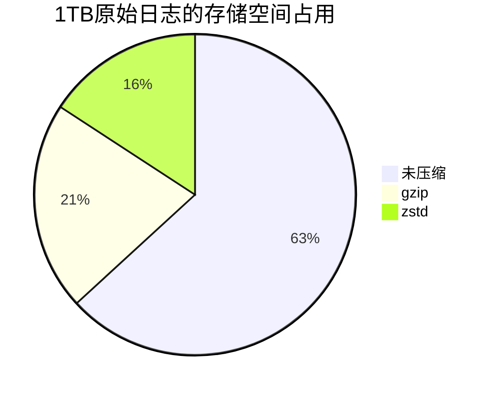

# 存储成本优化

## 介绍

在Grafana Loki中，存储成本优化是通过合理配置日志存储策略、压缩方式和保留策略来降低长期存储开销的过程。对于初学者来说，理解这些概念能帮助你在生产环境中平衡性能与成本。

Loki的存储模型基于以下核心组件：
- **索引存储**：快速查找日志流（如Amazon DynamoDB、Google Bigigtable）
- **日志存储**：实际日志内容（如S3、GCS、本地文件系统）

:::tip
优化存储成本的关键原则：**热数据高性能，冷数据低成本**。
:::

---

## 1. 选择适当的存储后端

不同的存储后端在成本和性能上差异显著：

| 存储类型       | 适合场景                | 成本示例（每月/1TB） |
|----------------|-------------------------|---------------------|
| 本地SSD        | 高频查询的近期数据      | $100-$200           |
| Amazon S3      | 长期存储/低频查询       | $23（标准存储）     |
| GCS Nearline   | 30天内可能访问的数据    | $10                 |

**配置示例**（Loki的`config.yaml`）：
```yaml
storage_config:
  aws:
    s3: s3://access-key:secret-key@region/bucket-name
    dynamodb:
      dynamodb_url: dynamodb://region
```

---

## 2. 配置日志保留策略

通过`table_manager`控制数据保留周期：

```yaml
table_manager:
  retention_deletes_enabled: true
  retention_period: 720h # 30天
  # 对于S3兼容存储
  s3:
    bucket_name: "loki-archives"
```

:::caution
过短的保留期可能导致数据丢失，建议根据合规要求设置（如金融行业通常需要1年以上）。
:::

---

## 3. 使用块压缩策略

Loki支持多种压缩格式，显著影响存储空间：

| 格式    | 压缩率 | CPU开销 | 示例命令                     |
|---------|--------|---------|------------------------------|
| gzip    | ~3:1   | 中      | `--storage.tsdb.wal-compression` |
| snappy  | ~2:1   | 低      | （默认选项）                 |
| zstd    | ~4:1   | 高      | `--storage.tsdb.compression=zstd` |

**效果对比**：


---

## 4. 实际案例：电商日志优化

**场景**：某电商平台每天产生500GB日志，需要保留90天。

**原始方案**：
- 全部存S3标准存储
- 无压缩
- 总成本：500GB × 90 × $0.023 = $1,035/月

**优化方案**：
```yaml
compression:
  enabled: true
  type: zstd
retention:
  hot_data: 7d  # 热数据存本地SSD
  cold_data: 83d # 冷数据存S3-Infrequent Access
```

**优化后成本**：
- 热数据：500GB × 7 × $0.10 = $350
- 冷数据：(500GB×4:1压缩)×83×$0.0125 = $130
- **总节省**：$1,035 → $480（节省53%）

---

## 5. 高级技巧：按标签分流

通过`storage_config`实现不同级别日志的差异化存储：

```yaml
storage_config:
  boltdb_shipper:
    active_index_directory: /hot-storage
    shared_store: s3
  extra_storage_config:
    critical_logs:
      aws:
        s3: s3://critical-logs-bucket
    debug_logs:
      aws:
        s3: s3://cheap-debug-logs
```

---

## 总结

关键优化手段：
1. 分层存储（热/冷数据分离）
2. 选择合适的压缩算法
3. 设置合理的保留周期
4. 按日志重要性差异化存储

**练习建议**：
1. 在测试环境尝试将保留期从7天调整为3天，观察存储变化
2. 比较gzip与zstd的压缩率和查询延迟差异

:::note
进一步学习：
- [Loki官方存储文档](https://grafana.com/docs/loki/latest/storage/)
- 《云原生日志设计模式》第三章
:::