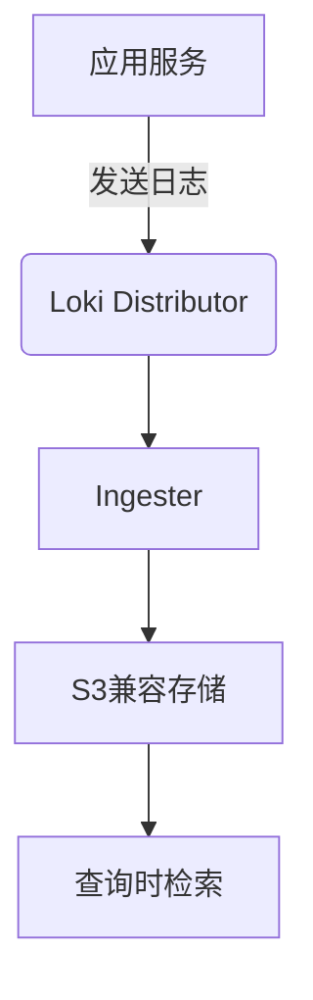

# S3兼容存储

## 介绍

S3兼容存储是一种基于Amazon S3 API标准的对象存储服务，它允许你以低成本、高可靠性的方式存储大量数据。在Grafana Loki中，S3兼容存储常用于存储索引和日志块数据，这使得Loki能够高效地处理大规模日志数据。

S3兼容存储的优势包括：
- **可扩展性**：轻松扩展以应对数据增长
- **持久性**：数据通常跨多个设备或位置冗余存储
- **成本效益**：比传统存储解决方案更经济

## S3兼容存储基础

S3兼容存储使用简单的键值对存储模型，其中：
- **Bucket**：类似于文件系统中的文件夹，用于组织对象
- **Object**：存储的基本单元，包含数据和元数据
- **Region**：存储桶所在的地理位置

在Loki中，S3兼容存储通常用于两种主要组件：
1. **块存储**：存储压缩的日志数据
2. **索引存储**：存储日志的索引信息

## 配置S3兼容存储

要在Loki中使用S3兼容存储，你需要在配置文件中进行相应设置。以下是一个基本配置示例：

```yaml
storage_config:
  aws:
    s3: s3://your-bucket-name
    endpoint: s3.amazonaws.com
    region: us-east-1
    access_key_id: your-access-key
    secret_access_key: your-secret-key
```

对于其他S3兼容服务（如MinIO），配置类似但需要指定自定义端点：

```yaml
storage_config:
  aws:
    s3: s3://your-minio-bucket
    endpoint: http://minio.example.com:9000
    region: us-east-1
    access_key_id: your-minio-access-key
    secret_access_key: your-minio-secret-key
    s3forcepathstyle: true
```

:::note
生产环境中，建议使用IAM角色而不是硬编码的访问密钥，以提高安全性。
:::

## 认证方式

Loki支持多种S3认证方式：

1. **静态凭证**（如上例所示）
2. **IAM角色**（适用于AWS环境）
3. **环境变量**
4. **EC2实例配置文件**

使用IAM角色的配置示例：

```yaml
storage_config:
  aws:
    s3: s3://your-bucket-name
    region: us-east-1
    # 不提供access_key_id和secret_access_key
    # Loki 将自动使用IAM角色凭证
```

## 存储桶策略

为确保Loki能正常工作，你的S3存储桶需要适当的权限策略。以下是一个最小权限策略示例：

```json
{
  "Version": "2012-10-17",
  "Statement": [
    {
      "Effect": "Allow",
      "Action": [
        "s3:ListBucket",
        "s3:PutObject",
        "s3:GetObject",
        "s3:DeleteObject"
      ],
      "Resource": [
        "arn:aws:s3:::your-bucket-name",
        "arn:aws:s3:::your-bucket-name/*"
      ]
    }
  ]
}
```

## 实际应用案例

**场景**：一家电商公司使用Loki收集和分析其微服务架构的日志。他们选择S3兼容存储因为：

1. **成本考虑**：日志数据量大但访问频率低，适合S3的低成本存储
2. **可靠性**：需要确保日志数据不会丢失
3. **扩展性**：在促销期间日志量会激增

他们的配置如下：

```yaml
storage_config:
  aws:
    s3: s3://ecommerce-loki-logs
    region: eu-west-1
    sse_encryption: true  # 启用服务器端加密
    http_config:
      idle_conn_timeout: 90s
```



## 性能优化建议

1. **分区策略**：根据时间或租户对数据进行分区
2. **生命周期规则**：自动将旧数据转移到更便宜的存储层
3. **缓存层**：对频繁访问的数据使用缓存
4. **批量操作**：配置Loki批量写入以减少请求数量

## 常见问题解决

**问题1**：权限错误
- 检查IAM角色或凭证是否正确
- 验证存储桶策略

**问题2**：连接超时
- 检查网络连通性
- 调整`http_config`中的超时设置

**问题3**：性能问题
- 考虑增加并发连接数
- 评估是否需要分片存储桶

## 总结

S3兼容存储为Grafana Loki提供了可靠、可扩展且经济高效的存储解决方案。通过正确配置和优化，它可以满足从开发环境到大规模生产部署的各种需求。

## 进一步学习

1. 尝试在不同S3兼容服务（AWS S3、MinIO、Ceph等）上配置Loki
2. 实验不同的存储桶生命周期策略
3. 研究S3存储的加密选项
4. 探索S3存储的监控和告警设置

:::tip
练习：设置一个本地MinIO实例，并将其配置为Loki的存储后端。尝试上传和查询一些测试日志数据。
:::