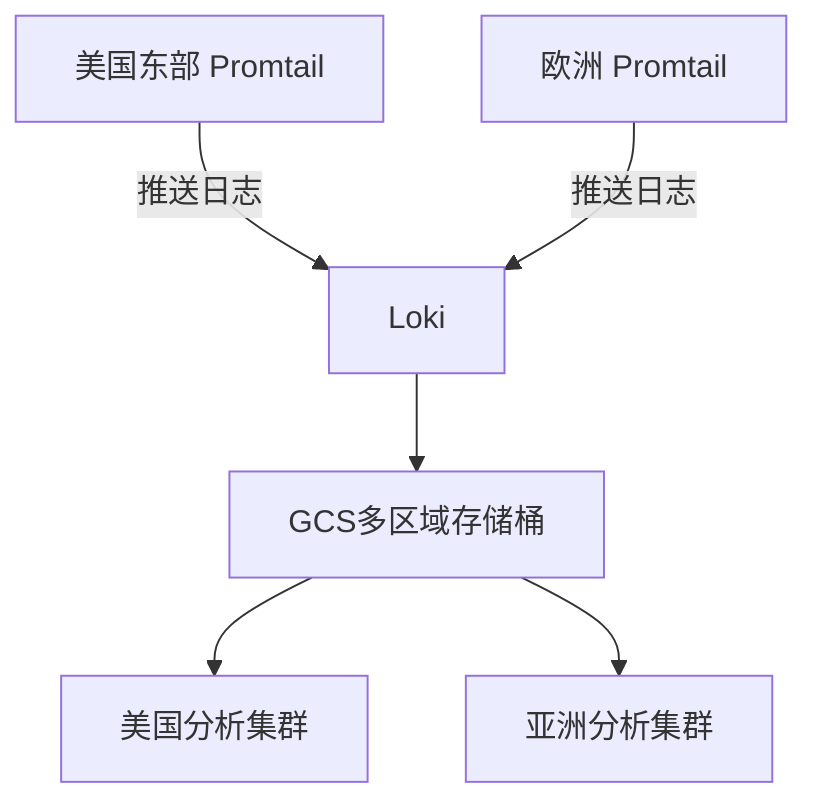

# Google Cloud Storage 存储配置

Google Cloud Storage (GCS) 是Grafana Loki推荐的云原生存储解决方案之一，特别适合需要高可用性和全球分布的场景。本章将指导您完成GCS与Loki的集成配置。

## 核心概念

GCS作为对象存储服务，为Loki提供：
- **持久的块存储**：存储压缩后的日志数据块
- **索引存储**：存储日志流的元数据索引
- **无限扩展性**：自动处理存储扩容需求

:::note 为什么选择GCS？
- 11个9的持久性保证(99.999999999%)
- 与Google Cloud服务深度集成
- 支持细粒度的访问控制
:::

## 基础配置

### 1. 创建GCS存储桶

首先在Google Cloud Console创建专用存储桶：

```bash
gsutil mb -l us-central1 gs://my-loki-storage
```

### 2. 服务账号配置

创建具有以下权限的服务账号：
- `storage.objects.create`
- `storage.objects.get`
- `storage.objects.list`
- `storage.objects.delete`

生成密钥文件并保存为`gcs-credentials.json`。

### 3. Loki配置文件示例

在Loki的`config.yaml`中添加GCS配置段：

```yaml
storage_config:
  gcs:
    bucket_name: "my-loki-storage"
    chunk_buffer_size: 10MiB
    request_timeout: 1m
    credentials: "/etc/loki/gcs-credentials.json"
```

## 高级配置选项

### 数据生命周期管理

```yaml
compactor:
  working_directory: /tmp/loki/compactor
  shared_store: gcs
  retention_enabled: true
  retention_delete_delay: 2h
  retention_delete_worker_count: 10
```

### 性能优化参数

```yaml
storage_config:
  gcs:
    # 增加批量操作大小
    max_retries: 5
    retry_min_backoff: 100ms
    retry_max_backoff: 5s
```

## 实际应用案例

### 场景：多区域日志收集



配置要点：
1. 创建多区域存储桶
2. 为每个地区配置独立的前端缓存
3. 使用统一的服务账号认证

## 常见问题处理

:::warning 认证失败排查
1. 确认服务账号密钥文件路径正确
2. 验证存储桶权限设置
3. 检查网络连接（特别是VPC Service Controls）
4. 尝试使用`gcloud auth application-default login`测试本地认证
:::

## 验证配置

使用Loki的`/ready`端点检查存储状态：

```bash
curl http://localhost:3100/ready
```

预期输出应包含存储组件健康状态。

## 总结与最佳实践

- **安全建议**：
  - 定期轮换服务账号密钥
  - 启用存储桶版本控制
  - 设置对象生命周期策略

- **性能建议**：
  - 根据日志量调整`chunk_buffer_size`
  - 监控GCS API调用配额
  - 为高频查询配置缓存层

## 扩展学习

1. 尝试配置存储桶自动归档策略
2. 实验不同存储类（Standard vs. Nearline）的成本差异
3. 集成Google Cloud IAM进行细粒度权限控制

:::tip 动手练习
创建两个环境（开发/生产）使用独立的GCS存储桶，并配置不同的保留策略：
- 开发环境：7天保留期
- 生产环境：30天保留期
:::