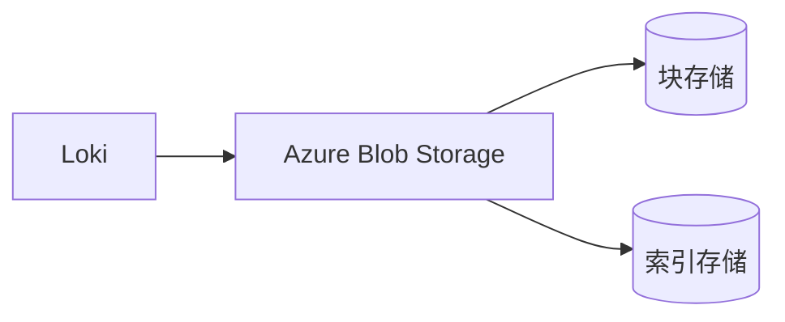
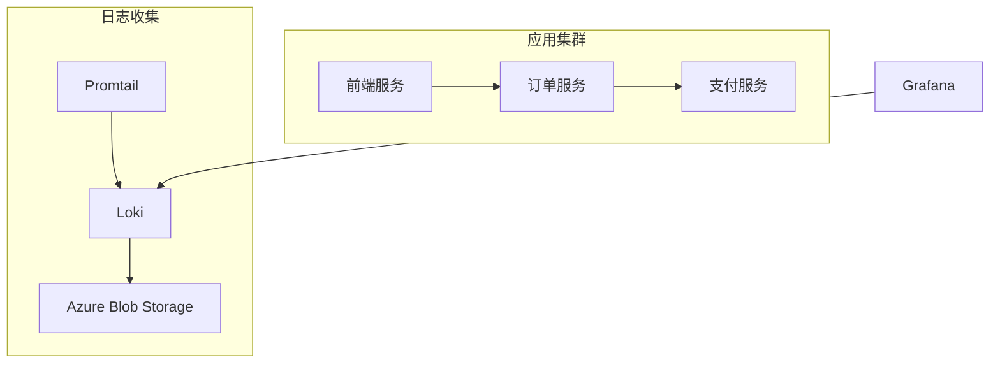

# Azure Blob Storage 配置指南

Azure Blob Storage是微软提供的对象存储服务，适合存储非结构化数据如日志文件。作为Grafana Loki的存储后端，它能提供高可用性、低成本的大规模日志存储方案。

## 核心概念

### 1. Blob Storage基本组件
- **存储账户(Storage Account)**：访问Azure存储服务的命名空间
- **容器(Container)**：类似于文件系统的文件夹
- **Blob**：存储的基本单位（块Blob/页Blob/追加Blob）

### 2. Loki的存储需求
Loki需要两类存储：
- **索引存储**：快速查询的小型数据
- **块存储**：压缩后的日志数据块



## 配置实战

### 1. 创建Azure存储账户
通过Azure CLI创建存储账户和容器：

```bash
# 创建存储账户
az storage account create \
    --name lokistorage \
    --resource-group my-resource-group \
    --sku Standard_LRS \
    --location eastus

# 创建容器
az storage container create \
    --account-name lokistorage \
    --name loki-blocks \
    --auth-mode login
```

### 2. Loki配置文件示例

在Loki的`config.yaml`中添加以下配置段：

```yaml
storage_config:
  azure:
    account_name: lokistorage
    account_key: <your-account-key>
    container_name: loki-blocks
    endpoint: blob.core.windows.net
    use_managed_identity: false

schema_config:
  configs:
    - from: 2023-01-01
      store: boltdb-shipper
      object_store: azure
      schema: v11
      index:
        prefix: loki_index_
        period: 24h
```

:::note
生产环境中建议使用`use_managed_identity: true`配合Azure AD进行身份验证，而非直接使用账户密钥。
:::

## 实际应用场景

### 电商平台日志架构
某电商平台使用以下架构处理黑色星期五的流量高峰：



**配置亮点**：
- 使用热/冷存储分层：近期数据在Premium Blob，历史数据在Archive Blob
- 生命周期管理自动转移30天前的数据

## 常见问题排查

### 1. 权限错误
错误示例：
```
storage.AzureStorageError: Server failed to authenticate the request
```

解决方案：
- 验证账户密钥或托管身份权限
- 检查容器ACL设置

### 2. 性能优化技巧
- 为高频查询的索引使用Premium Blob
- 调整`chunk_target_size` (建议4-6MB)
- 启用Blob存储的CDN缓存

## 总结与进阶

Azure Blob Storage为Loki提供了：
- 理论上无限的存储扩展能力
- 99.9%的可用性SLA
- 与Azure生态的无缝集成

**推荐练习**：
1. 尝试配置生命周期管理规则自动归档旧日志
2. 测试在不同区域存储账户下的查询性能差异
3. 实现基于托管身份的安全认证

**延伸阅读**：
- [Azure Storage冗余选项对比]
- [Loki存储引擎设计原理]
- [Blob存储性能优化白皮书]