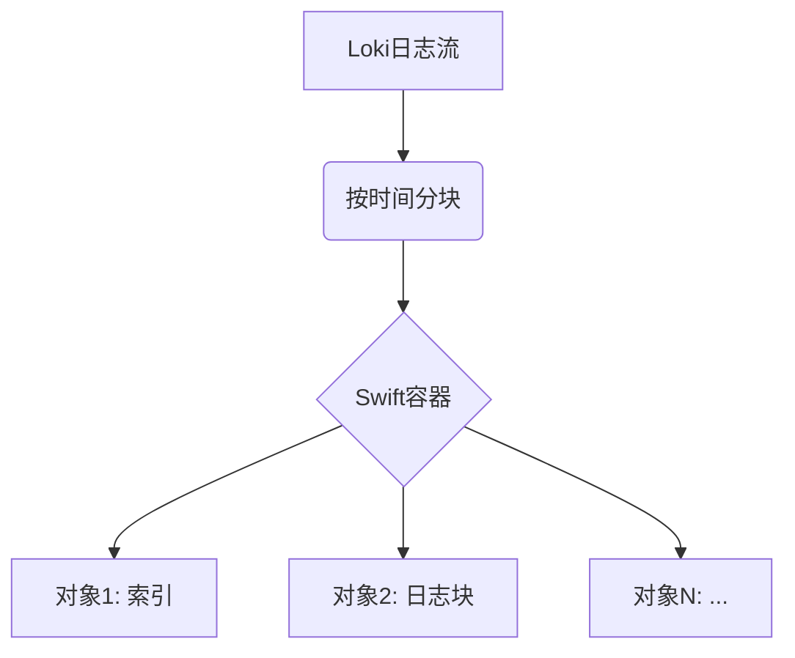

# Swift存储

## 介绍

Swift是OpenStack生态系统中的分布式对象存储系统，适合存储非结构化数据（如日志）。在Grafana Loki中，Swift可以作为长期存储后端，替代或补充本地存储方案。本指南将介绍如何配置Loki使用Swift存储日志数据。

:::note 关键特性
- 高可用性和横向扩展能力
- 通过容器(Container)和对象(Object)组织数据
- 支持多租户认证
- 与OpenStack Keystone集成
:::

## 前置条件

1. 有效的OpenStack Swift服务端点
2. 具有读写权限的Swift账户凭证
3. 已部署的Grafana Loki实例

## 基础配置

在Loki的配置文件(`loki.yaml`)中添加Swift存储部分：

```yaml
storage_config:
  swift:
    auth_url: https://your-keystone-url:5000/v3
    username: your_swift_username
    user_domain_name: Default
    project_name: your_project
    project_domain_name: Default
    region: RegionOne
    container_name: loki_logs
```

:::caution 安全提示
建议通过环境变量注入敏感信息，而非直接写在配置文件中：
```bash
export SWIFT_PASSWORD='your_password'
```
然后在配置中使用 `password: ${SWIFT_PASSWORD}`
:::

## 认证方式详解

### 1. 密码认证（最常用）

```yaml
auth_version: 3
password: ${SWIFT_PASSWORD}
```

### 2. 应用凭证认证

```yaml
auth_version: 3
application_credential_id: your_app_cred_id
application_credential_secret: your_app_cred_secret
```

### 3. Token认证（短期有效）

```yaml
auth_token: your_keystone_token
storage_url: https://your-swift-url:8080/v1/AUTH_xxx
```

## 高级配置选项

### 分块配置

```yaml
chunk_store_config:
  max_look_back_period: 168h # 保留7天的索引

schema_config:
  configs:
    - from: 2020-10-24
      store: boltdb-shipper
      object_store: swift
      schema: v11
      index:
        prefix: loki_index_
        period: 24h
```

### 性能调优参数

```yaml
swift:
  connect_timeout: 10s
  request_timeout: 30s
  max_retries: 3
  retry_interval: 5s
  chunk_size: 5MiB
```

## 数据组织架构



## 实际案例：电商日志存储

**场景**：某电商平台需要存储：
- 用户行为日志（高频率）
- 订单处理日志（中频率）
- 系统审计日志（低频率）

**解决方案**：
```yaml
swift:
  container_name: "prod-logs-${ENVIRONMENT}"
  object_prefix: "${LOG_TYPE}/"
  upload_concurrency: 10
```

通过环境变量区分：
```bash
# 用户行为服务
export LOG_TYPE=user_activity

# 订单服务
export LOG_TYPE=order_processing
```

## 常见问题排查

1. **认证失败**：
   - 检查`auth_url`是否包含正确的API版本(v2/v3)
   - 验证用户域(domain)和项目域是否匹配

2. **写入缓慢**：
   ```yaml
   swift:
     part_size: 50MB  # 增大分块大小
     buffer_size: 100MB
   ```

3. **容器不存在**：
   ```bash
   # 预先创建容器
   openstack container create loki_logs
   ```

## 总结

Swift为Loki提供了可靠的云原生存储方案，特别适合：
- 已有OpenStack基础设施的组织
- 需要多租户隔离的场景
- 大规模日志存储需求

## 延伸学习

1. 尝试配置生命周期规则自动归档旧日志
   ```bash
   openstack object store set --property 'X-Container-Meta-Access-Log-Delivery'='true'
   ```

2. 测试不同分块大小对查询性能的影响

3. 集成监控：
   - 跟踪Swift容器的存储用量
   - 设置Loki的存储健康告警