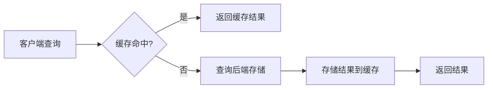

# 存储缓存配置

## 介绍

在Grafana Loki中，存储缓存是一种关键机制，用于加速查询性能并减少后端存储（如对象存储）的负载。通过缓存查询结果或索引数据，Loki可以更快地响应重复查询，尤其是在高负载场景下。本指南将详细介绍Loki的缓存配置选项及其实际应用。

---

## 缓存类型

Loki支持以下缓存类型，可通过配置文件启用：

1. **索引缓存**：缓存从后端存储（如DynamoDB或Bigtable）读取的索引数据。
2. **查询结果缓存**：缓存查询结果（如LogQL查询的响应）。
3. **块缓存**：缓存从对象存储下载的日志块数据。

:::tip
缓存通常配置在Loki的 `config.yaml` 文件中，使用 `boltdb-shipper` 或 `tsdb` 等存储引擎时尤其重要。
:::

---

## 配置示例

以下是一个典型的缓存配置片段，展示如何在 `config.yaml` 中定义缓存：

```yaml
query_range:
  results_cache:
    cache:
      enable_fifocache: true
      fifocache:
        max_size_bytes: 500MB
        validity: 1h

storage_config:
  boltdb_shipper:
    shared_store: s3
    cache_ttl: 24h  # 索引缓存的有效期
  cache:
    enable_fifocache: true
    fifocache:
      max_size_bytes: 1GB
```

### 参数说明
- `enable_fifocache`：启用基于内存的FIFO缓存。
- `max_size_bytes`：缓存的最大内存占用。
- `validity`：缓存结果的保留时间（如 `1h` 表示1小时）。

---

## 实际案例

### 场景：高频重复查询
假设你的应用需要频繁查询过去1小时的错误日志（如 `{level="error"}`）。启用查询结果缓存后，首次查询会从存储加载数据，后续相同查询直接从缓存返回，显著降低延迟。

```yaml
# 配置查询结果缓存
query_range:
  results_cache:
    cache:
      enable_fifocache: true
      fifocache:
        max_size_bytes: 200MB
        validity: 30m  # 缓存30分钟
```

---

## 缓存流程图



---

## 注意事项

1. **内存限制**：FIFO缓存基于内存，需根据服务器资源调整 `max_size_bytes`。
2. **缓存失效**：确保 `validity` 设置合理，避免返回过时数据。
3. **分布式部署**：多实例部署时，考虑使用Redis等分布式缓存替代FIFO缓存。

:::caution
过度缓存可能导致内存压力。监控 `loki_cache_request_duration_seconds` 指标以评估缓存效果。
:::

---

## 总结

存储缓存是优化Loki性能的重要手段。通过合理配置索引、查询结果和块缓存，可以显著提升查询速度并降低后端负载。建议从默认配置开始，逐步调整参数以适应实际需求。

### 扩展练习
1. 在测试环境中启用缓存，对比查询延迟变化。
2. 使用Grafana监控缓存命中率（`loki_cache_request_total`）。

### 附加资源
- [Loki官方文档：缓存配置](https://grafana.com/docs/loki/latest/configuration/#cache_config)
- [LogQL查询优化指南](https://grafana.com/docs/loki/latest/logql/)