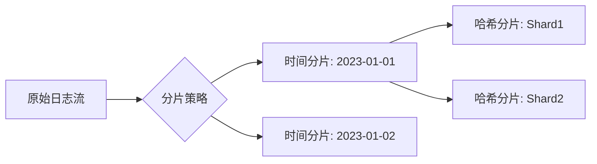

# 存储分片策略

## 介绍

存储分片（Sharding）是Grafana Loki中用于横向扩展存储负载的核心策略。它将日志数据分散到多个物理存储单元（如S3桶或本地磁盘），通过并行处理提升读写效率。对初学者而言，理解分片策略能帮助优化Loki集群的性能和成本。

:::note 为什么需要分片？
- **性能提升**：避免单个存储节点成为瓶颈<br />
- **成本控制**：按需分配存储资源<br />
- **容错能力**：单点故障不影响整体服务
:::

## 分片原理

Loki的分片策略基于两个关键维度：
1. **时间范围分片**：按时间窗口（如每日/每周）划分数据
2. **哈希分片**：通过标签哈希值分散数据



## 配置方法

### 1. 基础配置示例

在Loki的配置文件（通常为`loki.yaml`）中定义分片策略：

```yaml
schema_config:
  configs:
    - from: 2023-01-01
      store: boltdb-shipper
      object_store: s3
      schema: v11
      index:
        prefix: loki_index_
        period: 24h  # 按24小时分片
      chunks:
        prefix: loki_chunks_
        period: 24h
```

### 2. 动态分片配置

通过运行时参数控制分片行为：

```bash
-target=ingester \
-ingester.ring.replication-factor=3 \
-ingester.ring.num-tokens=128 \
-store.max-chunk-age=2h
```

:::tip 参数说明
- `replication-factor`：数据副本数<br />
- `num-tokens`：哈希环虚拟节点数<br />
- `max-chunk-age`：内存中分块最大保留时间
:::

## 实际案例

### 电商日志处理场景

**需求**：处理黑色星期五期间暴增的订单日志（日均10TB）

**解决方案**：
1. 将分片周期从24小时调整为6小时
2. 增加哈希分片数量到16个

```yaml
schema_config:
  configs:
    - from: 2023-11-24
      chunks:
        period: 6h  # 高峰期缩短分片周期
```

```bash
-ingester.concurrent-flushes=16  # 匹配分片数量
```

## 性能调优建议

1. **分片粒度选择**：
   - 高频日志：1-4小时分片周期
   - 低频日志：24小时分片周期

2. **监控指标**：
   ```promql
   # 查看分片负载均衡情况
   rate(loki_ingester_chunks_stored_total[5m])
   ```

3. **存储后端适配**：
   - AWS S3：每个分片对应独立前缀
   - 本地存储：确保磁盘IOPS分配均匀

## 总结

存储分片策略是Loki实现水平扩展的关键，通过合理配置：
- 时间分片优化历史查询性能
- 哈希分片实现写入负载均衡
- 动态调整应对流量波动

## 延伸学习

1. **实践练习**：
   - 在测试环境尝试不同分片周期（1h/6h/24h）的查询延迟对比
   - 使用`logcli`工具分析分片分布：`logcli series --analyze-labels`

2. **进阶阅读**：
   - Loki官方文档《Storage Scaling Patterns》
   - 论文《Dynamic Sharding for Large-Scale Log Analytics》