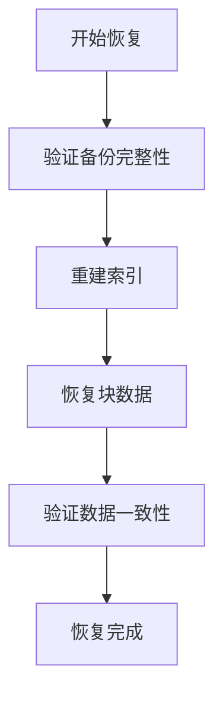

# 存储备份恢复

## 介绍

在Grafana Loki中，存储备份恢复是确保日志数据持久性和灾难恢复的关键环节。Loki的存储架构设计允许您通过配置不同的后端存储（如S3、GCS、本地文件系统等）来实现数据的备份和恢复。本文将指导您完成Loki存储备份恢复的全流程操作。

:::note 核心概念
Loki的存储备份恢复主要涉及两个部分：
1. **索引存储**（通常使用BoltDB或Cassandra）
2. **块存储**（通常使用对象存储如S3）
:::

## 备份策略配置

### 1. 基于对象存储的自动备份

当使用云存储服务（如AWS S3）时，Loki会自动利用云服务的高可用特性。您可以通过以下配置启用版本控制：

```yaml
storage_config:
  aws:
    s3: s3://your-bucket-name
    s3forcepathstyle: true
```

### 2. 定期快照备份

对于本地存储或需要额外备份的场景，可以使用`loki-admin`工具创建快照：

```bash
loki-admin backup --output=/path/to/backup --since=24h
```

示例输出：
```
Backup created successfully at /path/to/backup/2023-07-01T12:00:00Z
Contains 42 chunks and 3 index tables
```

### 3. 备份验证

验证备份完整性：

```bash
loki-admin verify-backup --input=/path/to/backup
```

## 恢复操作指南

### 1. 从对象存储恢复

如果使用云存储，通常不需要手动恢复。当新实例配置相同的存储桶时，数据会自动可用。

### 2. 从快照恢复

```bash
loki-admin restore --input=/path/to/backup --config.file=/etc/loki/local-config.yaml
```

恢复过程示例：


## 实际案例：AWS S3跨区域备份

```yaml
storage_config:
  aws:
    s3: s3://primary-loki-bucket
    s3forcepathstyle: true
  backup_storage:
    aws:
      s3: s3://backup-loki-bucket-region2
      s3forcepathstyle: true
backup:
  interval: 24h
  retention: 30d
```

:::caution 注意事项
1. 确保备份期间Loki实例处于低负载状态
2. 跨区域备份可能产生额外的网络费用
3. 定期测试恢复流程
:::

## 总结

通过合理配置存储备份策略，您可以确保：
- 数据丢失风险最小化
- 满足合规性要求
- 快速从故障中恢复

## 扩展资源

1. [Loki官方文档 - 存储配置](https://grafana.com/docs/loki/latest/configuration/storage/)
2. [AWS S3版本控制最佳实践](https://docs.aws.amazon.com/AmazonS3/latest/userguide/Versioning.html)
3. 练习：设置一个本地备份并尝试恢复测试数据

:::tip 进阶学习
探索Loki的`table-manager`配置，了解如何优化长期存储保留策略
:::