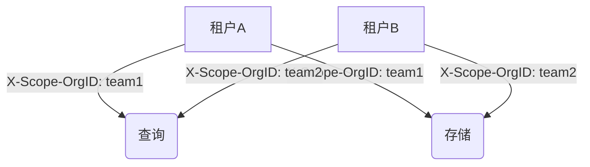

# Loki 多租户概念

## 介绍

多租户（Multi-tenancy）是Grafana Loki的核心特性之一，它允许单一Loki实例为多个独立用户或团队（称为"租户"）提供服务，同时确保各租户间的数据完全隔离。这种设计特别适合企业级场景，例如：

- SaaS平台为不同客户提供独立日志服务
- 企业内部多个团队共享同一套日志基础设施
- 需要严格权限控制的合规环境

## 核心原理

Loki通过租户ID（Tenant ID）实现多租户隔离，每个请求都必须携带`X-Scope-OrgID`头部来标识租户身份。系统会在以下层面进行隔离：



### 隔离维度
1. **数据存储**：不同租户的日志存储在不同前缀的存储桶中
2. **查询处理**：租户只能访问自己权限范围内的日志数据
3. **资源限制**：可针对每个租户设置独立的速率限制

## 配置多租户

### 1. 启用多租户模式
在Loki配置文件中设置认证层（推荐使用Grafana Enterprise或OAuth2代理）：

```yaml
auth_enabled: true
```

### 2. 发送带租户ID的请求
使用curl示例推送日志：

```bash
curl -v -H "X-Scope-OrgID: team1" \
  -H "Content-Type: application/json" \
  -XPOST -s "http://localhost:3100/loki/api/v1/push" \
  --data-raw \
  '{"streams": [{ "stream": { "app": "nginx" }, "values": [ [ "<timestamp>", "example log line" ] ] }]}'
```

查询日志时也需要相同头部：

```bash
curl -G -s "http://localhost:3100/loki/api/v1/query" \
  --data-urlencode 'query={app="nginx"}' \
  -H "X-Scope-OrgID: team1"
```

## 实际应用案例

### 场景：电商平台日志管理
某电商平台使用Loki多租户功能为不同部门提供服务：

1. **支付团队**（租户ID: `payment`）存储交易日志
2. **物流团队**（租户ID: `logistics`）存储配送日志
3. **客服团队**（租户ID: `support`）存储用户咨询日志

配置不同的保留策略：
```yaml
limits:
  retention_period:
    payment: 720h  # 30天
    logistics: 2160h # 90天
    support: 8760h  # 1年
```

## 最佳实践

:::tip 租户设计建议
- 按业务功能而非个人划分租户
- 租户ID使用有意义的名称（如`team-frontend`）
- 为每个租户配置适当的资源限制
:::

:::caution 注意事项
1. 确保认证中间件正确处理租户ID
2. 监控各租户的资源使用情况
3. 生产环境建议使用Grafana Enterprise的细粒度访问控制
:::

## 总结

Loki的多租户功能通过简单的HTTP头部实现强大的隔离能力，使组织能够：
- 安全地共享日志基础设施
- 实现基于租户的资源分配
- 满足合规性要求

## 延伸学习

1. [官方多租户文档](https://grafana.com/docs/loki/latest/operations/multi-tenancy/)
2. 尝试为你的Loki实例配置两个租户
3. 使用Grafana探索不同租户的仪表板隔离效果