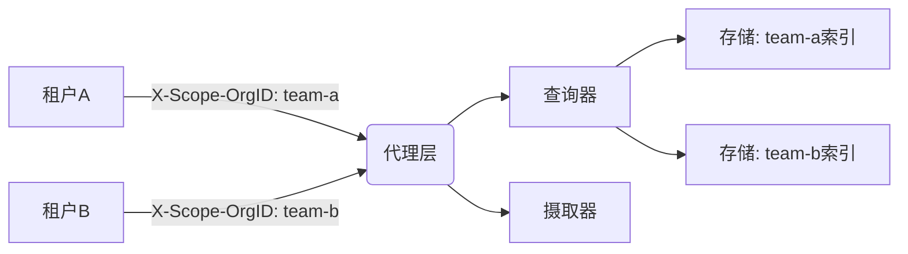

# 多租户架构设计

## 介绍

多租户（Multi-tenancy）是云计算和分布式系统中常见的架构模式，它允许单个服务实例为多个租户（用户、团队或组织）提供服务，同时隔离彼此的数据和资源。在Grafana Loki中，多租户设计使得不同团队可以共享同一个Loki集群，而日志数据保持逻辑隔离。

:::note 关键特性
- **资源隔离**：租户间的查询和写入操作互不影响。
- **成本优化**：共享基础设施降低运维成本。
- **权限控制**：通过租户ID实现细粒度访问管理。
:::

---

## 多租户实现原理

### 租户标识（Tenant ID）
Loki通过HTTP请求头 `X-Scope-OrgID` 标识租户。例如：

```bash
# 写入日志时指定租户
curl -v -H "X-Scope-OrgID: team-a" -H "Content-Type: application/json" \
  -XPOST -s "http://loki:3100/loki/api/v1/push" --data-raw \
  '{"streams": [{ "stream": { "label": "value" }, "values": [ [ "<timestamp>", "log line" ] ] }]}'
```

### 存储隔离
Loki的存储后端（如S3、GCS）会为每个租户创建独立的数据目录：
```
s3://loki-bucket/team-a/
s3://loki-bucket/team-b/
```

---

## 架构设计详解

### 组件级多租户支持


### 关键配置项
在Loki配置文件中启用多租户：
```yaml
auth_enabled: true  # 必须开启认证
multi_tenant: true
```

---

## 实际应用案例

### 场景：SaaS平台的日志隔离
一个SaaS公司使用Loki收集客户日志：
1. 每个客户分配唯一租户ID（如 `customer-123`）
2. 客户只能查询自身租户下的日志
3. 平台管理员可以跨租户聚合分析

:::tip 性能优化建议
- 为高频访问租户配置单独的缓存策略
- 使用限流机制防止单一租户耗尽资源
:::

---

## 总结

多租户架构是Loki企业级应用的核心特性，它通过：
1. 请求头标识实现逻辑隔离
2. 存储层物理隔离保障数据安全
3. 资源配额管理维持系统稳定性

---

## 扩展学习

### 实践练习
1. 部署启用多租户的Loki开发环境
2. 使用`logcli`工具尝试跨租户查询：
```bash
logcli --tenant-id=team-a query '{job="api"}'
```

### 进一步阅读
- [Loki官方多租户文档](https://grafana.com/docs/loki/latest/operations/multi-tenancy/)
- 《云原生日志系统设计模式》第三章