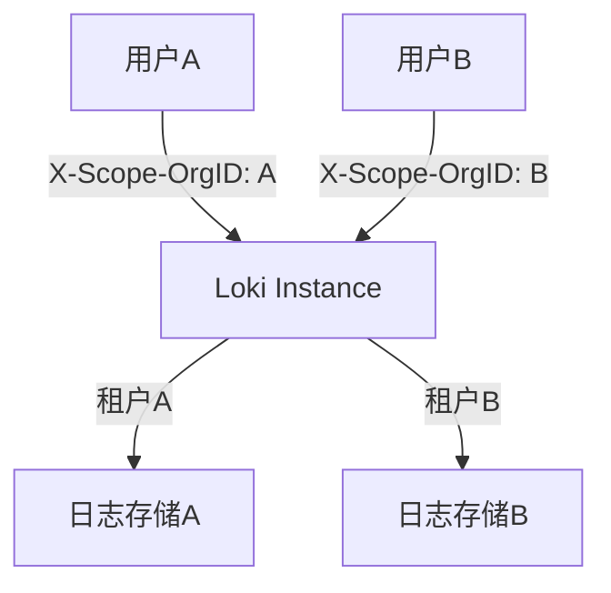

# 租户管理API

## 介绍

Grafana Loki 是一个高度可扩展的日志聚合系统，支持**多租户**架构。多租户允许多个团队或项目共享同一个 Loki 实例，同时保持数据的隔离性。租户管理API 提供了一组接口，用于创建、配置和管理租户，是 Loki 多租户功能的核心组成部分。

本指南将介绍租户管理API的基本概念、使用方法以及实际应用场景，帮助初学者快速上手。

---

## 租户管理API基础

租户管理API 主要通过 HTTP 接口与 Loki 交互，支持以下操作：
- 创建租户
- 删除租户
- 列出所有租户
- 配置租户的日志存储策略

:::note
租户管理API 需要管理员权限（通常通过 `X-Scope-OrgID` 头或 Loki 配置中的 `auth_enabled` 设置启用）。
:::

---

## 核心API接口

### 1. 创建租户
使用 `POST` 请求创建一个新租户：

```bash
curl -X POST http://localhost:3100/loki/api/v1/tenant \
  -H "X-Scope-OrgID: admin" \
  -d '{"name": "team-a"}'
```

**响应示例**：
```json
{
  "status": "success",
  "message": "Tenant 'team-a' created"
}
```

### 2. 列出所有租户
通过 `GET` 请求获取当前所有租户：

```bash
curl -X GET http://localhost:3100/loki/api/v1/tenants \
  -H "X-Scope-OrgID: admin"
```

**响应示例**：
```json
{
  "tenants": ["team-a", "team-b"]
}
```

### 3. 删除租户
使用 `DELETE` 请求移除租户（谨慎操作！）：

```bash
curl -X DELETE http://localhost:3100/loki/api/v1/tenant/team-a \
  -H "X-Scope-OrgID: admin"
```

---

## 实际案例：为不同团队分配租户

假设一个公司有两个开发团队（`team-dev` 和 `team-ops`），需要隔离日志数据：

1. **创建租户**：
   ```bash
   curl -X POST http://loki:3100/loki/api/v1/tenant \
     -H "X-Scope-OrgID: admin" \
     -d '{"name": "team-dev"}'
   ```

2. **推送日志**时指定租户：
   ```bash
   curl -X POST http://loki:3100/loki/api/v1/push \
     -H "X-Scope-OrgID: team-dev" \
     -d '{"streams": [...]}'
   ```

3. **查询日志**时仅返回当前租户数据：
   ```bash
   curl -G http://loki:3100/loki/api/v1/query_range \
     -H "X-Scope-OrgID: team-dev" \
     --data-urlencode 'query={job="api-server"}'
   ```

---

## 多租户架构示意图



---

## 总结

租户管理API 是 Loki 多租户功能的关键，通过简单的 HTTP 接口即可实现：
- 租户的创建与删除
- 数据的逻辑隔离
- 灵活的权限控制

:::tip 练习
1. 使用 API 创建一个名为 `test-tenant` 的租户。
2. 尝试推送和查询该租户的日志数据。
3. 删除租户并验证数据不可访问。
:::

**进一步学习**：
- [Loki 官方多租户文档](https://grafana.com/docs/loki/latest/operations/multi-tenancy/)
- 探索租户级别的资源配额配置